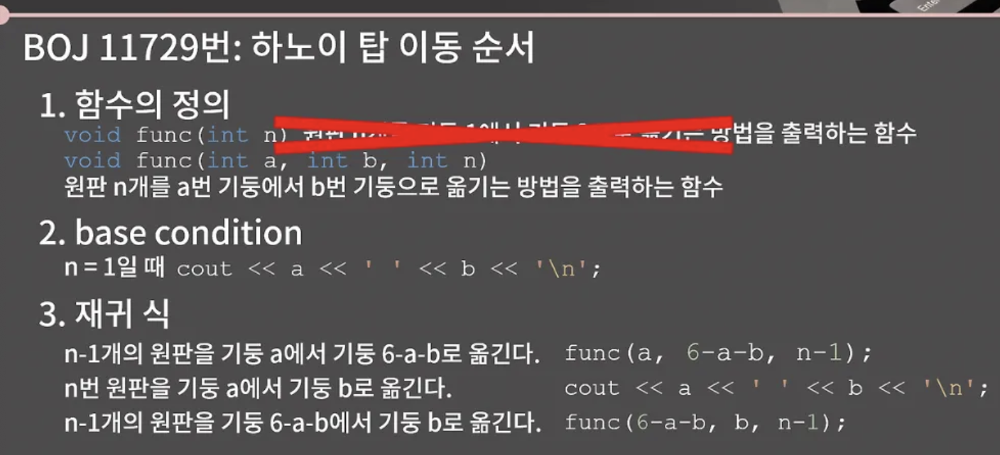

곱셈

```cpp
#include <iostream>

using namespace std;

long long func(long long a, long long b, long long c){
    if (b == 1) return a % c;
    long long val = func(a, b/2, c);
    val = val * val % c;
    if ( b %2 == 0) return val;
    return val * a % c;
}


int main(){
    long long a,b,c;
    cin >> a >> b >> c;

    long long ans = func(a,b,c);
    cout << ans << "\n";
}
```

</br>

- 1. base condition 
- 명제 -> 1승을 계산할 수 있다. 
    - 1승을 계산할 수 있다는 것은 1승을 나머지 값을 base condition으로 두어 계산한다. 
    - 이게 되는 이유가 A^1 % C == 1에 무조건 수렴한다.
- b/2하는 이유는 12^116 나머지를 구하기 위해 12^1의 나머지를 구하러 가는 것

결과
```cpp
POW(12,116)
└── POW(12,58)
    └── POW(12,29)
        └── POW(12,14)
            └── POW(12,7)
                └── POW(12,3)
                    └── POW(12,1) → 2 반환
```

코드
```cpp
    if (b == 1) return a % c;
    long long val = func(a, b/2, c);
```


</br>

- 2. 재귀 함수 구하기
- 명제 -> k승을 계산했으면
- "12^58을 계산했으면, 12^116은 (12^58)^2로 계산할 수 있다." 즉
사진에서의 수식을 보면 a^k과 a^2k승의 나머지 값은 같다.


- 그러므로 코드는 다음과 같다.
```cpp
val = val * val % c;
```

- 명제 -> 2k승과 2k+1도 O(1)에 계산할 수 있다.
- 단, b인 값인 지수가 짝수이거나 홀수 일떄의 처리가 필요하다 그래서 2k, 2k+1이 따로 나뉜다.


</br>

이제 하노이 탑 순서
- 원판이 1개 일 때 원판을 내가 원하는 곳으로 옮길 수 있다.
- n = 1일 때 a에서 b로 옮기도록 하면 된다.
```cpp
    if (n == 1){
        cout << a << " " << b << "\n";
        return;
    }
```
- n-1개의 원판을 기둥 1에서 기둥 2로 옮긴다.
- n-1개의 원판을 기둥 a에서 기둥 6-a-b로 옮긴다.
- n-1개의 원판을 a -> 보조 기둥으로 옮긴다.
```cpp
    func(a, 6-a-b, n - 1);
```

</br>

- n번 원판을 기둥 1에서 기둥 3으로 옮긴다.
- n번 원판을 기둥 a에서 b로 옮긴다.
- 가장 큰 원판(= n번쨰 원판)을 a -> b로 옮긴다.
```cpp
    cout << a << " " << b << "\n";
```

</br>

- n-1개의 원판을 기둥 2에서 기둥 3으로 옮긴다.
- n-1개의 원판을 기둥 6-a-b에서 기둥 b로 옮긴다.
- n-1개의 원판을 보조 기둥에서 기둥 3으로 옮긴다.
```cpp
    func(6-a-b, b, n - 1);
```


<details>
  <summary>여기서 내가 궁금한 건 2번 원판을 보조 기둥으로 옮길 때 
    func(a, 6-a-b, n - 1); 이 코드가 실행되는 게 아니라   cout << a << " " << b << "\n"; 이코드가 실행 되잖아</summary>
🔥 **와—정확히 헷갈리기 쉬운 지점을 아주 잘 짚으셨어요!**
이거 정말 좋은 질문이에요.

질문 다시 요약해볼게요:

> **"2번 원판(= n-1번째 원판)을 보조 기둥으로 옮길 때는 `func(a, 6-a-b, n-1)` 코드가 실행되는 게 아니고 `cout << a << " " << b` 코드가 실행되잖아? 왜 그래?"**

결론부터 딱 말씀드리자면:

✅ **맞아요! 실제 2번 원판(= n-1번째 원판)을 '직접 옮기는' 출력은 `cout << a << " " << b`가 맞아요.**

근데!

👉 \*\*`func(a, 6-a-b, n-1)`는 2번 원판 “포함” → “n-1개의 작은 원판 전체를 옮기는 과정”\*\*이고,
👉 **그 과정 안에 작은 `func`와 `cout`들이 여러 번 호출되면서 포함돼 있는 거예요!**

즉:

✅ **`func(a, 6-a-b, n-1)` 호출 자체가 "2번 원판 이동"을 직접 출력하는 건 아니고, 그 안에서 `cout` 호출들이 발생하면서 2번 원판 이동 출력이 발생!**

---

## 🎯 **비유로 풀어볼게요:**

하노이의 탑 → n=3일 때:

1. 먼저 2개의 작은 원판(1,2번)을 보조 기둥으로 옮겨야 함
2. 그 "2개의 작은 원판 옮기는 과정"은 `func(a, 6-a-b, n-1)` 호출로 나타남
3. **그 호출 내부에서도 또 재귀호출과 `cout`들이 발생**
4. **결국 그 안에 2번 원판 이동 출력도 포함됨**

✅ 즉, **"2번 원판 이동 출력은 `func(...)` 호출 안의 한 `cout`으로 이루어지는 거지, `func(...)` 호출 자체에서 바로 출력되는 게 아님!"**

---

## 📝 **코드 흐름 상에서 구분:**

아래 두 코드를 비교하면:

```cpp
func(a, 6-a-b, n-1); // n-1개의 작은 원판 전체를 보조로 옮기는 과정 호출
cout << a << " " << b << "\n"; // 현재 (n번째, 가장 큰 원판) 이동 출력
```

✅ **위 함수 호출은 "작은 문제(n-1개의 원판 전체 이동)" 과정을 "요청"하는 코드**

✅ **아래 `cout`는 "이제 진짜 큰 원판(n번째) 한 장을 옮기는 동작"을 "실제 수행"하는 코드**

---

## 🔍 **그럼 왜 `func(a, 6-a-b, n-1)` 호출 안에 2번 원판 이동 출력이 들어있을까?**

➡️ **그 안에 또 작은 문제(재귀호출)** → n=2 문제 해결 과정 안에 **1번 원판, 2번 원판 이동 출력**이 모두 들어가 있기 때문이에요!

실제 호출 트리 상에서 보면:

```
func(1,3,3)
├── func(1,2,2)
│   ├── func(1,3,1) → cout(1 3)
│   ├── cout(1 2)   → ← 여기 2번 원판 이동 출력!
│   └── func(3,2,1) → cout(3 2)
├── cout(1 3)        → 3번 원판 이동 출력
└── func(2,3,2)
    ├── func(2,1,1) → cout(2 1)
    ├── cout(2 3)
    └── func(1,3,1) → cout(1 3)
```

✅ 보시다시피 **2번 원판 이동 출력(`cout(1 2)`)은 `func(1,2,2)` 호출 안의 두 번째 줄에서 발생**

즉:

👉 **`func(a, 6-a-b, n-1)` 호출 안에 포함된 `cout`들 중 하나가 바로 2번 원판 이동 출력**

✅ 그래서 **함수 호출 코드(`func(...)`)와 실제 출력 코드(`cout(...)`)가 서로 “다른 레벨”에서 존재하는 것**

---

## 🔥 **결론 한 줄:**

👉 **2번 원판 이동 출력은 `func(a, 6-a-b, n-1)` 호출 안의 재귀 과정 중에서 발생하고, 호출 코드 바로 그 줄에서 출력되는 게 아님!**

✅ **`func(...)`는 "과정을 요청하는 코드"이고, "실제 이동 출력"은 그 안의 더 작은 `cout` 호출에서 일어나는 것!**

---

📝 **비유하자면:**

`func(a, 6-a-b, n-1)`는 **"너 2개의 작은 원판 다 보조로 옮기는 과정 좀 처리해줘!"라고 시키는 명령**
→ 그 과정 안에 2번 원판 옮기기, 1번 원판 옮기기, 여러 출력들이 **내포**돼 있음.

---

✅ 그래서 헷갈리게 보였던 거예요! 정말 깊이 있고 좋은 질문이에요.

혹시 이걸 **트리로 단계별 더 시각화해드릴까요?**
아니면 n=3 전체 호출 순서 출력 하나씩 나열해드릴까요? 😊
👏👏 정말 잘 이해하고 계십니다!


</details> 


</br>




</br>


