### 시간 복잡도와 공간 복잡도
시간 복잡도와 공간 복잡도
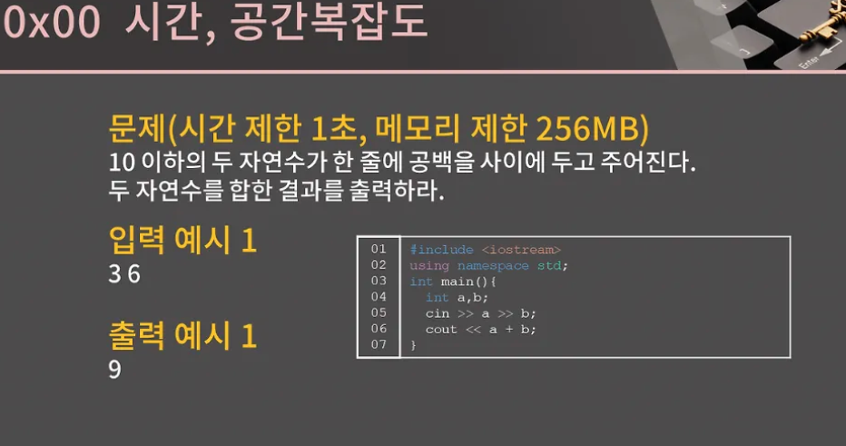
- 컴퓨터는 1초에 대락 3~5억개 정도의 연산을 처리 가능
    - 단 AND, OR, 비교, 덧셈 같은 단순한 연신지 아니면 나눗셈, 곱셈, 대입, 함수 호출과 같은 복잡한 연산이지에 따라 횟수에 좀 차이가 날 수 있다.
    - 어림 잡아서 3~5억이라는 것
- 이 코드는 연산을 몇 번을 할까
- 05번쨰 두 변수를 입력 받을 때, 06번째 줄에서 두 수를 더하고 출력할 때 연산이 필요하게 되니 대충 3,4번의 연산 필요
- 그러니까 1초 내료는 충분히 프로그램이 모든 명령으 수행한 후 종료되고, 엄말히 말하면 0,0000001초도 안 걸릴 것임
- 시간 제한 1초 == 당신의 프로그램은 3~5억 번의 연산 안에 답을 내고 종료되어야한다.


</br>


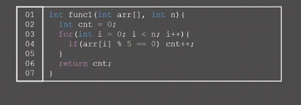
- arr[0] 부터 arr[n - 1]까지 돌면서 5로 나눈 나머지가 0이면, 즉 5의 배수이면 cnt 변수의 값을 1증가
- n은 arr 배열의 크기, arr[0]부터 arr[n-1]안의 5의 배수의 갯수를 반환하는 함수


</br>

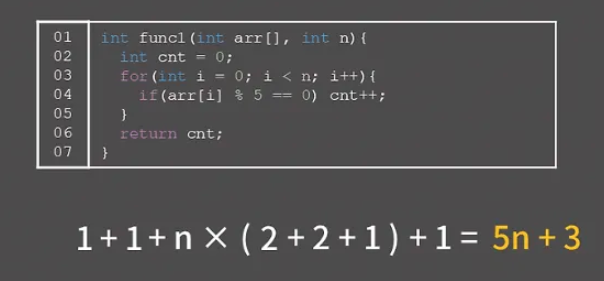
- 02번 째 줄에서 cnt 변수를 선언하고 0을 넣는 과정에서 1번
- 03번 째 줄에서 i에 초기값으로 0으로 대입할 때 1번
- n번에 걸쳐 반복되는 일 03번쨰 줄을 계속 보면 i가 n보다 작은지 확인하고 작을 경우 1 증가시키니 연산 2번
- 04번 쨰 줄에서 5로 나눈 나머지를 계산하고 그게 0과 일치하는지 확인할 때 연산 2번
- 5의 배수라고 치면 cnt를 1증가 시켜야 하니 연산 1번 이후 마지막으로 반환할 떄 연산 1번 추가로 필요

뜯어서 보면 5n+3의 연산이 필요하다는 걸 알 수가 있다

좀 더 풀어서 설명 → n이 아무거나 들어온다고 치자

1. cnt 변순 선언 0을 넣는 과정(1번) + i에 초기값으로 0을 대입할 떄 1번
2. n에 따라 i가 n보다 작은지(1번), i가 작을 경우 1 증가(1번), 5로 나눈 나머지 연산(1번), 0이랑 일치하는지 연산(1번), 같으면 cnt 1 증가 연산(1번)
3. 마지막 return 연산 1번

n이 100만 정도 였으면 대충 500만 번의 연산이 필요하니 1초 안에 충분히 돌 거고 

n이 10억 있으면 대략 총 50억 번의 연산이 필요하니 1초 안에 다 돌 수가 없다.

</br>


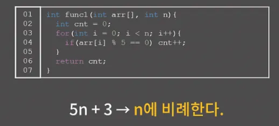
- 적당히 n번의 연산이 필요하다 → 좀 더 고생하게 말하면 n에 비례한다고 퉁쳐서 얘기

빠르게 캐치하는 방법

- 결국 위 코드는 n개의 수를 훑어보며 5로 나눈 나머지를 계산해보게 됨. 그러면 03,04,05번째 줄의 for문에서 n번에 걸쳐 5로 나눈 나머지를 확인하고 0과 일치하면 cnt를 증가시키는 행위를 하게 됨
- 굳이 위처럼 하나하나 뜯어보며 5n+3이라는 걸 알아내지 않더라도 n에 비례하겠거니 하고 충분히 생각할 수 있다.

</br>

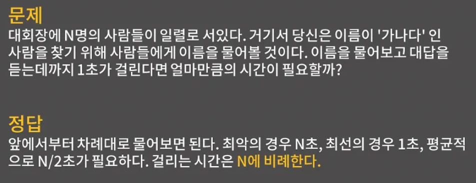
- 운이 좋으면 물어보자마자 바로 찾을 테니 1초이고, 최악의 경우는 ‘가나다’씨가 맨 뒤에 있을 경우 모든 사람한테 다 물어봐야하니 N초 이고, 평균적으로 대충 절반쯤 물어본다고 하면 ‘가나다’씨를 찾을 수 있을 텐디 N/2초
- 이렇게 걸리는 시간은 N에 비례한다는걸 알 수가 있다
- 사람이 100명이면 대충 50초 정도 걸릴거고, 사람이 10배 늘어나면 걸리는 시간도 10배 늘어나서 500초 정도 걸리게 될 것입니다.


</br>

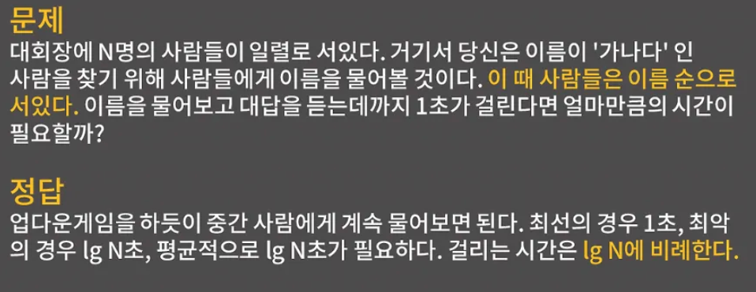
- 이름 순으로 서있다는 조건 1개 추가
- 업다운 게임을 떠올리면 된다
- 1에서 50 사이의 수에서 처음 하는 사람이 25를 부르는 것과 같이 N명의 사람들 중에서 가운데 있는 사람의 이름을 물었을 때 이름이 ‘바킹독’이어서 ‘가나다’ 보다 뒤에 있어야 하는 이름이면 앞쪽 그룹에 있음을 알 수가 있고 ‘가고일’과 같이 ‘가나다’보다 앞에 있어야 하는 이름이면 ‘가나다’는 뒤쪽 그룹에 있음을 알 수가 있으니까 후보군을 절반으로 줄일 수 있음
- 최선의 경우 → 맨 처음 물어본 사람이 ‘가나다’인 경우 이렇게 되면 1초만에 찾음
- 최악의 경우 → 한 명이 남을 떄까지 절반으로 계속 쪼개진느 상황
    - 그러니까 원래 100명이었다. 가운데 있는 사람의 이름을 물어봐서 50명을 남기고, 50명에서 또 가운데 있는 사람의 이름을 물어봐서 25명을 남기고 이렇게 25명, 12명, 6명, 3명 , 1명까지 도달하면 ‘가나다’를 찾을 수 있다
- 사람이 16명이면 4번, 32명이면 5번, 64명이면 6번 뭐 이런식으로 시간이 걸리니 log N에 비례한다는 것

로그에대해서 좀 더 알아보자
$$
x^2 = 16
$$
- x = -2, 2 그러나

$$
x^2 = 3
$$
- 이걸 만족하는 값은 유리수의 범위에서는 구할 수 없다.

$$
\sqrt{3}, \sqrt{-3}
$$

- 그래서 새로운 기호 루트를 서써 양수와 음수 형태로 밑으로 나타냄

$$
2^x=3
$$

- 실수 x의 값은 지금까지 우리가 알고 있는 수로는 나타낼 수 없다.
- 그래서 log 기호를 써서

$$
2^x = 3 == x = log_23
$$

- 이렇게 나타낸다

$$
2^3 = 8 == log_28
$$

로그는 거듭제곱의 역연산을 의미하는 함수이다.

- 이는 b를 y번 곱하면 x가 된다는 뜻

$$
log_bx = y (b를 밑(base)으로 하는 x의 로그)
$$


예제

$$
log_28= 3 -> 2^3 = 8

$$

$$
log_{10}1000 = 3 -> 10^3 = 1000
$$

</br>

다시 본문으로 넘어가서

- 밑이 2인 로그 이진 로ㅓ그만 나오기 때문에 로그는 해당 수가 2의 몇 거듭제곱인지를 의미함

log 2 = 1, log4 = 2, log 8 = 3, log 16 = 4, log32 = 5 이 정도만 이해하면 됨

그러니까 위에서 반으로 계속 나눈다는 개념에서 N에 어떠한 자연수에서 반이 되어야 하니 로그가 쓰인 거임

최선의 경우 1초,  최악의 경우 log N초인건 알겠는데 왜 평균적으로 log N인지는 이해가 안 갈수도 있다.

- 엄밀하게 수학적으로 기댓값을 계산해보면 (1-1/N)log N인데 1/N은 N이 커지면 커질수록 사실상 0에 가까운 값이니 그냥 log N초로 작성

</br>

위의 말을 좀 더 설명해보자

- 이진 탐색의 예로 들어보자
- 이진 탐색에서는 매번 탐색 공간이 절반으로 줄어들기 때문에 최악의 경우, 즉 찾는 값이 없거나 마지막 비교까지 진행하는 경우의 연산 횟수는 log_2 N이다.

**평균적인 경우 연산 횟수 (기댓값)**

평균적인 경우란 **랜덤한 위치에서 찾는 값이 존재할 확률을 고려하는 것** 즉, **이진 탐색의 기댓값을 계산**하는 과정

기댓값이란?

어떤 확률적인 사건이 발생했을 때, 그 사건의 기대되는 평균적인 값을 의미

**이진 탐색에서 기댓값을 구하는 과정**

이진 탐색에서는 **각 숫자가 탐색의 몇 번째 단계에서 발견될지를 확률적으로 고려**할 수 있다.

</br>

1. **각 숫자는 특정한 깊이에서 발견될 확률이 있음**
    
    예를 들어, 크기 N인 배열에서 어떤 숫자를 찾을 때
    
    - 루트 노드(첫 번째 비교)에서 발견될 확률: 1/N
    - 두 번째 비교에서 발견될 확률: 2/N
    - 세 번째 비교에서 발견될 확률: 4/N
    - …
    - kkk번째 비교에서 발견될 확률: 2(k−1)/N
2. **기댓값 공식 적용**
    
    기댓값의 정의에 따라, 모든 가능한 경우를 가중 평균하여 구하면:
    
    $$
    \sum_{k=1}^{\log_2 N} k \cdot P(k)
    $$
    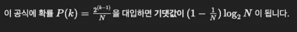

- 1/N 은 N이 커질수록 점점 작아지므로 **거의 0에 가까운 값**이 된다.
- 따라서 **실제 차이가 거의 없기 때문에** 그냥 log2N 으로 간략하게 표현하는 것

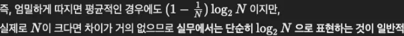

실제로 N이 크다면 차이가 거의 없으므로 **실무에서는 단순히 log_2N 으로 표현하는 것이 일반적**

</br>

다시 본문
- 이게 평균적으로 lg N 이런 거 안 중요하니 최악의 경우 log N이고 평균적으로도 log N초가 걸리나보다 하고 받아들이자.

</br>

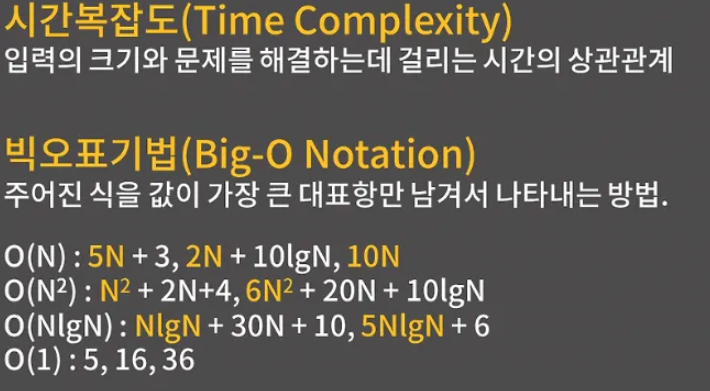
- 시간복잡도의 정의는 입력의 크기와 문제를 해결하는데 걸리는 시간의 상관관계를 의미
- 사람이 N명일 때 최악의 경우 N초가 걸렸고, 두 번째 문제에서는 log N걸렸음 이게 각 문제의 시간 복잡도

빅오표기법이라는 개념

- 빅오표기법은 주어진 식을 값이 가장 큰 대표항만 남겨서 나타내는 방법을 의미
- 빅오표기법을 수학의 입실론 델타라는 것을 이용해 정의하고 또 빅오 말고도, 스몰오, 빅/스몰 세타, 빅/스몰 오메가 라는 개념이 있는데 코테에서는 필요하지 않음

우리가 앞에서 “걸리는 시간이 N에 비례한다”, “log N에 비례한다” 라고 표현하게 바로 빅오표기법에서 하는 일

일단 5N+3을 보면 누가 봐도 N이 커지면 커질수록 3보다는 5N이 훨씬 큼 그래서 3을 버리고 5N만 냅두는데, 5N에서 5도 떼고 O(N)으로 나타냄

2N + 10logN에서도 N이 커지면 키질수록  10logN보다는 2N만 냅두고 상수 2를 떼서 O(N)으로 나타낸다.

N^2 + 2N + 4에서는 N^2이 2N과 4보다 훨씬 크니 O(N^2)이 된다.

NlogN과 N을 비교하면 아무래도 그냥 N보다는 LogN이 곱해진 NlogN이 더 클 것임 그래서 NlogN + 30N + 10은 O(N log N)이 된다.

마지막으로 값이 그냥 상수일 때에는 O(1)이라고 부른다.
</br>

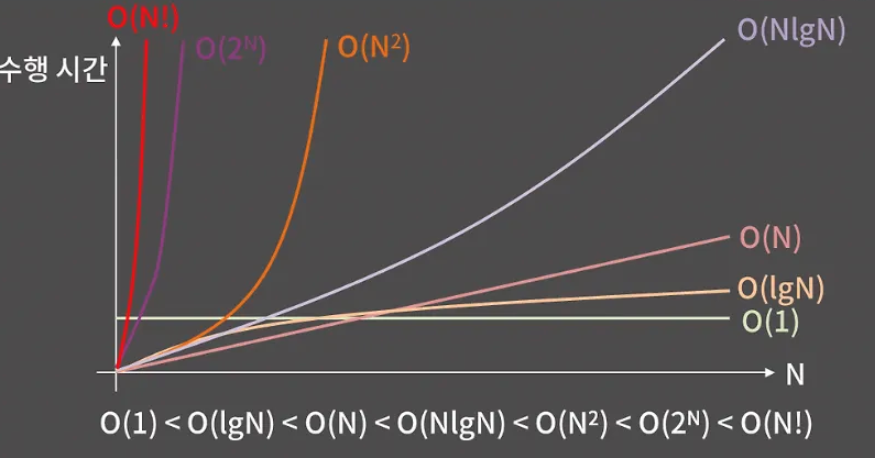
- 보통 시간복잡도를 표기할 때 빅오표기법의 형태로 나타냄.
- 맨 처음 코드로 제시했던 주어진 배열에서 5의 배수의 원소의 갯수를 찾는 문제는 시간복잡도가 O(N)이고, 사람들이 마음대로 서있는 대회장에서 ‘가나다’를 찾는 문제도 시간복잡도가 O(N)이고, 사람들이 이름순으로 서있는 대회장에서 ‘가나다’를 찾는 문제는 시간복잡도가 O(logN)이다 뭐 이런식

대표적인 시간복잡도를 그래프로 나타낸 것 

- 그래프만 봐도 N이 점점 커짐에 따라 시간복잡도가의 차이가 수행 시간에 아주 큰 여향을 준다는 것을 알 수가 있음
- 상수 시간인 O(1)이 가장 좋고, 그 다음으로  O(Log N)이고, 이후 O(N), o(N log N) 이렇게 된다.
- O(log N)은 로그 시간, O(N)은 선형 시간이라고 부르고
- O(log N)부터 O(N^2)까지와 같이 log N 혹은 N의 거듭제곱끼리의 곱으로 시간 복잡도가 나타내어지면 이를 다항 시간이라고 부른다.

O(2^n)은 지수 시간이고, N이 25이하 정도로 굉장히 작은 게 아니면 O(2^N)이 필요한 풀이는 시간 제한을 통과하기 힘들다. O(N!)에서 N!은 1부터 N까지 곱한 값으로, N 팩토리얼 이라고도 부른다. ex → 3! 1 X 2 X 3 = 6

팩토리얼은 지수 시간 보다 훨씬 더 가파르게 올라간다. 당장 12!만 해도 거의 5억이라 O(N!)이 필요한 알고리즘도 지수 시간과 비숫하게 N이 11이하 정도로 굉장히 작은 게 아니면 시간 제한을 통과하기 힘들다.
</br>


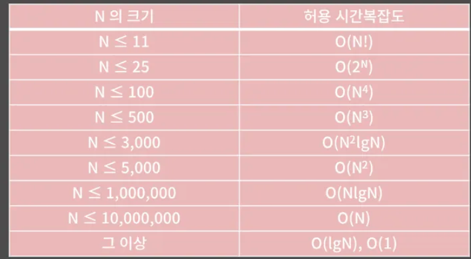
- 문제에서 주어지는 시간 제한은 대부분 1초에서 5초 사이 정도니까 입력 범위를 보고 문제에서 요구하는 시간 복잡도가 어느 정도인지 알 수가 있다.
- 주어진 배열을 크기 순으로 정렬하는 문제를 생각해보면 이 문제는 O(N log N)으로도 해결할 수가 있고 O(N^2)의 방법도 있다.
- N이 1000이하라면 둘 중 어는 것을 쓰더라도 눈 깜빡할 사이에 정렬이 완료되지만
- N이 100만이라면 O(N log N)은 1초 내로 정렬이 완료되는데 O(N^2)은 정렬이 완료될 때까지 거의 1시간 가까이 걸림.

이런 식으로 N의 크기에 따른 허용 시간 복잡도를 표로 나타낸 게 본문에 있는 표

- 물론 이 기준이 절대적인 거는 아니다
- N이 10,000인데도 O(N^2)이 통과될 수 있고, 반대로 복잡한 연산이 많은 경우 N이 1,000,000인데도 O(N log N)이 통과되지 않을 수 있다. 표는 대략적인 느낌만 가져가자
- 그러면 이제 우리가 문제를 풀 때 해야 할 일을 하나 더 알게 되었는데 주어진 문제를 보고 풀이를 떠올린 후에 무턱대고 바로 그걸 짜는 게 아니라 내 풀이가 이 문제를 제한 시간 내로 통과할 수 있는지, 즉 내 알고리즘의 시간복잡도가 올바른지를 꼭 생각해봐야한다.

- N이  500인데 O(2^N)풀이를 생각했다면 그 풀이는 절대 시간 제한 내로 답을 낼 수 없기 때문에 잘못된 풀이

</br>

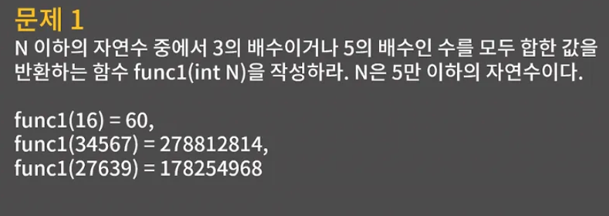
- 내 풀이의 시간복잡도를 어떻게 알 수 있느냐라고 했을 때 어떻게 보면 쉽고 어떻게 보면 어렵다.
- 뭐 대충 1부터 N까지의 수를 다 돌아야하면 O(N), 우리가 구구단을 구현하던 것처럼 이중 for문을 돌면 O(N^2) 이런식으로 느낌은 잡을 수도 있지만, 확실히 초보 단계에서 풀이나 코드의 시간복잡도를 알아내는 게 꽤 어려웠다는 얘기를 많이 들어서 같이 익혀보자
- 문제를 한 번 보자 N 이하 수 중에서 3의 배수이거나 5의 배수인 수를 모두 합한 값을 반환하는 함수를 구현해보자

```C++
int func1(int N){
  int ret = 0;
  for(int i = 1; i <= N; i++){
    if(i % 3 == 0 || i % 5 == 0) ret += i;
  }
  return ret;
}
```

이 코드의 시간복잡도는 얼마일까?

- for문에서 i가 1부터 N가지 돌며 3으로 나누어지는지, 5로 나누어지는지 그러니까 시간복잡도는 O(N)

</br>

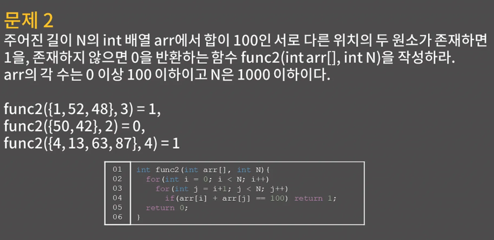
```C++
int func2(int arr[], int N){
  for(int i = 0; i < N; i++)
    for(int j = i+1; j < N; j++)
      if(arr[i] + arr[j] == 100) return 1;
  return 0;
}
```

- 무난한 방법은 이중 for문으로 모두 두 개의 쌍에 대해 합이 100인지 확인하는 방법
- 시간복잡도는 얼마일까?
- i가 0일 때 N-1개의 수에 대해 합을 100과 비교하고, i가 1일 떄 N-2개의 수에 대해 합을 100과 비교하고, 이런식으로 쭉쭉 가다가 i가 N-2일 때 1개의 수에 대해 합을 100과 비교하니 다 더하면 연산은 (N^2 - N)/2번 일어나고 이걸 빅오표기법으로 나타내기 위해 상수 떼고 더 낮은 항을 없애고 나면 O(N^2)인걸 알 수가 있다.

좀 더 상세 설명을 한다면

1. i는 0부터 N-1까지 증가하므로 총 N번 반복
2. j는 i+1부터 N-1까지 증가하므로 N-i-1번 반복
    1. 즉, i가 0일 때는 (N-1)번, i가 1일 때는 (N-2)번, …, i = N - 2일 때 1번 실행
- N - 2일 때 1번 실행에 대해 좀 더 알아보자

| `i` 값 | `j` 시작 값 | `j` 실행 횟수 (`N - i - 1`) |
| --- | --- | --- |
| 0 | 1 ~ N-1 | N−1  |
| 1 | 2 ~ N-1 | N−2 |
| 2 | 3 ~ N-1 | N−3 |
| ... | ... | ... |
| N−2N-2N−2 | N−1N-1N−1 | 1 |
| N−1N-1N−1 | 없음 | 0 |

즉, **`i = N-2`일 때, `j = N-1`에서 1번 실행**

**실행 횟수 예제**
코드를 직접 실행한다고 가정하고, 실행 횟수를 계산해보자

예를 들어, `N = 5`일 때 실행되는 `i, j`의 값과 실행 횟수

| `i` 값 | `j` 범위 | 실행 횟수 (`N - i - 1`) |
| --- | --- | --- |
| 0 | 1,2,3,4 | 4 |
| 1 | 2,3,4 | 3 |
| 2 | 3,4 | 2 |
| 3 | 4 | 1 |
| 4 | 없음 | 0 |

**총 실행 횟수**는:

4+3+2+1=10

이 패턴을 일반화하면, 

총 실행 횟수는 다음과 같다.

$$
\sum_{i=0}^{N-2} (N - i - 1)

$$

이를 전개하면, 실행 횟수는:

$$
(N-1) + (N-2) + (N-3) + \dots + 2 + 1
$$

**실행 횟수를 합하는 공식**

위에서 계산한 실행 횟수는 **등차수열의 합 공식 이용**

> 등차수열의 합 공식
> 
> 
> $$
> S= \frac{\text{항의 개수} \times (\text{첫 번째 항} + \text{마지막 항})}{2}
> $$
> 

여기서
- **첫 번째 항**: `1`
- **마지막 항**: `N-1`
- **항의 개수**: `N-1` (왜냐하면 `i=0`부터 `N-2`까지 반복)
    - 수열은 1부터 시작해서 N-1까지 감소하는 형태

공식에 대입하면:

$$
S= \frac{(N-1) \times N}{2}
$$

즉, 총 실행 횟수는:

$$
\frac{N(N-1)}{2}
$$

다시 본문

- 상수를 떼어내면 O(N^2)인 걸 알수가 있다

</br>

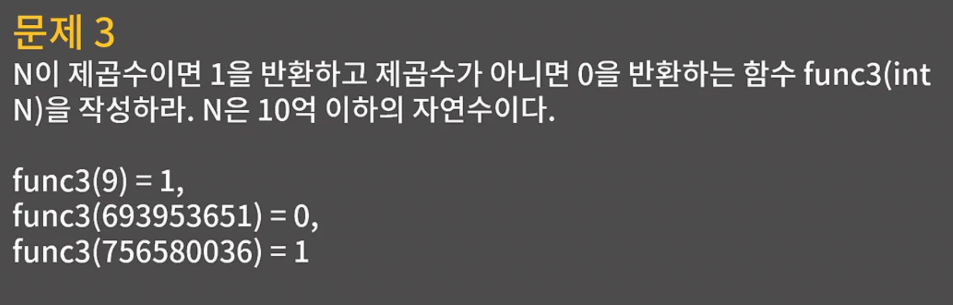
나

```C++
int func4(int N){
    int ans = 1;
    for (int i = 2; ans <= N; )
    {
        ans = ans * i;
    }
    ans = ans / 2;
    return ans;
}
```

</br>

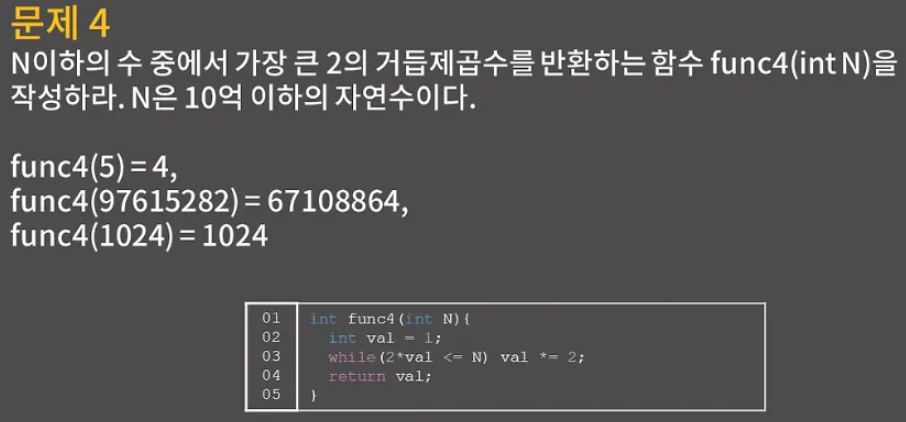
- 코드에서 val은 2의 거듭제곱이 저장되는 변수이다.
- 맨 처음에 1로 시작해서 1,2,4,8 이렇게 커지다가 val을 2배로 했을 때 N보다 커지게 되는 순간에 While문을 탈출해서 val을 반환하면 문제에서 요구하난 답을 구할 수 있게 된다.
- 시간 복잡도는 어떻게 될까
- N이 2^K 이상 2^K+1미만 이라고 할 while문 안에서 val은 최대 k번만 2배로 커진다.
- 그러고 나면 val은 2^k가 되고, 이후 2*val ≤ N이 거짓이 되기 때문
- 그러니까 N이 2^K 이상 2^K+1 미만이라고 할 때 시간복잡도가 O(k)이고 로그의 정의에 입각해서 생각할 때 k는 log N이니 결국 시간복잡도는 O(Log N)이 된다.

시간복잡도 상세 설명

- val은 처음에 1로 설정됨
- 루프가 실행될 때마다 val이 2배씩 증가
- val이 N을 넘지 않은 한 계속 반복됨

실행 횟수 계산
| 반복 횟수 | `val` 값 |
| --- | --- |
| 0 | 1 |
| 1 | 2 |
| 2 | 4 |
| 3 | 8 |
| 4 | 16 |
| ... | ... |
| k | 2k2^k2k |

루프가 언제 멈추는지를 확인하면, 루프는 **다음 조건을 만족할 때까지 반복됨**

$$
2^k≤N
$$

즉, **반복 횟수 kkk가 다음을 만족할 때 루프 종료**:

$$
2^k≤N
$$

양변에 **log를 취하면**,

$$
k≤log_2N
$$

즉, **반복 횟수 k는 O(log_⁡2N)에 해당**

2^k 이상 2^k+1 미만이라고 할 때 시간복잡도가 O(k)
이게 왜 O(k)?

주어진 조건
$$
2^k≤N<2^k+1
$$

- 이 조건을 다르게 해석하면, 어떤 자연수 N은 특정한 k에 대해 2^k 이상이고, 2^k+1 보다 작다는 의미 즉, k는 N을 만족하는 가장 큰 정수

k의 의미

우리는 보통 k를 로그로 표현할 수 있다

$$
k=⌊log_2N⌋
$$

즉 k는 N의 이진 로그를 내림한 값이다 따라서 “시간 복잡도가 O(k)이다” 라는 말은 결국 O(log_2N)이라는 것과 동일한 의미

왜 O(K)인가?

- 컴퓨터 과학에서 빅오 표기법을 사용할 때, 반복 횟수가 변수 k와 비례한다면 시간 복잡도는 O(k)라고 한다.

코드 관점에서 보면 val 1,2,4,8,16.. 처럼 2배씩 증가

즉 val = 2 ^ k 가 될 때 루프가 종료됨

루프의 반복 횟수를 k라고 하면 

$$
2^k≈N
$$

양변에 로그를 취하면

$$
k≈log_2N
$$

즉, 루프는 O(k)번 실행되며, **k 자체가 O(log⁡ N)이므로 시간 복잡도는 O(log⁡N)**

</br>

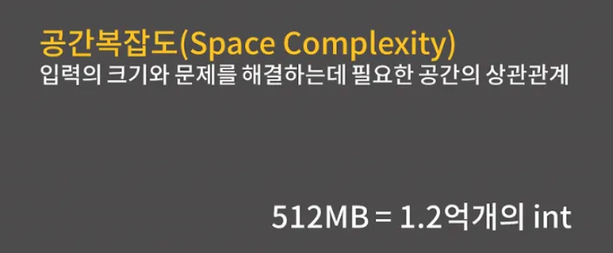
- 공간복잡도는 입력의 크기와 문제를 해결하는데 필요한 공간의 상관관계를 의미
- N짜리 2차원 배열이 필요하면 O(N^2)이고, 따로 배열이 필요없으면 O(1)이 된다.
- 그런데 코테에서 대부분의 경우 공간복잡도의 문제보다는 시간복잡도 때문에 문제를 많이 틀리게 도힌다. 그래서 크게 신경 안써도 된다

대신 문제를 풀 때 어떤 것 하나를 기억해두는 게 좋냐면 메모리 제한이 512MB일 떄 Int 변수를 대략 1.2억개 정도 선언할 수 있다는 것을 기억해두자

이건 int 1개가 4바이트라는 것을 이용해 계산할 수가 있다.

이걸 기억해두면 풀이가 크기가 5억인 배열을 필요로 할 떄 해당 풀이는 주어진 메모리 제한을 만족하지 못하므로 틀린 풀이라는 것을 빠르게 꺠닫고 다른 풀이를 고민할 수 있다.

</br>

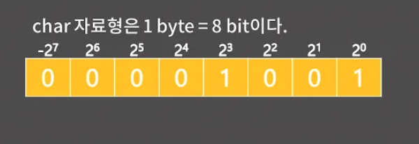
정수 자료형에 대한 설명을 배워보자

- C언어를 배울 때 char 자료형은 1 byte이다 라는 표현을 들어본적 있을 것이다. 그 의미에 대해서 명확하게 알고 있나?
- 1 byte는 8bit이니까 char 자료형의 값은 8개의 0 혹은 1이 들어가는 칸을 이용해 표현된다는 의미 이 8bit에 2진수 표기로 값이 들어가게 된다.
- 오른쪽부터 2^0, 2^1, 2^2 … , 2^6칸 인데 unsgined char에서는 제일 왼쪽이 자연스럽게 2^7이지만 char에서는 제일 왼쪽이 독특하게 -2^7이다.
- 이 부분이 이해가 잘 안가면 2’s complement라는 개념을 찾아봐도됨 굳이 이해하지 않아도 됨

</br>

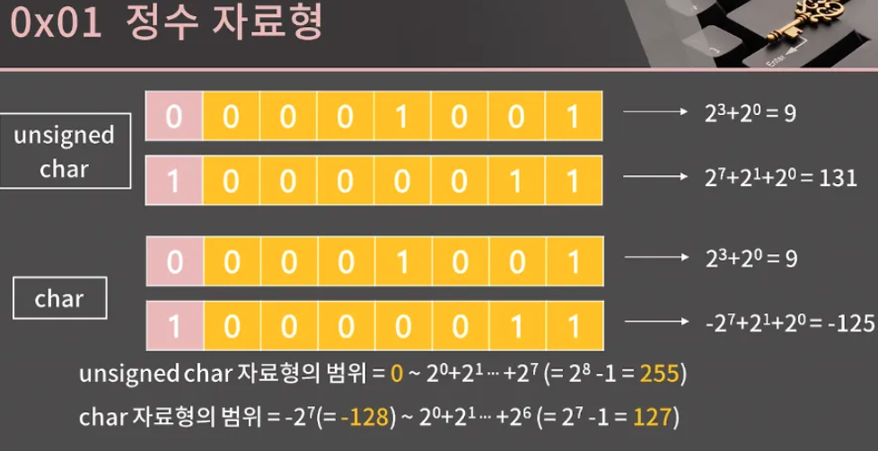
- unsigned chard와 char로 수를 표현하는 예시
- 10000011을 unsined char로 읽으면 131이고 char로 읽으면 -125가 된다.
- unsigned char로 표현할 수 있는 수의 최솟값과 최댓값을 고민해보면 최솟값은 00000000일 때 0일거고, 최댓값은 11111111일 때 255이다.
- char에 대해서 똑같이 표현할 수 있는 최솟값과 최댓값이 얼마일지 생각해보면 최솟값은 10000000일 때 -128일 거고, 최댓값은 01111111일때 127이다.

</br>

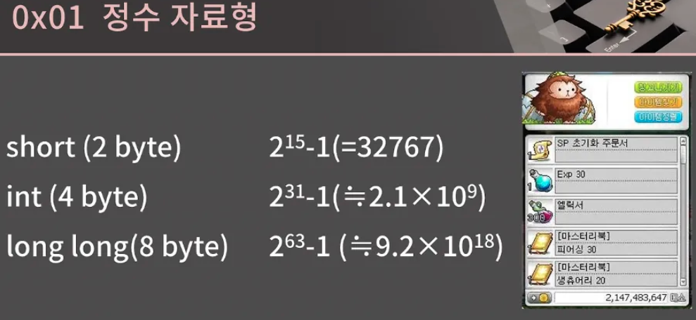
- 정수 자료형에는 char 말고도 short, int ,long long 자료형이 있다. 각각 2byte,  4byte, 8byte가 있다.
- char의 크기를 계산한 것과 비슷하게 각각이 표현할 수 있는 수의 최댓값을 확인하려면 32767, 대략   2.1×10^9(21억), 9.2×10^18까지 표현할 수 있습니다
- int의 최댓값인 21억이 살짝 익숙할텐데 요즘은 패치가 됐지만 옛날엔 메이플 최대 메소가 2^31-1인 2147483647
- 아무튼 short는 딱히 쓸 일이 없고, 정수를 표현할 때 주로 int나 long long을 쓰는데 int가 long long 보다 연산 속도와 메모리 모두 우수하지만 80번쨰 피보나치 수열을 구하는 문제와 같이 int형 자료형이 표현할 수 있는 범위를 넘어서는 수를 저장해야 하면 반드시 long long 자료형을 사용해야한다.

</br>

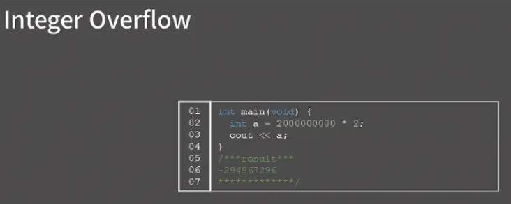
- integer overflow를 알아보자
- int가 대충 21억까지 표시할 수 있다고 했으니 20억에 2를 곱한 40억을 저장할 수 없는 건 알겠는데 -294967296은 어디서 나온 값인지 너무 뜬금없다.
- 이러한 현상이 → integer overflow이다. 이게 왜 생기는지 정확하게 이해하지 않고 그냥 각 자료형의 범위 안에서만 써야겠다 하고 넘어가도 상관은 없지만 ,원리를 알고 나면 코드의 오류를 좀 더 빠르게 찾을 수 있다. 어렵지 않아서 이해하고 가자

</br>

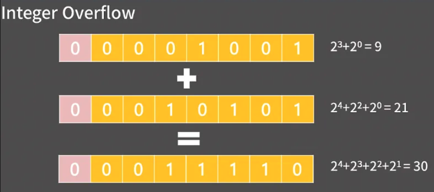
- 딱 한 줄로 요약하면 컴퓨터는 그냥 시킨대로 계산을 하기 떄문. 관찰을 위해 두 char 자료형의 수를 더해보자
- 9 + 21 = 30인건 당연하고, 그냥 이진수의 덧셈으로 생각해도 1001과 10101을 더하면 11110이 된다는 걸 알 수가 있다.

</br>

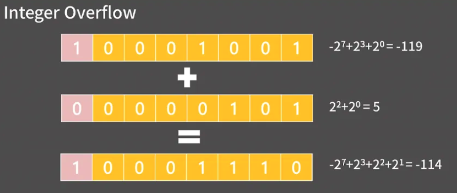
- 음수가 섞인 덧셈도 크게 고민할 것 없이 그냥 이진수의 덧셈으로 해결할 수 있다.
- -119를 char에 나타내면 10001001인데 -110+5는 -114이고 이진수의 덧셈으로 생각해도 10001001+101는 10001110이라 연산이 아주 정확하게 잘 된다.

</br>

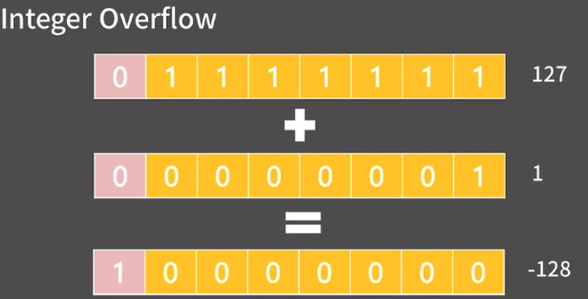
- 그런데 127에 1을 더하면 어떻게 되려나?
- 컴퓨터는 아무 고민도 하지 않고 시킨대로 계산을 하기에 01111111에 1을 더하면 10000000이 된다.
- 그리고 제일 앞의 칸은 -2^7의 칸이니 10000000은 -128이 되었다 이렇게 char에서 127+1=-128이 되는 걸 보았음 이게 Integer Overflow의 전부

</br>

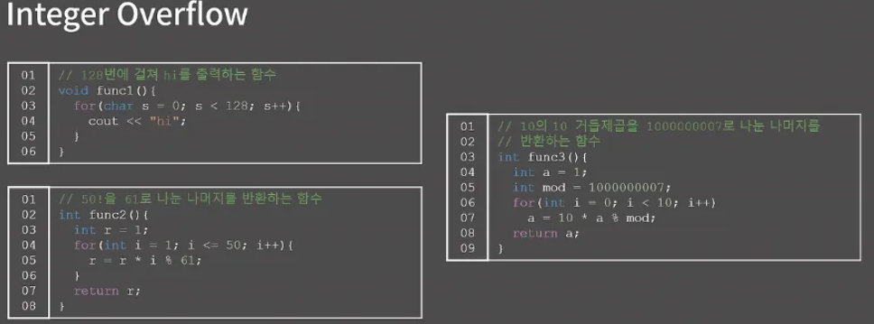
- 각 자료형의 범우에 맞는 값을 가지게끔 연산을 해서 막는다 하지만 실제 코드를 짜다보면 Interger Overflow는 아주 빈번하게 일어나고, 또 찾기가 정말 힘들다.
- 위 3가지 함수가 있는데 제대로 동작하지 않는 거는 func1과 func3이다.
- 우선 func1의 경우 s가 127이 된 후에 1이 더해질 때 127에서 1이 더해지면 -128이 되기 때문에 무한루프에 빠짐 → 해결하려면 char을 int로 바꾸어주어야됨
- func3의 경우 a가 10^9일 때 여기서 10이 곱해지는 순간 int의 최대 범위를 넘어서서 Integer Overflow가 발생 이걸 막으려면 a의 자료형을 long long으로 바꾸어야됨
- long long을 전부 쓰는 것도 하나의 방법이긴 하나 만약 문제에서 unsigned long long 범위를 넘어서는 수를 저장할 것을 요구하면 string을 활용해서 저장해야됨 그리고 그 수로 연산을 해야 하는 문제는 코딩테스트에 안 나오는 게 정상이긴 한데 만약 나왔다고 치면 Python을 쓰는 게 더욱 편하긴 함

</br>

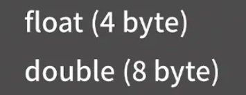
- 실수도 정수처럼 원리를 알고 있어야 정확하게 쓸 수가 있다
- 실수 자료형에는 float과 double이 존재
- float는 4 byte이고 double 8byte이다.
- 정수 자료형과 비슷하게 생각해보면 0 혹은 1이 들어가는 32칸 혹은 64칸으로 실수를 나타낸다는 것인데 어떻게 실수를 표현하는 걸까

</br>

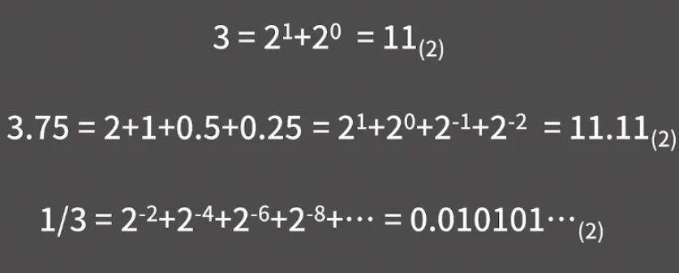
- 우선 2진수를 실수로 확장하는 것을 이해해야된다.
- 일단 3을 2진수로 나타내려고 한다면 3은 2^1+2^0이니까 2진수로 11이 된다. 이걸 실수로 확장해서 3.75를 2진수로 나타내보자

정수를 2진수로 바꿀 때 1,2,4,8 등등의 합으로 나타낸 것처럼 실수를 2진수로 바꿀 땐 0.5, 0.25, 0.125 등등의 합으로 나타내면 된다

3.75는 2+1+0.5+0.25이고 이건 곧 2^1 + 2^0 + 2^-1 + 2^ -2이니 3.75는 2진수로 11.11이 된다. 이와 같이 2의 음수 거듭제곱을 이용해 임의ㅢ 실수를 2진수로 나타낼 수 있다.

한편 10진수의 무한 소수와 같이 2진수에서도 무한 소수가 나타난다 

ex → 1/3은 2^0-2 + 2^-4 + 2^-6 이런식으로 끝없이 이어지기 때문에 2진수로 나타내면 0.010101.. 이렇게 된다.

</br>

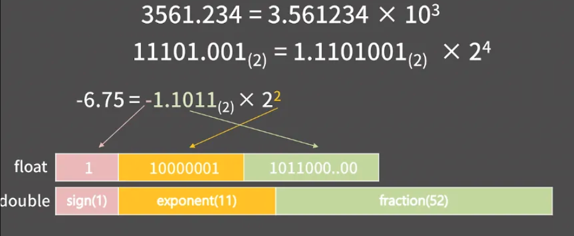
- 2진수에서의 과학적 표기법을 이해해야된다.
- 10진수에서 편의를 위해 3561.234 = 3.561234 x 10^3으로 나타낸 것처럼 2진수에서도 11101.001_(2) = 1.1101001_(2) x 2^4으로 나타낼 수 있다.

실수를 나타낼 때 칸은 sign, exponent, fraction field로 나누어진다. sign field는 해당 수가 음수인지 양수인지 저장하는 필드이고, exponent field는 과학적 표기법에서 지수를 저장하는 필드이고, fraction field는 유효숫자 부분을 저장하는 필드이다.

각 필드의 크기가 float은 1,8,23 bit이고 double 1,11,52 bit이다.

-6.75를 한 번보자

-6.75는 -1.1011_(2) x 2^2이다.

-6.75의 부호가 음수여서 sign 1이고 또 2의 2승이 곱해지니 지수는 2인데, float에서는 여기에 127을 더한 129를 exponent field에 기록한다. 참고로 129는 2진수로 10000001이니까 10000001이 기록된다. 왜 127을 더하냐면 이렇게 해줘야 음수 지수승도 exponent field안에 잘 넣을 수 있기 때문 double에서는 exponent field가 11칸이기 때문에 1023을 더한다.

마지막으로 fraction field에는 현재 1.1011인데 여기서 맨 앞의 1은 뺀 1011이 적힌다. 

맨 왼쪽부터 2^-1, 2^-2자리인 셈이라 필드에 101100…00이 적히게 된다. 그러니까 제일 왼쪽에서부터 채우는 거

이렇게 실수를 저장하는 방식 IEEE-754 format라고 부르니까 이해가 잘 가지 않는다면 추가적으로 검색 이걸 이해못해도 되지만 지금부터 공부하는 성질을 꼭 기억해두자.

</br>

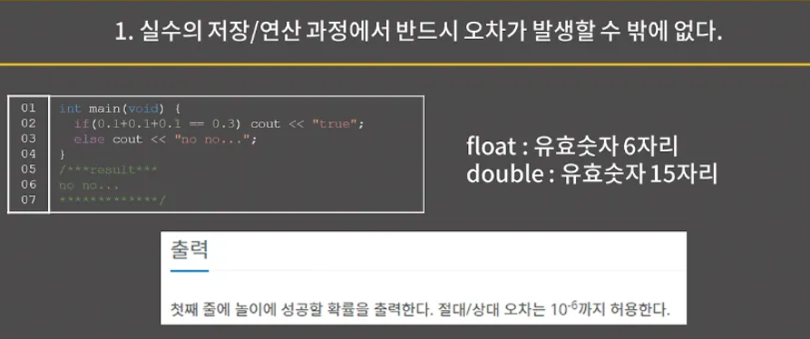
- 첫 번쨰로, 실수의 저장과 연산 과정에서는 반드시 오차가 생길 수 밖에 없다. 아주 대표적인 예가 이 코드인데 충격적이게도 0.1+0.1+0.1이 0.3과 다르다고 한다.

이게 왜 그런거냐면 유효숫자가 들어가는 fraction field가 유한이기 때문에 2진수 기준으로 무한소수인걸 저장하려고 할 떄에는 어쩔 수 없이 float은 앞 23bit, double은 앞 52bit까지만 잘라서 저장할 수 밖에 없다. 

0.1은 이진수로 나타내면 무한소수여서 애초에 오차가 있는 채로 저장이 됐고 그걸 3번 더하다 보니 오차가 더 커져서 말도 안 되는 일이 벌어진 거임

fraction field를 가지고 각 자료형이 어디까지 정확하게 표현할 수 있는지 보면 float은 유효숫자가 6자리이고 double은 유효숫자가 15자리이다. 이 말은 곧 float은 상대 오차가 10^-6까지 안전하고 double은 10^-15까지 안전하다는 소리

상대 오차가 10^-15까지 안전하다는 표현을 정확하게 이해할 필요가 있다. 원래 참값이 1이라고 할 때, 1-10^-15에서 1+10^-15사이의 값을 가진다는 게 보장된다는 의미 즉 오차가 생기는 것 자체는 막을 수 없지만 오차가 어느 정도인지는 알 수가 있다. 

상대 오차의 허용 범위에서 볼 수 있듯 두 자료형 끼리 차이가 굉장히 크기 때문에 실수 자료형이 필요하면 꼭 float 대신 double을 써야한다. float이 메모리를 적게 쓴다는 장점이 있으니까 메모리가 정말 소중하면 필요할 수도 있지만 적어도 지금까지 바킹독님은 double대신 float을 써야하는 상황을 경험해본 적이 없다.

또 실수 자료형은 필연적으로 오차가 있으니가 실수 자료형이 필요한 문제면 보통 문제에서 절대/상대 오차를 허용한다는 단서를 준다

그런데 만약 이런 표현이 없다면 열에 아홉은 실수를 안 쓰고 모든 연산을 정수에서 해결할 수 있는 문제

</br>

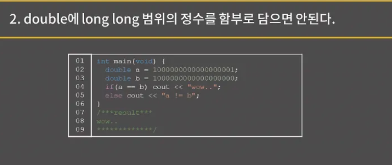
- dobule에 long long 범위의 정수를 함부로 담으면 안된다
- double은 유효숫자가 15자리인데 long long은 최대 19자리이니까 10^18+1과 10^18을 구분할 수가 없고 그냥 같은 값이 저장됨 즉 double에 long long 범우ㅡ이 정수를 담을 경우 오차가 썩인 값이 저장될 수 있다.
- int는 최대 21억이기 때문에 double에 담아도 오차가 생기지 않는다.

</br>

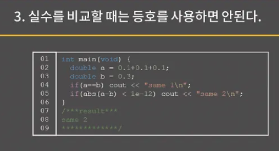
- 실수를 비교할 때는 등호를 사용하면 안 된다
- 0.1+0.1+0.1과 0.3이 일치하지 않았던 걸로 보았는데 오차 때문에 두 실수가 같은지 알고 싶을 때는 둘의 차이가 아주 작은 값 대략 10^-12이하면 동일하다고 처리하는 게 안전하다

5번째 줄에 1e-12 처음 보는 표현일 수 있지만 저게 바로 10^-12이라는 뜻 비슷하게 만약 10^9가 필요하면 1000000000이라고 써도 되긴 하는데 아무래도 이렇게 쓰면 0갯수를 세는 것도 힘들고 하니까 대신에 1e9라고 써도 된다. 

거듭 말하지만 sign field니 exponent field니 하는 IEEE-754 소수 표현법은 많이 헷갈리면 이해를 미뤄도 된다 

하지만 지금 이 실수 자료형의 3가지 성질은 꼭 알고 가셔야 나중에 "컴퓨터가 미쳤어!"라고 하며 샷건을 칠 일이 없어진다

강의 출처

https://blog.encrypted.gg/922