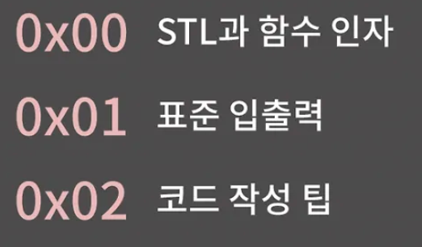
- 실제로 코드를 짤 때 주의해야 하는 점들

 

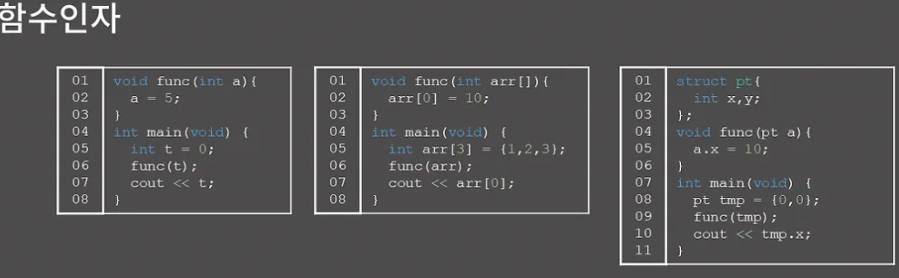
- 첫 번째로 C언어 공부를 제대로 하셨는지 점검을 한 번 해보자
- 3개의 코드를 보고 출력을 예측해보자.
- 함수의 인자로 int / int 배열 / 구조체를 실어보내서 값을 바꿨을 때 원본의 값이 바뀌는지를 물어보는 것입니다.

 

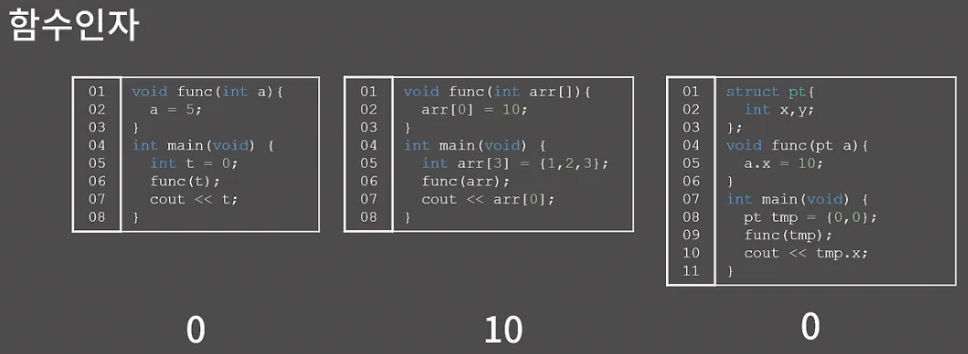
첫 → 0

두 번째 → 10

세 → 0

- 첫 번쨰는 int를 함수 인자로 보내면 값이 복사돼서 넘어감 그러니까 함수에서 값을 바꾸더라도 main의 변수 t에는 아무런 영향을 주지 않는다.
- 두 번째는 arr[0]이 바뀌게 되는데, func에 int 배열 arr를 인자로 주는게 arr의 주소를 넘겨주는 것이니 arr[0]을 func 함수에서 바꾸면 원본의 값도 바뀜
- 세 번째는 구조체의 경우 int랑 비슷하게 그냥 값이 다 비슷하게 복사되기 때문에 func 함수에서 값을 바꿔도 원본에는 영향을 주지 않는다.

써놓은 저 설명 자체가 이해가 안간다고 하면 C언어의 함수 인자와 포인터 부분을 따로 복습을 좀 하실 필요

 

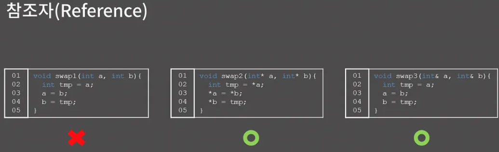
- 두 변수를 swap하는 함수를 만는 방법
- swap1 함수는 제대로 동작하지 않는다. 원본 2개를 바꾸고 싶은데 복사된 2개를 바꾼다고 하면 의미가 ㅇ벗다
- swap2 함수처럼 포인터를 보내서 두 변수의 값을 바꿀 수가 있다
- C++에서는 해결법이 한 개 더 있는데, 바로 참조자(reference)이다. swap3 함수를 보면 함수 인자인 a와 b의 type이 int가 아니고, int 뒤에 &가 붙어있는 것을 볼 수가 있다 a와 b는 int reference인 것이다.
- a와 b를 참조자로 만들면 함수 내의 코드에서는 그냥 int를 쓰듯이 tmp에 a를 대입하고, a에 b를 대입하고 하는데 저게 다 원본을 바꾸는 것

참조자는 C에서의 포인터랑 거의 비슷한 기능을 하지만 포인터에서 Null pointer에 값을 넣는다거나 type이 다른 걸 마음대로 캐스팅 한다거나 하는 문제들을 덜 할 수 있게 하는 패러다임인거고, 지금이 C++시간은 아니니까 이 정도만 다루자

 

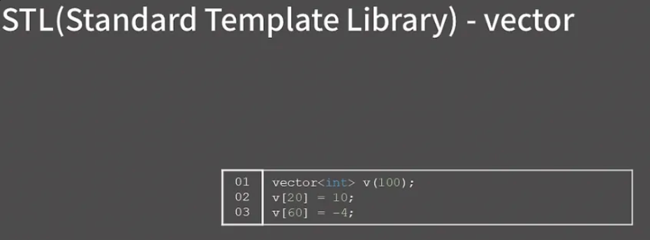
- STL을 좀 다뤄보자
- STL은 C++에서 제공되는 라이브러리로, C++을 입문한지 얼마 안 되었다고 하더라도 STL이라는 단어 단어 자체는 들어보았을 것이다.
- C++에는 미리 다양한 알고맂므과 자료구조가 STL에 구현되어 있어서 우리는 필요한 자료구조를 직접 구현할 필요가 없어 그냥 STL에서 가져다 써서 사용

 

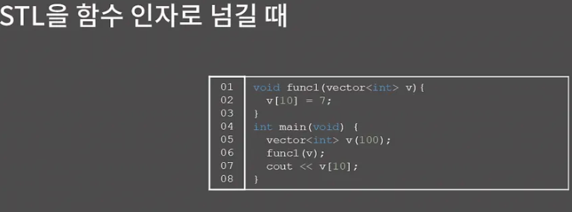
- STL을 함수 인자로 넘길 떄 어떤 일이 생길까?
- 코드를 보면 100칸 자리 0으로 초기화된 vector v를 선언하고 func1을 호출한다 func1에는 v[10]을 7로 바꾼다. 그 다음에 v[10] 출력하면 어떻게 될까?

 

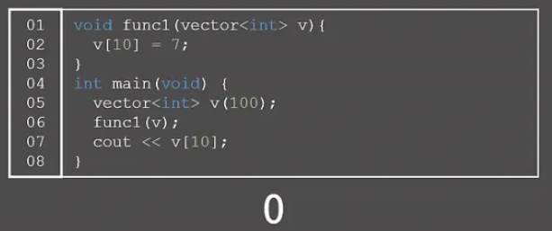
- 답은 0이 나오게 된다
- STL도 구조체랑 비슷하게 함수 인자로 실어 보내면 복사본을 만들어서 보내기 때문에 func1함수에서 바꾼건 원본에 영향을 주지 않는다.

 

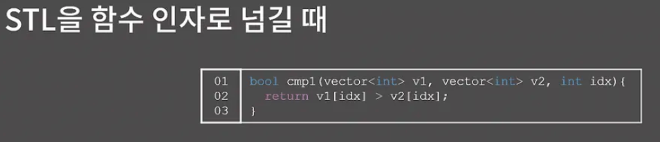
- 그냥 STL을 썡으로 함수 인자에 넣으면 복사해서 보낸다는 걸 꼭 유의하자
- 이 사실을 머릿속에 넣어두고 cmp1 함수를 한 번 확인해보자

이 함수가 뭐하는 함수인지 쉽게 알 수 있을 텐데, 두 vector를 인자로 넘겨 받아 idx 번쨰 원소의 값을 비교한 결과를 반환하는 함수. 두 vecotr의 크기가 N이라고 할 때 이 함수의 시간복잡도는 얼마일까?

- 충격적이게도 O(N)이 된다. 아니 함수 안에 연산을 딱 1번만 하는데 O(N)이라는 게 무슨 말도 안 되는 소리냐고 생각이 들 수 있지만 v1, v2를 인자로 실어서 보낼 떄 원본으로부터 복사본을 만드는 비용을 생각하지 못하고 있다는 것
- v1, v2의 크기가 N이니가 N개의 원소들을 하나하나 복사하는 과정은 O(N)이 든다. 그래서 이 함수는 의도하지 않게 시간복잡도가 O(N)이 된다.

 

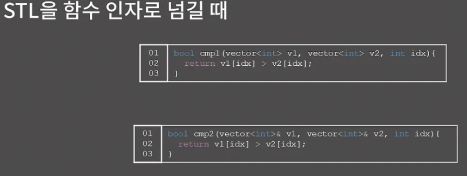
우리는 그냥 idx 번쨰의 원소의 값만 비교하고 싶은데 매번 vector를 복사하는 건 정말 말이 안 되는 일이다. 이럴 때 참조자를 사용하면 된다

- cmp2 함수에서는 v1,v2의 type vector의 reference로 만들었다 그러면 cmp2 호출될 때 복사본을 따로 만들어내지 않고 참조 대상의 주소 정보만 넘기기 떄문에 시간복잡도는 의도한대로 O(1)이 된다.

- 표준 입출력에 대해 공부해보자.
- C에서는 scanf/printf로 입력과 출력을 처리하고 C++에서는 cin/cout을 사용하는데 기능 별 차이가 없다
- scanf/printf에서는 C++ string을 처리할 수가 없다. C에서는 문자열을 char*로 다루는데 사실 char*보다 C++ string이 월등하게 편하다 그래서 scanf/printf를 쓰면서도 C++ string을 활용하고 싶으면 일단 char*으로 입력을 받고 string으로 형 변환을 해서 원하는 작업을 다 끝낸 후에 c_str() 메소드를 이용해 출력하면 된다.

 

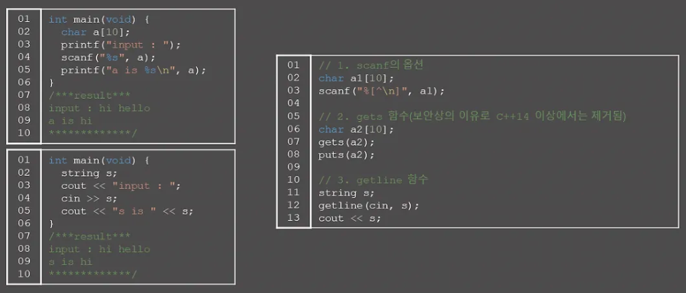
scanf를 쓰든 cin을 쓰든 주의할 것

- scanf와 cin 모두 공백을 포함한 문자열을 입력을 받을때 굉장히 껄끄럽다.
- 둘 다 공백 앞까지만 입력을 받기 떄문이다

해결책

1. 첫 번째 scanf에서 줄바꿈(\n)이 나오기 전까지 입력을 받는다는 걸 명시하는 방식 → 이건 외우기가 너무 힘들 듯,,
2. gets 함수를 사용하는 건데 보안상의 이유로 C++ 14이상에서는 제거됨 → 이것도 별로
3. getline을 이용 제일 깔끔 대신 이건 type C++ string 이어야함

공백이 포함된 문자열을 받아야할 때 단순히 scanf나 cin을 쓰면 안 된다는 걸 기억하자

 

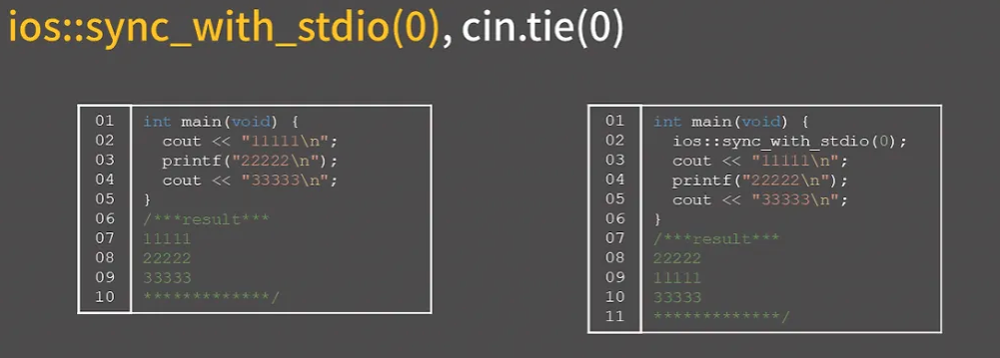
scanf/printf에서는 신경을 안 써도 되는데 cin/cout에서는 꼭 주의할게 있다

- cin/cout은 입출력으로 인한 시간초과를 막기 위해서 ios::sync_with_stdio(0), cin.tie(0)이라는 두 명령을 실행시켜야한다
- 이걸 안 해두면 입/출력 양이 많을 때 시간초과가 날 수 있다. 두 명령이 뭐하는 명령인지 몰라도 상관은 없지만 알아서 나쁠 건 없으니 알아보자

기본적으로 scanf/printf 등에서 쓰는 C stream과 cin/cout 등에서 쓰는 C++ stream은 분리가 되어 있다. 그런데 지금 코드처럼 printf와 cout을 번갈아하며 사용하는 상황을 생각해보면 사용자 입장에서는 C stream과 C++ stream이 분리되어 있고 어쩌고 하는 내용이 다 알빠가 아니고 그냥 11111,22222,33333이 차례대로 나오는 게 정상일 것이다.

이렇게 코드의 흐름과 실제 출력이 동일하기 위해서 기본적으로 프로그램에서는 C++ stream과 C stream을 동기화하고 있다. 그런데 내가 C++ stream만 쓸거면 굳이 두 stream을 동기화하고 있을 필요가 없게 된다. 쓸데 없이 시간만 잡아먹으니까

그렇기 때문에 C++ stream만 쓸거면 동기화를 끊어버려서 프로그램 수행 시간에서 이득을 챙길 수 있고, 동기화를 끊는 명령어 sync_with_stdio(0)이다. 

대신 동기화를 끊었으면 절대 cout과 printf를 섞어서 쓰면 안 된다. 섞어 쓰면 위처럼 출력 결과가 꼬이게 된다.

참고로 Visual Studio 2017/2019에서는 sync_with_stdio를 그냥 무시하고 무조건 동기화를 유지하고 있어서 혹시 실습을 VS 2017/2019에서 진행한다면 오른쪽 코드도 그냥 11111 22222 33333으로 출력이 나올 것이다 하지만 채점 서버는 gcc이기 때문에 분명히 차이가 있다.

두 번쨰 명령인 cin.tie(0)을 이해라려면 버퍼라는 개념을 알아야된다.

그런데 버퍼가 각 잡고 강의하면 거의 30분은 들여서 설며하는 거라서 좀 간략하게 알아가자

 

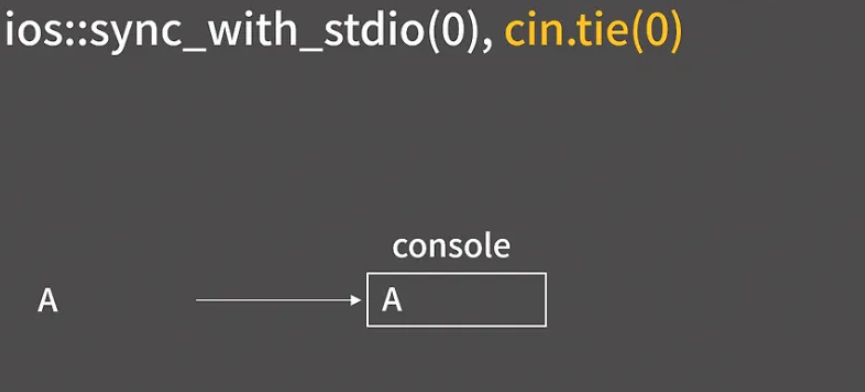
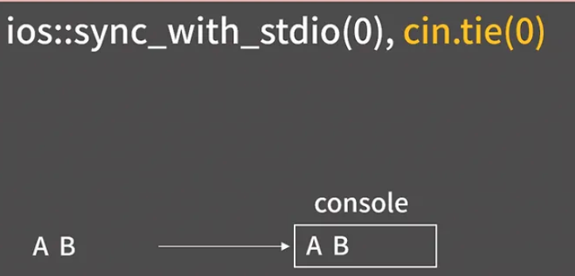
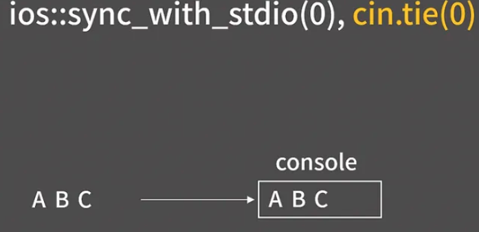
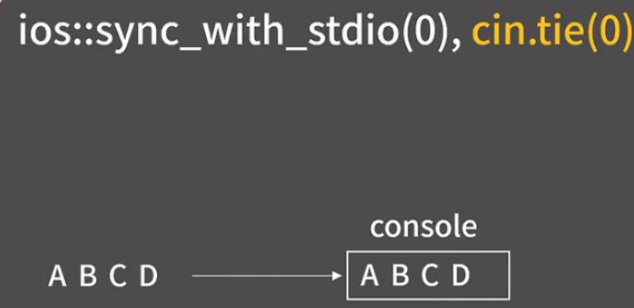
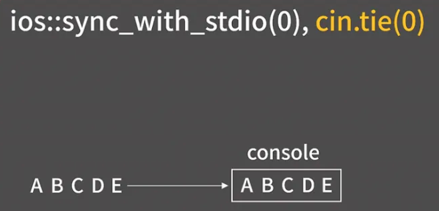
화면에 아무 글자나 출력을 하는 걸 생각해보면 우리는 별 생각 없이 cout으로 출력을 찍지만 사실은 위와 같이 한 글자가 바로 화면에 보이는 게 아니다.

 

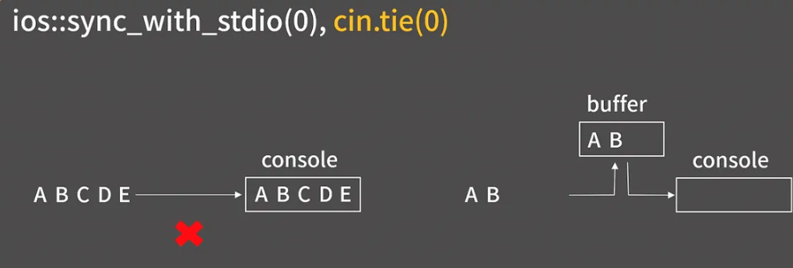
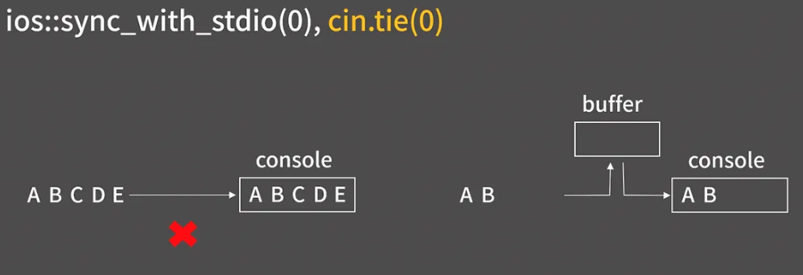
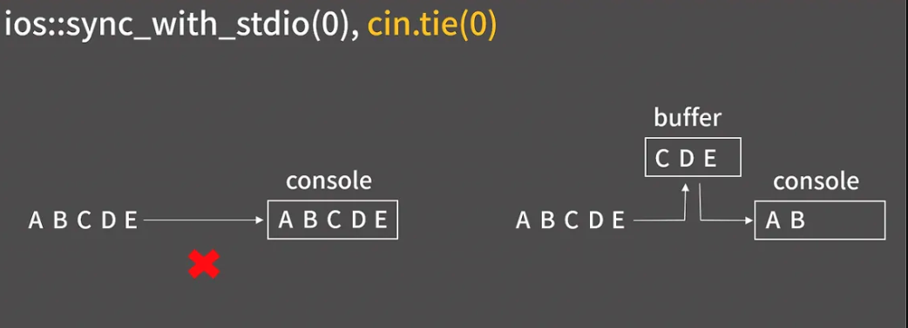
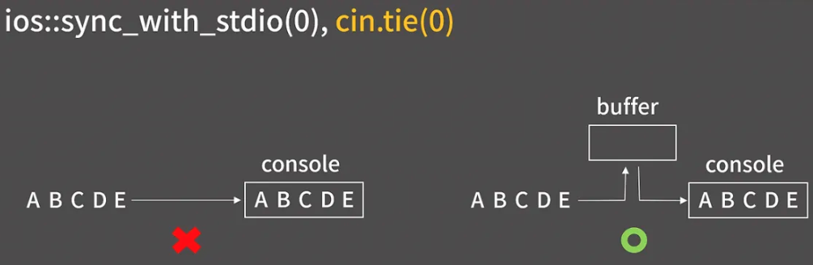
- 출력 버퍼라는 곳에  문자가 ㅇ미시로 저장되었다가 버퍼가 지워지면 화면에 보이는 것
- 출력에서 버퍼가 있는 것처럼, 입력에서도 버퍼가 있어서 키보드로 받은 입력을 바로바로 넘겨주지 않고 버퍼에서 어느 정도 모았다가 준다.

 

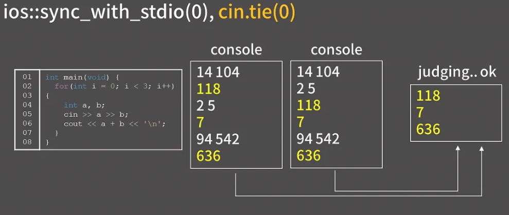
- 그런데 입력과 출력이 번갈아나오고 그게 한 화면에서 다 보여질 경우에는 버퍼의 존재로 인해서 순서가 꼬여버릴 수 있다.
- 지금 이 코드를 보면 3번에 걸쳐 두 수를 입력 받고 합을 출력하는데 우리는 당연히 순서에 맞게 콘솔에 나타나기를 원한다 그런데 예를 들어 6번 줄에서 “118\n”이란 출력을 하라고 했을 때, 바로 출력이 되지 않고버퍼에 들어있다가 “2 5”를 입력한 후에 출력이 되면 순서가 꼬일 것이다.

이런 현상을 막으려고 기본적으로 cin 명령을 수행하기 전에 cout 버퍼를 비워준다. 버퍼를 비우면 자연스럽게 “2 5” 입력이 들어오기 전에 118이 출력 될 거고 또 “94 542”입력이 들어오기 전에 7이 출력 되어서 순서가 꼬이지 않게 된다. 

그런데 온라인 저지 사이트에서는 채점을 할 때 그냥 출력 글자만 확인을 한다 그렇기 때문에 콘솔 창에서 입력 글자와 출력 글자 사이에 순서가 꼬인다고 해도 채점에 아무런 영향을 주지 않고 두경우 모두 다 정답 처리가 된다.

굳이 cin 명령을 수행하기 전에 cout 버퍼를 비울 필요가 없다는 것을 알 수가 있다 그래서 cin 명령을 수행하기 전에 cout 버퍼를 비우지 않도록 하는 코드가 cin 명령을 수행하기 전에 cout 버퍼를 지우지 않도록 하는 코드가 cin.tie(nullptr)인거고, 엄밀히는 type을 지켜서 nullptr로 쓰는 게 좋지만 그냥 0으로 쓴다

sync_with_stdio, cin.tie 명령에 대해 설명을 드렸는데 잘 이해가 안가면 cin/cout을 쓸 땐 반드시 저 두 명령을 넣어줘야한다고만 받아들이고 넘어가도 된다. 그리고 sync_with_stdio를 쓴 이후로는 무조건 cin/cout만 쓰고 printf/scanf를 쓰면 안된다는 것도 꼭 기억하

 

- endl 절대 쓰지 마라
- 이게 개행문자를 출력하고 출력 버퍼를 비워라는 명령
- 어차피 저지는 프로그램 종료될 때 출력이 어떻게 생겼는지를 가지고 채점을 진행하니까 중간 중간 버퍼를 비우라고 명령을 줄 필요가 전혀 없다.
- 개행 문자 출력하셈

 

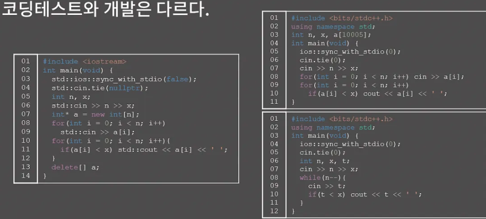
- 코딩테스트와 개발은 다르다는 것을 꼭 기억
- [BOJ 10871번 : X보다 작은 수](https://acmicpc.net/problem/10871) 문제를 통해서 표현의 의미를 한 번 이해해보자

문제를 보면 N개의 정수를 입력받아서 싸바싸바 해야 하는데 실제 개발을 오래 했던 사람들은 코드를 아주 정교하게 짜려고 하는 경우가 있다. 

대충 왼쪽 코드와 같은 방식인데 일단 필한 헤더만 include 했고, 딱 크기에 맞게 N칸 짜리 배열을 잡은 후 해제까지 함 아주 깔끔함

그런데 코테는 내가 헷갈리지 않는 범위 안에서 어떻게든 타이핑을 아낀느 게 최고이다. 그래서 오른쪽 위와 같이 바킹독님은 짤 것이다. 

왼쪽같은 코드를 선호하시는 분들은 기겁을 하실 수도 있다.

- 또 현업이었다면 코드리뷰에서 대차게 까일 것입니다.
- "아니 cin/cout만 쓰면서 온갖 헤더를 다 include할거야?", "sync_with_stdio는 bool 자료형을 인자로 받는데 왜 0을 넣어?", " 왜 전역에 다 때려박아?", "배열 크기는 왜 5를 더 크게 받았어?" 등등…

그런데 코딩테스트의 목표는 남이 알아볼 수 있는 클린코드를 작성하는게 아니다. 어떻게든 제한된 시간 안에 정답을 받아야한다.

좀 더럽더라도 내가 빠르게 짤 수 있는 방식으로 빠르게 구현하는게 훨씬 더 중요

 

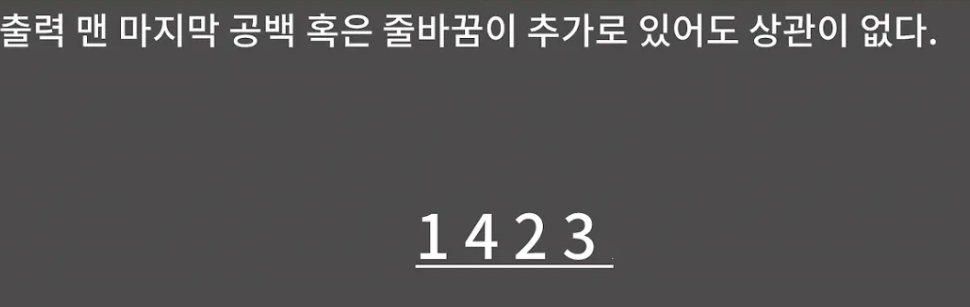
- 력 맨 마지막에 공백 혹은 줄바꿈이 추가로 있어도 상관이 없다.

 

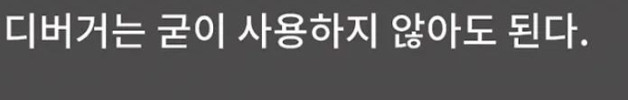
- 또 구현을 끝냈는데 예제에 대해 답이 올바르게 나오지 않을 때 코드의 어디가 잘못됐는지 알고 싶어서 디버거를 이용하는 경우가 간혹 있는데 사실 코딩테스트의 코드는 끽해야 100줄 전후 길이일 것
- 이때 디버거를 켜면 뭔가 꼬이고 늪에 빠져드는 것과 같은 느낌을 받을 떄가 있어서 차라리 중간 변수를 보고 싶으면 cout이나 printf로 출력을 찍어서 확인하고 디버거는 굳이 사용안 하는 것을 권장
 

