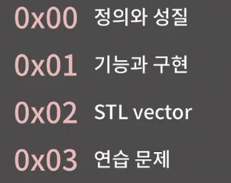

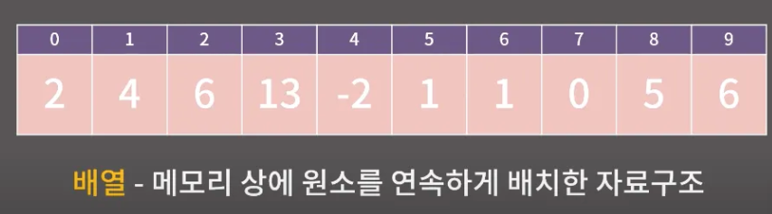
- 배열은 메모리 상에 원소를 연속하게 배치한 자료구조
    - 원래 C++에서는 int arr[10];으로 배열을 선언한 뒤에는 arr의 길이를 변경하는 게 불 가능하지만 자료구조로써의 배열에서는 길이를 마음대로 늘리거나 줄일 수 있다고 생각하자

</br>

배열의 성질
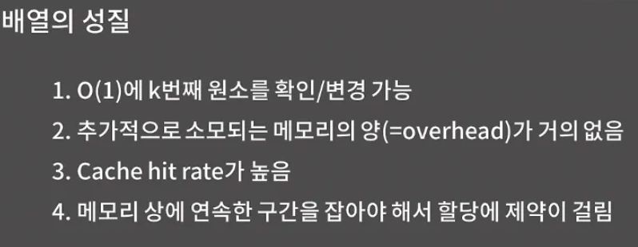
- 메모리 상에 원소를 연속하게 배치한 자료구조이라서  O(1)에 k번째 원소를 위치를 바로 계산 가능
    - 시작 주소에서 k칸 만큼 오른쪽으로 가면 되기 때문 그렇기 때문에 k번째 원소를 O(1)에 확인하거나 변경 가능
- 메모리는 다른 자료구조와 다르게 추가적으로 소모되는 메모리의 양이 거의 없다
    - 추가적으로 소모되는 메모리의 양(=overhead)이 거의 없음
- 메모리 상에 데이터들이 붙어 있으니까 Cache hit rate가 높음
- 메모리 상에 연속한 구간을 잡아야 해서 할당에 제약이 걸림.

1번 성질은 너무 당연하게 했던 성질이고 2,3,4번 성질은 굳이 신경쓰지 앟아도 코테를 칠 떄에는 별로 상고 상관이 없다

</br>

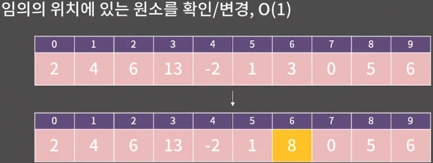
1. 임의의 위치에 있는 원소를 확인하고 변경하는 연산 → O(1)

### 시간 복잡도 O(1)의 의미

- O(1) (상수 시간)이란 입력 크기 N과 무관하게 일정한 시간 내에 연산이 끝나는 경우르르 의미
- 즉, 연산의 실행 시간이 데이터 개수 N에 비례하지 않고, 항상 일정한 경우 O(1)
```C++
int arr[100];  // 크기가 100인 배열 선언
int size = 5;  // 현재 배열에 저장된 원소 개수

arr[size] = 10;  // 끝에 10을 추가
size++;           // 배열 크기 증가
```

여기서 실행되는 연산을 보면:

1. **배열의 끝(index = `size`)에 값을 대입** → `arr[size] = 10;`
    - 배열의 특정 인덱스에 접근하는 것은 **메모리 주소 연산**이므로 **시간이 일정**함.
2. **배열 크기 증가** → `size++`
    - 정수 하나를 증가시키는 연산은 항상 일정한 시간이 걸림.

위 과정에서, **반복문이나 추가적인 연산이 필요하지 않으므로, 수행 시간은 입력 크기 N과 상관없이 항상 일정**합니다.

따라서, **배열 끝에 원소 추가 연산의 시간 복잡도는 O(1)** 입니다.

</br>

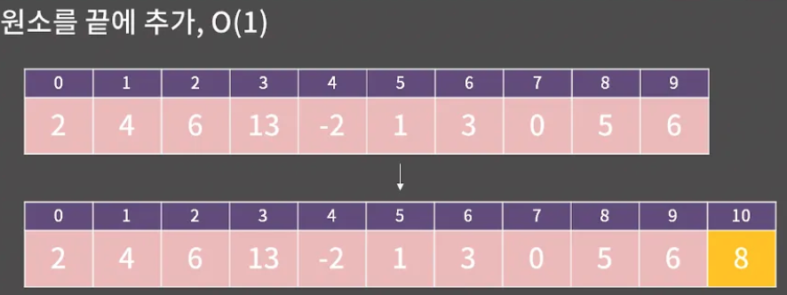
1. 원소 추가 변산 → 끝자리에 값을 쓰고 길이를 1증가 → O(1)

</br>

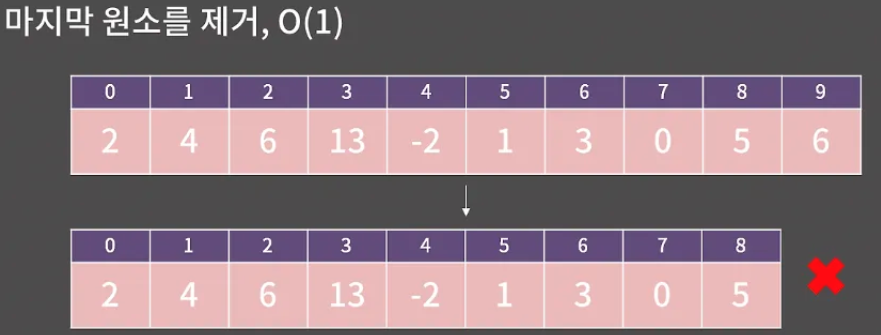
1. 마지막 원소 제거 → 길이 1 줄이면 됨 O(1)


</br>

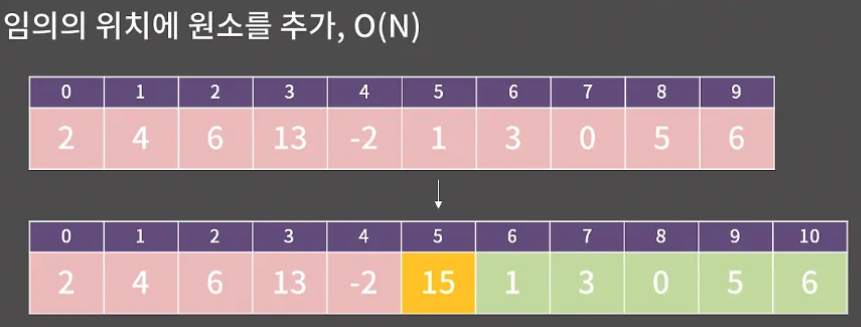
1. 임의의 위치 원소를 추가 → O(N)
- 지금 보면 5번에 15를 추가 했는데 이렇게 되면 그 두의 원소들을 전부 한칸씩 밀어야해서 O(N)이 필요하다
- 추가하는 위치가 끝에 가까울수록 시간은 줄어들고 앞에 가까울수록 시간은 늘어날테지마 평균적으로 N/2개를 밀어야하니  O(N)이라고 해도 상관없다.


```java
int arr[6] = {1, 2, 4, 5, 6};
int size = 5;  // 현재 배열의 크기
```

만약 **인덱스 `2`에 새로운 값 `3`을 삽입**하려면,

1. **배열의 마지막 요소부터 한 칸씩 뒤로 이동**

```java
원래 배열:   [1, 2, 4, 5, 6]
4,5,6을 뒤로 이동: [1, 2, _, 4, 5, 6]
```

1. 삽입 위치에 값 3을 넣음

```java
[1, 2, 3, 4, 5, 6]
```

- 이때 이동해야 하는 원소 개수는 삽입 위치에 따라 달라지며, 최악의 경우 O(N)개의 이동 연산 필요

### **최악의 경우**

- 만약 **배열의 맨 앞(인덱스 0)에 원소를 추가**하면,
    - 기존의 모든 원소를 **한 칸씩 뒤로 이동해야 하므로 총 N번 이동**.
    - 따라서 **시간 복잡도는 O(N)**

### **최선의 경우**

- 만약 **배열의 맨 끝(인덱스 `N-1`)에 원소를 추가**하면,
    - 단순히 마지막에 값을 추가하면 되므로 **이동이 필요 없고 O(1)**.

### **평균적인 경우**

- **삽입 위치가 배열의 중간(약 N/2번째)라면, 평균적으로 O(N/2)=O(N) 정도의 시간이 걸림**.

따라서 **임의의 위치에 원소를 삽입하는 연산의 시간 복잡도는 최악의 경우 O(N)이 된다.**

</br>

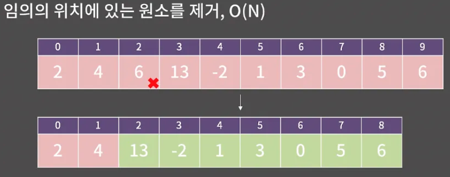
- 임의의 위치에 원소를 제거하는 것도 O(N)이 된다.
- 2번 원소를 지웠다고 치면 그 이후에 있던 모든 원소들을 한 칸씩 땡겨와야해서 그렇다
- 그냥 다 내버려두고 2번 원소만 비워두면 안 되냐고 생각할 수도 있지만 그렇게 되면 더 이상 메모리 상에 원소가 연속해서 존재하지 않기 떄문에 배열의 정의에도 위배되고 또 K번째 원소를 O(1)에 찾을 수가 없다

</br>

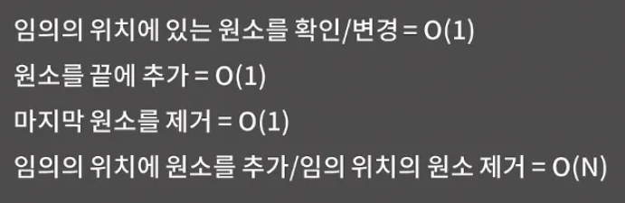
- 임의의 위치에 있는 원소를 확인하거나 변경하는 건 O(1)
- 마지막 원소를 제거 하는 것 O(1)
- 임의의 위치에 원소를 추가하거나 임의 위치에 원소를 제거하는 건 O(N)

이제 각 기능들을 직접 구현 해보자 위의 3개는 크게 어려움이 없을 것 같고 임의의 위치에 원소를 추가하는 것과 임의 위치의 원소를 제거하는 걸 해볼까 한다.

</br>

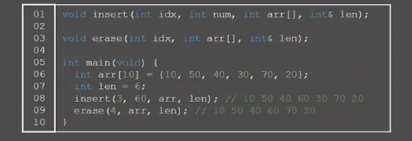
- insert 함수는 idx 번째 위치에 num을 넣을 것이다. 원래 idx 번째와 그 뒤에 있던 원소들을 자연스럽게 한 칸씩 뒤로 이동하게 된다.
- {10,50,40,30,70,20}에서 3번쨰 60을 넣는다면 30,70,20이 한 칸씩 뒤로 밀려 {10,50,40,60,30,70,20}이 되는 것 그리고 이 때 len은 참조자로 보냈으니 insert 함수에서 len 값을 바꾸면 원본의 값이 바뀜
- {10,50,40,60,30,70,20}에서 4번째 원소를 지우면 30이 지워지고 {10,50,40,60,70,20}이 된다.


</br>

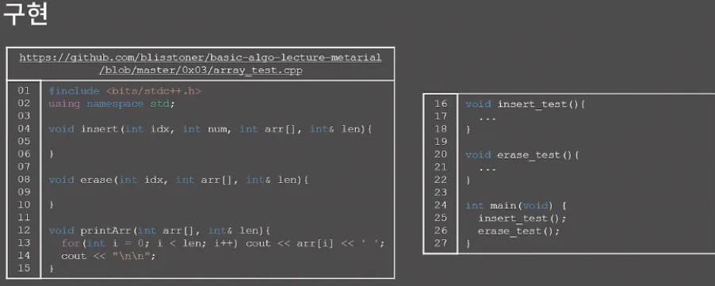
- [github 링크](https://github.com/encrypted-def/basic-algo-lecture/blob/master/0x03/array_test.cpp)에 들어가서 코드를 받은 후에 insert, erase 함수를 채워보자

```C++
#include <bits/stdc++.h>
using namespace std;

void insert(int idx, int num, int arr[], int& len){
    for (int i = len; i >= idx; i--)
    {
        arr[i + 1] = arr[i];
    }
    arr[idx] = num;
    len++;
}

void erase(int idx, int arr[], int& len){
    for (int i = idx; i < len; i++)
    {
        arr[i] = arr[i + 1];
    }
    len--;
}

void printArr(int arr[], int& len){
  for(int i = 0; i < len; i++) cout << arr[i] << ' ';
  cout << "\n\n";
}

void insert_test(){
  cout << "***** insert_test *****\n";
  int arr[10] = {10, 20, 30};
  int len = 3;
  insert(3, 40, arr, len); // 10 20 30 40
  printArr(arr, len);
  insert(1, 50, arr, len); // 10 50 20 30 40
  printArr(arr, len);
  insert(0, 15, arr, len); // 15 10 50 20 30 40
  printArr(arr, len);
}

void erase_test(){
  cout << "***** erase_test *****\n";
  int arr[10] = {10, 50, 40, 30, 70, 20};
  int len = 6;
  erase(4, arr, len); // 10 50 40 30 20
  printArr(arr, len);
  erase(1, arr, len); // 10 40 30 20
  printArr(arr, len);
  erase(3, arr, len); // 10 40 30
  printArr(arr, len);
}

int main(void) {
  insert_test();
  erase_test();
}
```

</br>


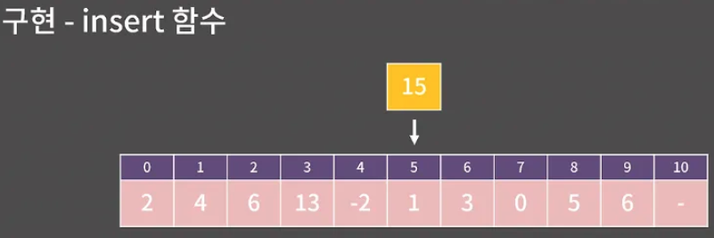
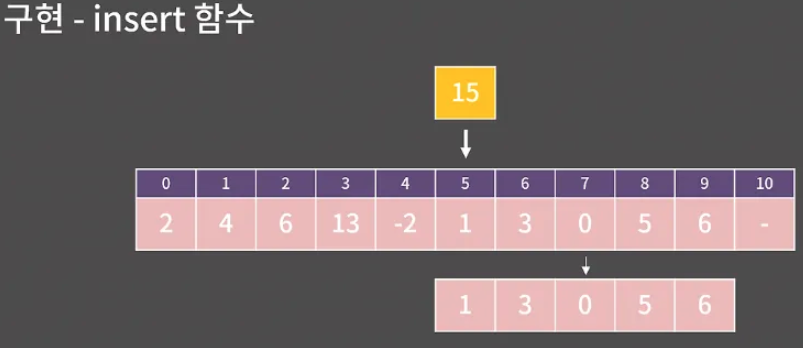
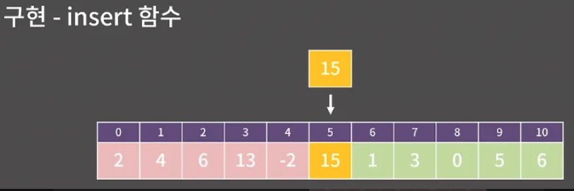
- insert부터 보면 5번째에 15를 넣고 싶다고 할 떄 1,3,0,5,6을 오른쪽으로 부터 한 칸씩 밀어서 자리를 만들어주어야함 그래야 15가 제 자리에 들어갈 수 있기 때문
- 그런데 지금 그림으로 나타낼 때에는 원소 5개를 한 번에 옮겼지만 실제 코드를 잘 떄에는 원소를 1개씩 옮길 수 밖에 없다.

</br>

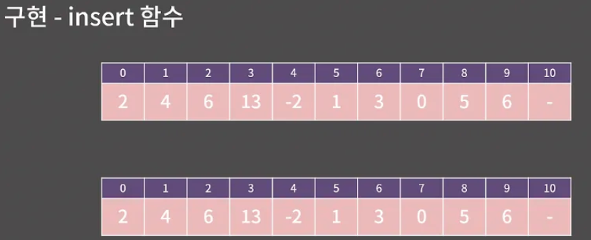
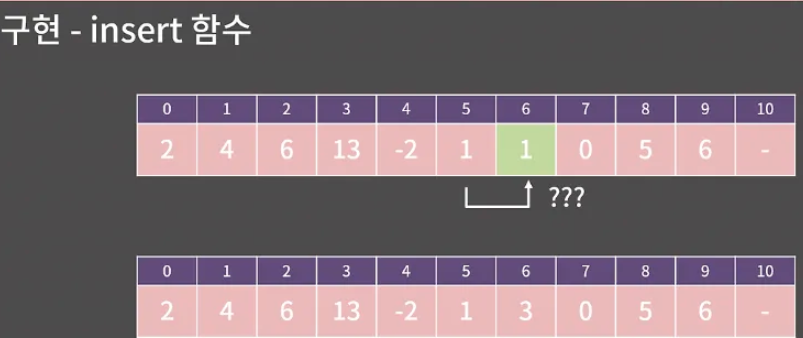
- 제일 왼쪽에서 부터 옮긴다고 하면 1을 6번자리로 옮기고 났을 떄 원래 6번쨰 있던 3이 온데간데 없이 사라져 버림 물론 임시 변수나 배열을 만들어서 처리를 할 수도 있겠지만 추가적인 메모리를 쓰지 않고 더 간단한 해결 방법이 있다.

</br>

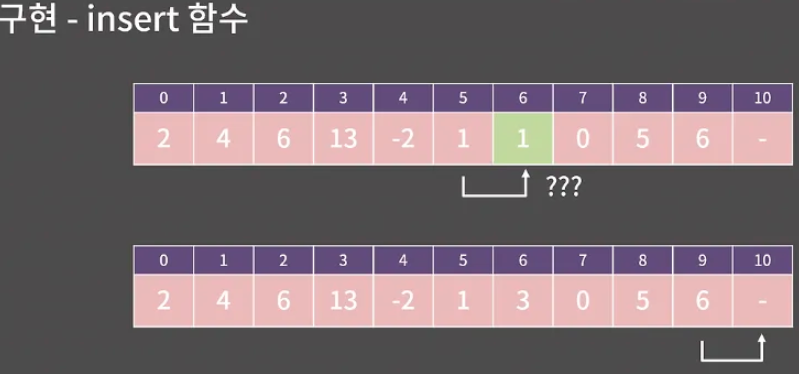
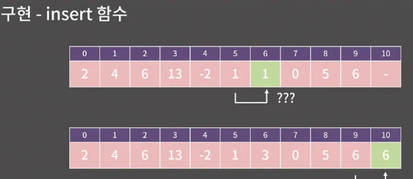
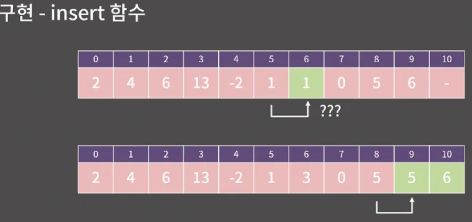
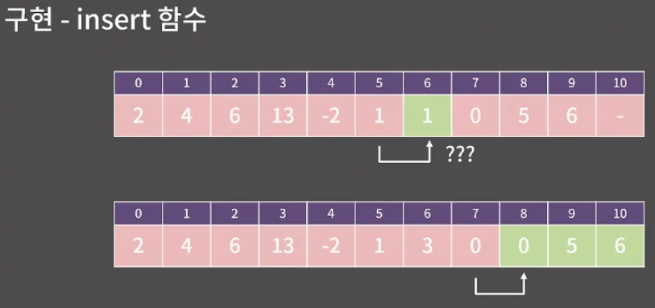
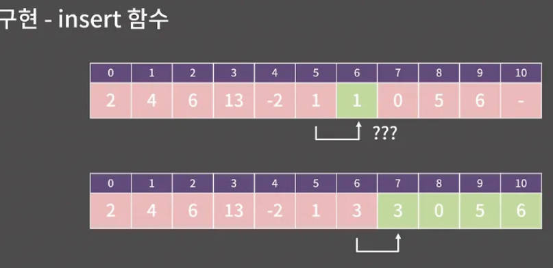
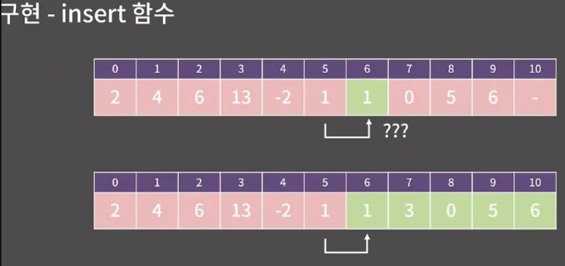
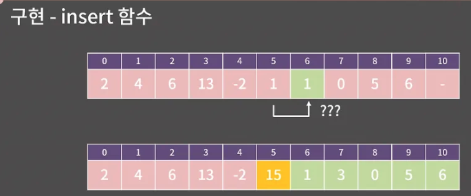


- 오른쪽에서부터 자기 왼쪽의 항을 떙겨오는 것을 볼 수가 있다.
- 만약 02번쨰 줄에서 i > idx 대신 i ≥ idx로 작성했다면 어떤 일이 발생을 할까?
- arr[idx] = arr[idx -  1]이 실행되고 04번쨰 줄에서 arr[idx] = num이 되니 별 문제가 없지 않나 싶겠지만, idx = 0일 때 arr[0] = arr[-1]이라는 명령이 수행되어서 런타임에러가 유발됨
- 이외에도 정말 다양한 오답들이 있을 것 같은데, 99%는 인덱스 문제일 것 같다.
- i가 len-1부터인지 len부터인지, 그리고 idx까지인지 idx+1까지인지 뭐 이런 것들이 굉장히 헷갈릴텐데 종이에 구상을 잘 해두고 구현하면 머릿속이 덜 꼬일 것이다

</br>

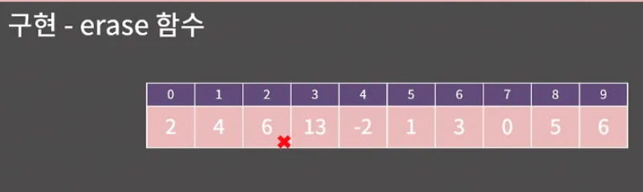
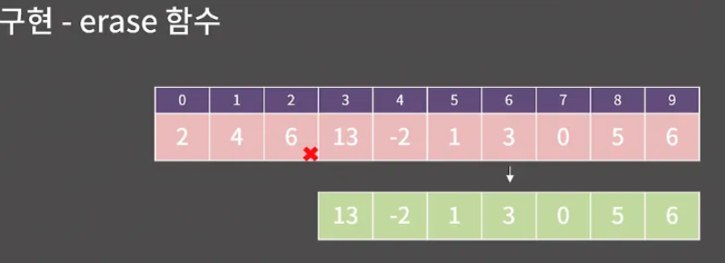
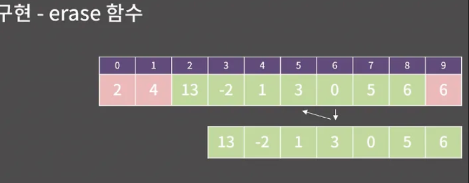
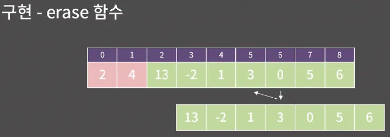
- earse 함수를 구현해보자 예를 들어 2번쨰 원소를 지우고 싶으면 이번에는 3번째부터 9번쨰까지의 원소들을 왼쪽으로 한 칸씩 밀면 된다.
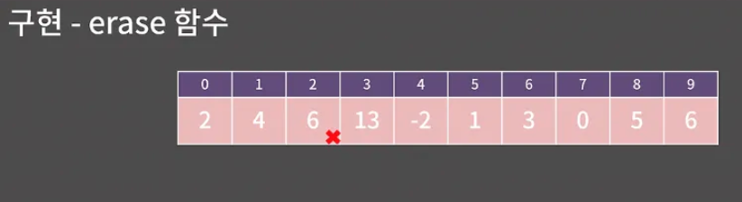
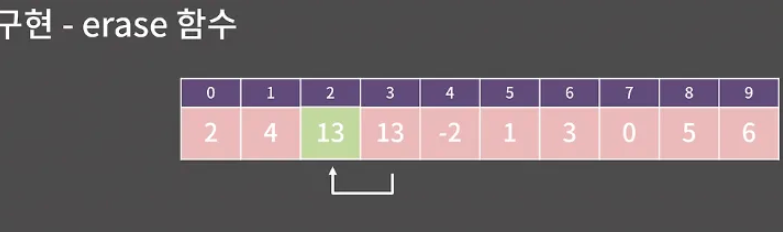
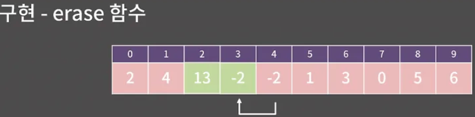
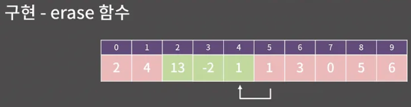
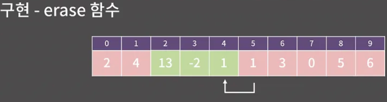
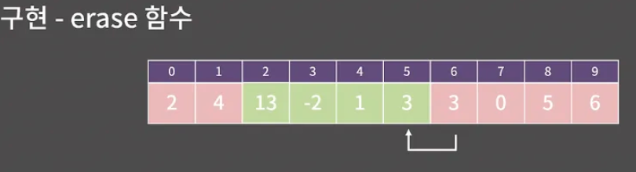
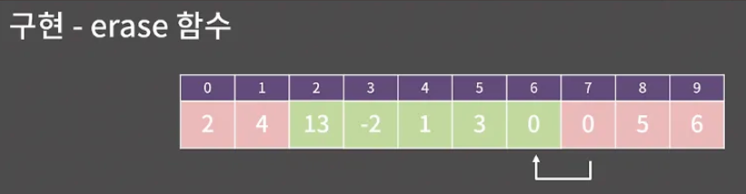
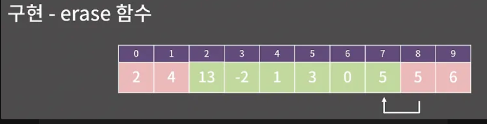
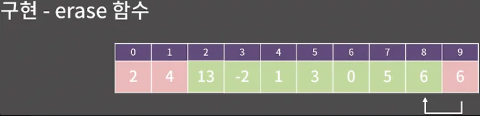
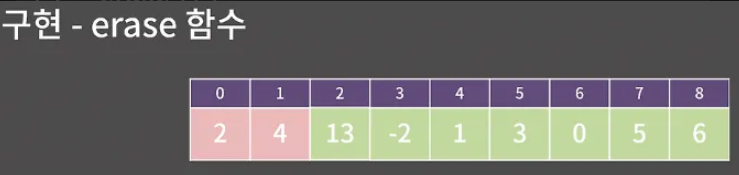
- insert 함수 떄와 비슷하게 실제 구현을 할 떄에는 한 개씩 옮기는데 이번에는 왼쪼부터 처리를 하면 추가적인 메모리를 쓰지 않고 구현할 수 있다.

</br>

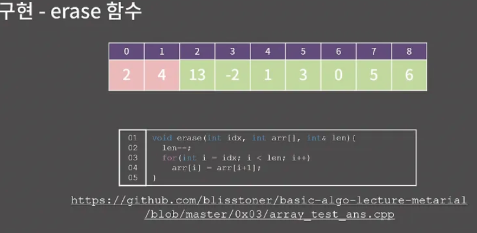

</br>

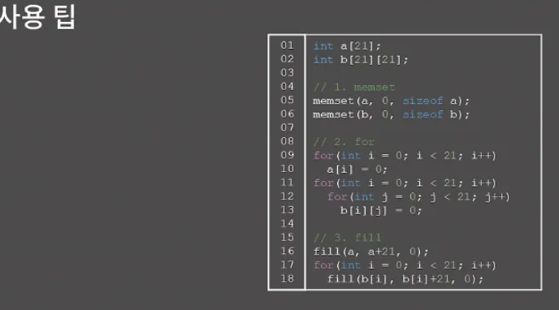
- C++에서의 배열은 워낙 간다난 구조여서 팁은 없는데 전체 특정 값을초기화 시킬 때 어떻게 하면 효율적으로 할 수 있는지만 짚고 넘어가자
1. cstring에 있는 memset 함수 → 이게 실수할 여지가 굉장히 많다. 예를 들어 0이나 -1이 아닌 다른 값을 넣으면 오작동한다거나 2차원 이상의 배열을 함수의 인자로 넘겨 그곳에서 memset을 잘못 들어간다거나 하는 점들이 있다.  그래서 memset은 정말 비추천
2. 그냥 for문을 사용해서 할 수 있지만 실수할 여지가 없기 때문에 무난하고 좋음
3. algorithm 헤더의 fill 함수를 사용하는 것 가장 추천하는 방식

</br>

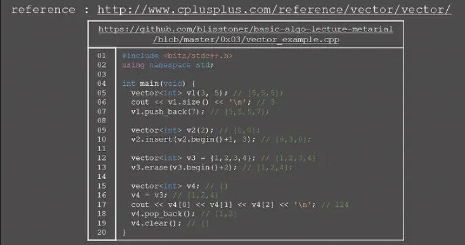

- 배열에 대한 이해를 마치고 이제 STL vector를 보자
- vector는 배열과 거의 동일한 기능을 수행하는 자료구조로, 배열과 마찬가지로 원소가 메모리에 연속하게 저장되어 있기 때문에 O(1)에 인덱스를 가지고, 각 원소로 접근할 수 있다.
- 그런데 vector는 배열과 달리 크기를 자유자재로 늘이거나 줄일 수 있다는 장점
- 그래프의 인접 리스트라는 것을 저장할 때 vector를 쓰는 게 많이 편해서 vector가 필요하게 되지만 그 전까지는 사실 굳이 배열 대신 vector를 써야하는 상황이 딱히 없다.
- 상단의 [레퍼런스 사이트](http://www.cplusplus.com/reference/vector/vector/)에 들어가면 다 익힐 수 있고 앞으로도 가능하면 설명글 보다는 직접 레퍼런스 사이트를 확인하면서 메소드들을 정확하게 익히는게 낫긴 하지만, 익숙하지 않으면 솔직히 좀 힘드니까 그냥 직접 vector를 사용한 예시 코드를 보자
- 직접 타이핑을 해서 확인해도 되고 [github 링크](https://github.com/encrypted-def/basic-algo-lecture/blob/master/0x03/vector_example.cpp)
- insert와 erase가 메소드로 이미 구현이 되어 있는 것을 알 수 있습니다. 인자로 v.begin() + x와 같이 주는걸 볼 수 있는데 STL의 iterator 개념을 모르면 조금 낯설 수 있을 것 같습니다. 하지만 설명은 안하고 넘어가겠습니다. iterator의 정체가 궁금하다면 따로 공부를 하시는걸 추천
- 우리가 구현한 것과 비슷하게 insert, erase는 시간복잡도가 O(N) push_back, pop_back은 제일 끝에 원소를 추가하거나 뺴는 것이니 O(1)
- 잘못된 시간복잡도로 문제를 접근하는 경우를 막기 위해서 메소드의 시간복잡도를 잘 생각해야됨
- 또 vecotr에서 =를 사용하면 deep copy가 발생 16번 째 줄에서 v4{1,2,4}가 되었고 이후 v4를 바꾸어도 v3에는 영향을 주지 않는다.

```cpp
#include <bits/stdc++.h>
using namespace std;

int main(void) {
  vector<int> v1(3, 5); // {5,5,5};
  cout << v1.size() << '\n'; // 3
  v1.push_back(7); // {5,5,5,7};

  vector<int> v2(2); // {0,0};
  v2.insert(v2.begin()+1, 3); // {0,3,0};

  vector<int> v3 = {1,2,3,4}; // {1,2,3,4}
  v3.erase(v3.begin()+2); // {1,2,4};

  vector<int> v4; // {}
  v4 = v3; // {1,2,4}
  cout << v4[0] << v4[1] << v4[2] << '\n';
  v4.pop_back(); // {1,2}
  v4.clear(); // {}
}
```

</br>

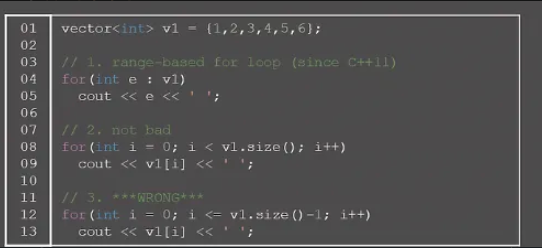
- vector에 있는 모든 원소를 순회를 하려고 할 때
- 본 적 없는 range-based for loop → 04,05번째 줄처럼 int e :v1 이라고 하면 e에 v1의 원소들이 하나씩 들어가는 for문이 된다.
    - 만약 int e : v1이라고 하면 복사된 값이 e에 들어가고 int & e : v1이라고 하면 원본이 e에 들어간다
    - 그렇기 때문에 int e : v1라고 쓴 for 문 내에서 e를 바꿔도 v1에는 영향이 가지 않지만 int & e : v1 이라고 쓴 for 문 내에서는 e를 바꾸면 원본인 v1에서 실제 해당 원소의 값이 바뀌게 된다.
    - 이 기능은 list,map,set 등에서도 모두 사용 가능 다만 이 기능은 C++11부터 추가된 기능
- range-based for loop가 그다지 익숙하지 않다면 아주 무난하게 for문으로 인덱스를 하나씩 다 돌아도 상관없다. 2번과 3번이 전부 그렇게 처리하는 코드인데 사실 3번처럼 쓰면 아주 잘못될 수도 있다
    - 기본적으로 vector의 size는 메소드는 시스템에 따라 unsigned int 혹은 unsigned long long 을 반환 그렇기 때문에 32비트 컴퓨터 기존 3번 같이 쓰면 v1이 빈 vector 일 떄 v1.size() - 1이 unsigned int 0에서 1을 뺴는 식이 되고 insigned int와int를 연산하면 unsigned int로 자동 형반환이 발생하기 떄문에 unsigned int)0 - (int)1은 -1이 아니라 4294967295이 되어버린다. unsigned int overflow로 인해 생기게 된 값
    - 그래서 아무것도 출력을 하지 않고 종료되는 것이 아닌, v1[0], v1[1], v1[2], ...  이렇게 i가 계속 커지다가 어느 순간 런타임에러가 발생
- 정리하자면 vector에 있는 모든 원소를 순회하고 싶으면 range-based for loop를 사용해도 되고 그냥 인덱스를 하나씩 다 돌아도 상관없는데, size 메소드의 반환값이 unsigned이기 때문에 3번처럼 구현하면 큰일

</br>


- vector도 무난하게 됐고 이제는 배열이 쓰이는 문제 몇 개를 다뤄보자
- 배열은 데이터를 자주 바꾸지 않고 그냥 쌓아두고 싶을 때 활용할 수 있다.
- 사실 거의 대부분의 문제에서 일단 입력값을 저장해놓고 시작하는 일이 많기 때문에 입력을 담아두기 위해 배열을 사용하곤 한다
- 단지 데이터를 쌓아두는 용도 말고 인덱스에 해당하는 원소를 빠르게 접근하는 목적으로 배열을 사용하면 효율적인 문제를 소개한다

</br>

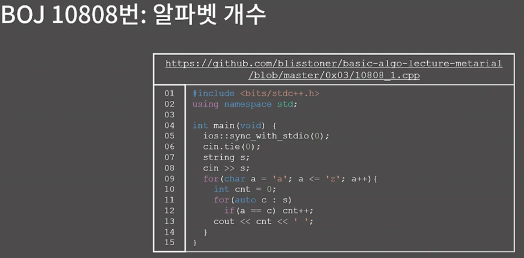
BOJ 10808 알파벳 개수

- 문자열을 입력 받고, 'a'부터 'z'까지 각각에 대해 문자열에 해당 글자가 몇 번씩 등장하는지를 확인
- 크게 어려울 것 없는 무난한 문제였습니다.
- 그런데 이 코드는 문자열 s를 26번 반복해서 확인하게 됨
- ‘a’, ‘b’ , .. ‘z’ 각각에 대해 s 전체를 다 살펴보기 때문
- 같은 문자열을 26번 볼 필요가 없고 한 번만 보면 될거라는 걸 알 수가 있다. 방식을 한 번 보자


</br>

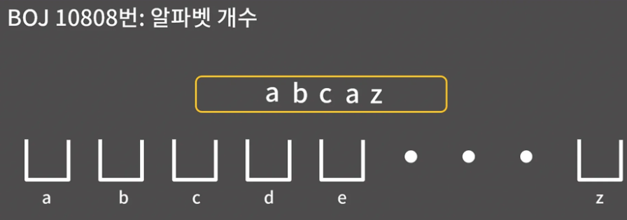
- 각 알파벳의 등장횟수를 담을 그릇을 다 만들어둔다.

</br>

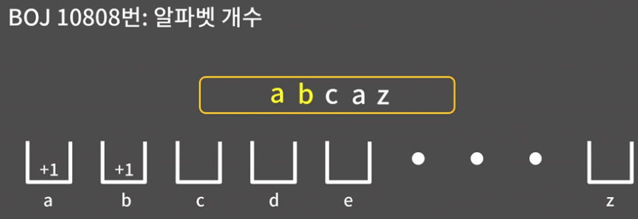
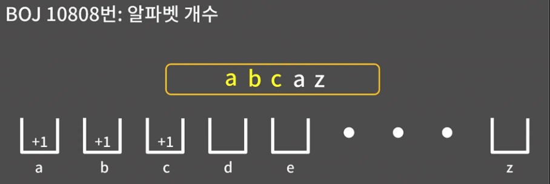
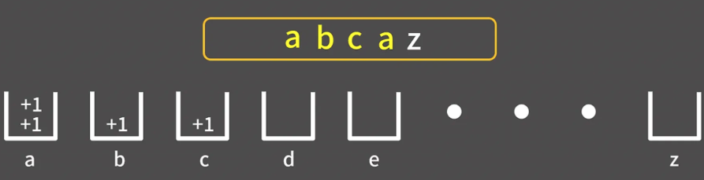
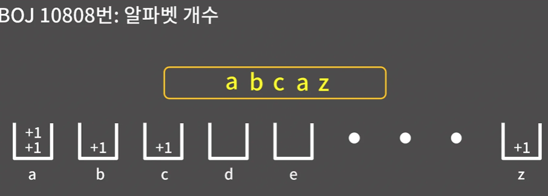
- 이후에 주어진 문자열을 한 글자씩 보면서 그릇에 알파벳을 담는다. 맨 처음에 글자가 a이니까 a를 나타내는 그릇에 1을 추가해주고 그 다음 글자는 b이니까 b를 나타내는 그릇에 1을 추가해주고, 이렇게 모든 글자를 순회하면 문자열을 한 번만 훑어도 될 것

</br>

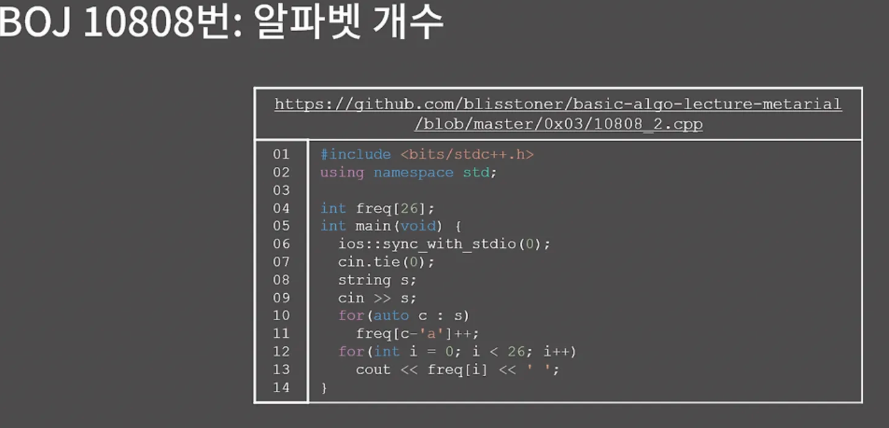
- 각 문자의 등장 횟수를 저장하는 freq 배열을 하나 만들어서 처리할 수 있다
- ‘a’, ‘b’,… ‘z’는 아스키코드 상에서 97번부터 122번까지로 인접하게 붙어있으니 ‘a;를 0으로 ‘b’를 1으로 ‘z’를 25로 만들떄 ‘a’를 빼주면 된다.
- 일단 freqp 초기값은 0이어야 할 텐데 전역에 선언한면 알아서 0으로 채워지니 따로 초기화를 하지 않아도 된다.
- freq가 지역변수였다면 int freq[26]; 이라 고민 할 경우 0이 아닌 다른 쓰레기 값이 채워지기 때문에 int freq[26] = {} 혹은 fill(freq,freq+26, 0)과 같은 조치가 필요
- s를 입력 받은 후  freq[c-'a']++;을 통해 마치 이전 슬라이드에서 본 것 처럼 그릇에 1을 더해준다. c-'a'를 해줌으로서 c가 'a'였다면 0, 'b'였다면 1, ···,  'z'였다면 25가 된다. 이 부분이 조금 낯설다 싶으시면 아스키코드를 한 번 찾아보자

내 코드

```cpp
#include <iostream>

using namespace std;

int arr[26] = {0};
int main(){
    string str;
    cin >> str;

    for (int i = 0; i < str.size(); i++)
    {
        arr[str[i] - 'a']++;
    }

    for (int i = 0; i < 26; i++)
    {
        cout << arr[i] << " ";
    }
    
    
}
```

</br>

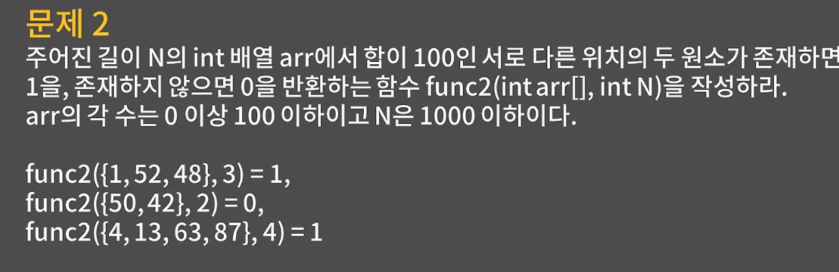
- 0x01 강에서 시간복잡도 얘기를 하면서 다른 문제
- 당시에는 이 문제를 이중 for문으로 해결하는 O(N^2) 알고리즘을 제시했고 O(N) 알고리즘도 존재한다는 얘기를 살짝 하고 넘어갔는데 이전 문제와 비슷한 느낌을 잘 이용하면 이 문제의 O(N) 풀이를 떠올릴 수 있다.

이 풀이는 생각이 나지 않는다..

</br>

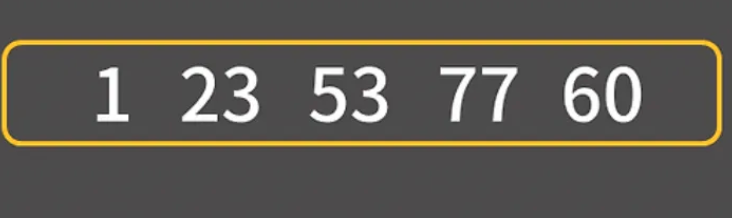
- O(N)에 해결하기 위해서는 관점을 살짝 바꾸어야 한다.
- 이전에는 모든 쌍을 살펴보면서 합이 100이 되는 쌍의 존재 여부를 확인했지만 이번에는 수를 차례로 하나씩 읽으면서 이전에 등장한 수 중에서 지금 보고 있는 수와 더해 100이 되는 수가 있는지를 알고 싶다.

</br>


- 현재 53을 보고 있으면 이전에 등장한 {1, 23}중에서 53과 더해 100이 되는 순가 있는지를 알고 싶은 것
- 이 말을 다르게 표현하면 53과 더해 100이 되는 수는 47이니 이전에 47이 등장했는지 확인하면 되는 것
- 이전에 등장한 모든 수를 살펴보는 과정을 1,23,53,77,60 각각에 대해 다 하면 합이 100이 되는 존재 여부를 알 수가 있다.
- 예를 들어 현재 보는 수가 60이면 60과 더해서 100이 되는 수를 40이니 {1, 23,53, 77}에서 40이 있는지를 확인해야 되는데, 이 과정에서 1,23,53,77각각을 하나하나 다 40과 비교해 같은지 확인한다고 치면 O(N)이 필요  그리고 이 과정을  N번에 걸쳐 진행하니 시간복잡도는 그대로 O(N^2)

</br>

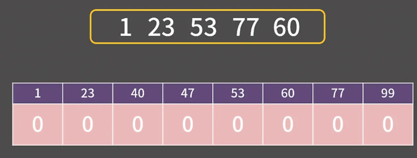
- 여기서 핵심 포인트는 나와 합해서 100이 되는 수의 존재 여부를 O(N)이 아닌 O(1)에 알아차리는 것이고, 이걸 배열을 이용해서 해결할 수 있다.
- 그 방법은 바로 각 수의 등장 여부를 체크한느 배열을 만드는 것
- 원래 인덱스가 0부터 100까지 있어야 하니 101칸의 배열이어야 하지만 공간의 한계로 일부 인덱스만 표시했다. 이 배열에서 해당 인덱스의 수가 이전에 등장한 적이 없으면 값이 0, 등장한 적이 있으면 값이 1

</br>

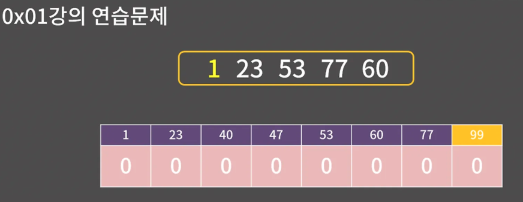
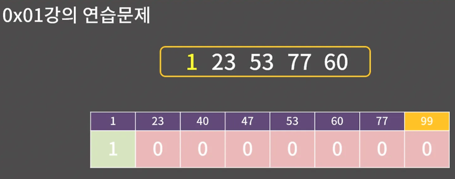
- 이제 첫 번째 원소인 1부터 시작해보자 일단 1과 더해서 100이 되는 수, 즉 99가 이전에 등장했는지 확인해보면 99번의 인덱스의 값은 0이니 99는 이전에 등장한 적이 없다. 그리고 다음 수로 넘어갈건데 그 전에 1이 등장헀다는 것을 배열에 나타내줘야 하니 1번 인덱스의 값을 0에서 1로 변경

</br>

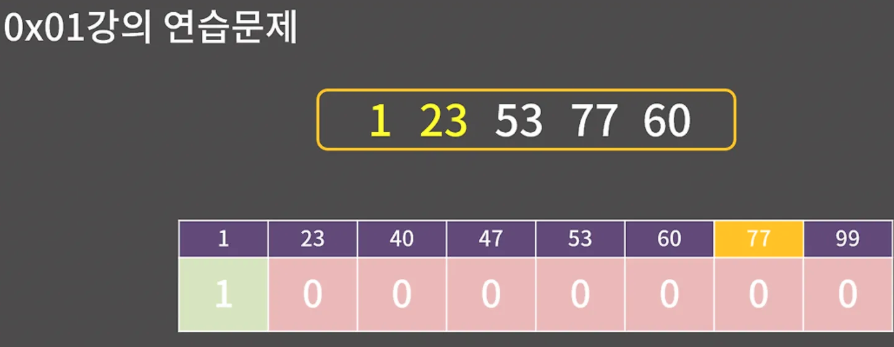
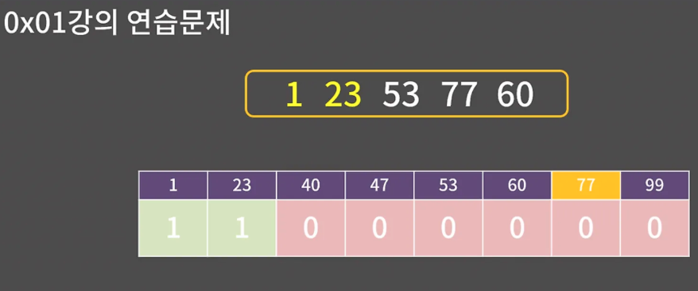
- 그 다음으로는 23
- 77이 이전에 등장했는지 를 보면 77번의 인덱스의 값이 0이니 77은 이전에 등장한 적이 없다. 이후 23번 인덱스의 값을 0에서 1로 변경

</br>

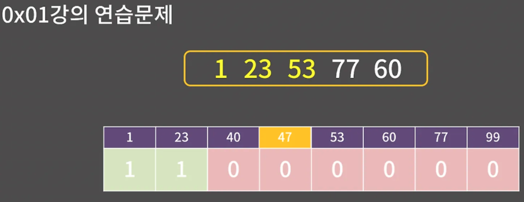
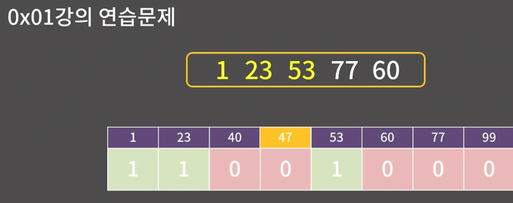
- 그 다음으로는 53인데 일단 47이 이전에 등장했는지를 확인하면 47번 인덱스의 값은 0이니 47은 이전에 등장한 적이 없다. 이후 53번의 인덱스의 값을 0에서 1로 변경

- 그 다음으로는 77
- 일단 23이 이전에 등장헀는지 확인해보면 23의 인덱스의 값은 1이니 23은 이전에 등장한 적이 있다.
- 23이 이전에 나온 적이 있으니 합이 100이 되는 쌍을 찾아내었다. 함수에서는 바로 1을 반환하면 된다. 이와 같은 방법으로 O(N)에서 해결할 수 있게 된다.

</br>

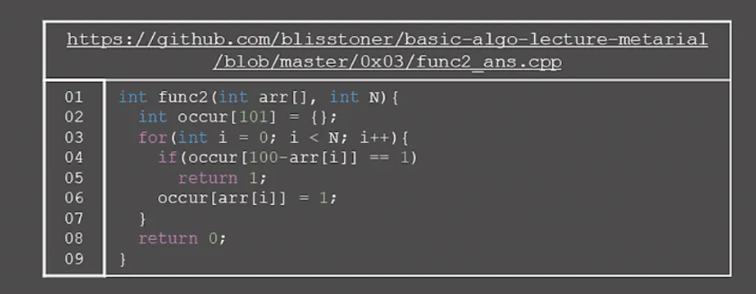
```cpp

int func2(int arr[], int N){
    int occur[101] = {};

    for (int i = 0; i < N; i++)
    {
        if (occur[100 - arr[i]] == 1)
            return 1;
        occur[arr[i]] = 1;
    }
    return 0;
}
```

- if (1){}은 1이 참으로 해석되어 중괄호 안의 내용이 실행되고 if(0){}은 0이 거짓으로 해석되어 중괄호 안의 내용이 실행되지 않기 때문에 04번쨰 줄을 그냥 if(occur100-arr[i])로 써도 동일하게 동작한다.
- 혼동을 줄까봐 == 1을 붙이긴 헀지만  if(occur[100-arr[i]])와 같이 쓰는 것을 선호
- N개의 원소를 도는 동안 합이 100인 쌍을 찾지 못했으면 0을 반환하면 되고, 이 코드는 나와 합이 100이 되는 원소를 매 순간마다 O(1)에 찾고 이 행위를 N번 반복하기 때문에 총 시간복잡도는 O(N)이 된다.