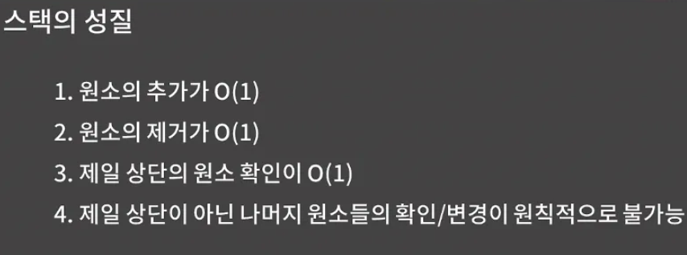
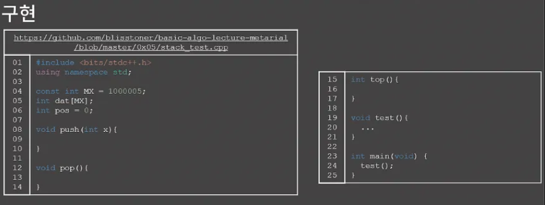
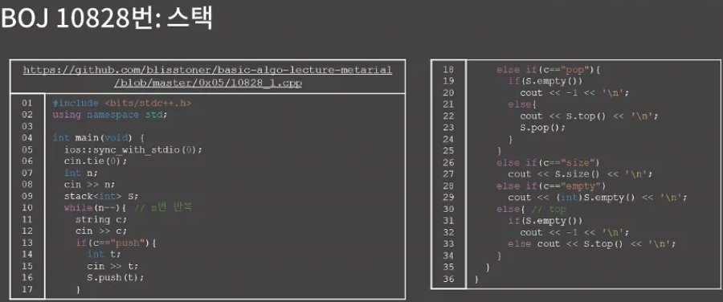

- 자료구조에서의 스택은 뭐냐
    - 바로 한쪽 끝에서만 원소를 넣거나 뺄수 있는 자료구조
    - 대충 프링글스 통을 생각하면 이해가 쉬울 것이다. 아니면 엘레베이터를 생각해도 된다.
- 스택은 구조적으로 먼저 들어간 원소가 제일 나중에 나오게 되는데 이런 의미로 FILO(First In Last Out) 자료구조라고 부르기도 한다
- 큐나 덱도 스택처럼 특정 위치에서만 원소를 넣거나 뺄 수 있는 제한이 걸려있다. 그래서 스택, 큐 덱을 묶어서 Restricted Structure라고 부르기도 한다.

</br>



- 스택은 특정 위치에서만 원소를 넣거나 뺼 수 있게 제한을 둔 대신에 원소의 추가와 제거가 모두 O(1)이다. 나중에 구현을 같이 해보겠지만 우리가 배열의 끝에서 원소를 추가/제거할 때 시간복잡도가 O(1)이었던 것과 완전히 똑같다. 그리고 제일 상단의 원소 확인 또한 O(1)이다.
- 대신 스택에서는 제일 상단이 아닌 나머지 원소들의 확인.변경이 원칙적으로 불가능하다. 원칙적으로 불가능하다는 뜻을 잘 이해할 필요가 있는데, 원래 스택이라는 자료구조는 원소의 추가/제거/제일 상단의 원소 확인이라는 기능만 제공하는 자료구조이다.
    - 그래서 제일 상단이 아닌 나머지 원소들의 확인/변경은 스택에서 제공하는 기능이 아니다.
    - 구현을 할 때 배열을 기반으로 구현해서 해당 기능이 가능하도록 만들 수 있지만, 나중에 응용 사례들을 보시면 모두 원소의 추가/원소의 제거/제일 상단의원소 확인 기능만을 필요로 한다.
- 정리를 하면 스택에서는 제일 상단이 아닌 나머지 원소들의 확인/변경 기능이 제공되지 않는다.
    - STL stack에서도 이 기능은 없다. 그리고 스택을 활용하는 예시들을 보면 애초에 제일 상단이 아닌 나머지 원소들의 확인/변경이 필요하지 않는다. 하지만 배열을 이용해 스택을 구현하면 기본적인 스택의 기능이 이외에도 제일 상단이 아닌 나머지 원소들의 확인/변경을 가능하도록 만들 수는 있다.

</br>


- 스택에서 제공되는 연산들을 살펴봤으니 그 다음으로 스택을 어떻게 구현하면 될지 알아보자. 스택은 배열 혹은 연결리스트를 이용해서 구현할 수 있다.
- 그리고 둘 중에서 배열을 이용하는 게 구현이 더 쉽다.
- 물론 연결리스트를 연습하는 차원에서는 연결 리스트로 구현을 시도해봐도 좋지만 여기에서는 배열을 이용한 구현만 다루도록 하자.

{13,21,30}이 담겨있는 스택을 나타내기 위해 dat[0], dat[1], dat[2] 각각 13,21,30을 썼고 pos는 3이라는 값을 가진다. 이와 같이 스택의 값들은 dat의 0번지부터 저장되고 pos는 다음에 원소가 추가될 때 삽입해야하는 곳을 가리키고 있다. 그리고 잘 생각해보면 pos의 값이 곧 스택의 길이, 즉 스택 내의 원소의 수를 의미한다는 것을 알 수가 있다.

</br>



이제 스택을 직접 구현해보자

- 진짜 정말로 쉬우니 한 번 시도해보자
- push 함수는 스택 x를 추가하는 함수이고, pop함수는 스택의 꼭대기에 위치한 원소를 제거하는 함수이고, top 함수는 스택의 꼭대기에 위치한 원소의 값을 확인하는 함수이다.

나의 답

```cpp
#include <bits/stdc++.h>
using namespace std;

const int MX = 1000005;
int dat[MX];
int pos = 0;

void push(int x){
  dat[pos] = x;
  pos++;
}

void pop(){
  pos--;
}

int top(){
  return dat[pos - 1];
}

void test(){
  push(5); push(4); push(3);
  cout << top() << '\n'; // 3
  pop(); pop();
  cout << top() << '\n'; // 5
  push(10); push(12);
  cout << top() << '\n'; // 12
  pop();
  cout << top() << '\n'; // 10
}

int main(void) {
	test();
}
```

</br>


- 왼쪽 스택에서 원소 12를 넣고 싶다고 해보자 그러면 어떤 작업을 해야하는지 직관적으로 눈에 딱 보일텐데 pos가 가리키는 자리에 12를 추가하고 pos 1 증가 시키면 된다.

</br>


- 꼭대기에 있는 12를 빼보자. 12를 뺴려면 딱 1개만 하면 되는데 그냥 pos를 1 줄이면 된다. 이 때 dat의 3번지에 있는 값 12자체는 굳이 변경하지 않아도 괜ㅊ찮다. 왜냐하면 나중에 push가 발생하면 어차피 그때 돌아올 값으로 덮어써질거라 더 이상 저 12라는 값은 아무 의미가 없고, 이런 상황이면 굳이 값을 변경하는 추가적인 연산을 하는 게 시간낭비니 내버려두면 될 것이다.

</br>


- top 함수는 더 날먹이다. 지금 이런 상황에서 12를 반환하고 싶으면 그냥 dat[pos-1]를 하면 된다.

</br>


- stack은 이처럼 구현이 특출나게 간단하지만 그래도 STL을 쓸 수 있다면 STL을 쓰는게 좋다. 내가 만든 스택을 썼는데 다 짜고 돌렸더니 틀렸다고 할 때, 이러면 내가 만든 스택에 틀린 점이 잇는지 의심을 해볼 수 밖에 없다.
- 그런데 STL stack을 썼으면 최소 스택 쪽에서는 문제가 없다는 걸 알 수가 있으니 로직을 바로 잡는게 조금이나마 더 편할 것
- 그래서 STL stack을 익히는 차원에서 예제를 한 번 살펴보고 가자 STL stack에서 주로 push,pop,top,empty,size 멤버 함수를 쓰게 될 것이다. push, pop, top은 우리가 앞에서 한 거랑 똑같고, empty랑 size도 크게 어렵지 않을 것이다.
- 그리고 18번째 줄을 보면 알겠지만 스택이 비어있는데 top을 호출하면 런타임에러가 발생함
- 스택이 비어있는데 pop을 호출해도 마찬가지 그렇기 때문에 스택이 비어있을 때 top이나 pop을 호출하지 않도록 해야한다. 또 제출한 코드의 결과로 런타임 에러를 받았을 경우에는 다양한 원인이 있을 수 있겠지만 스택이 비어있을 때 top이나 pop을 하지는 않았을지 의심해볼 수 있다.

</br>


첫 번째 연습문제는 [BOJ 10828번: 스택](https://www.acmicpc.net/problem/10828) 문제

- 그냥 곧이 곧대로 스택을 구현하라는 문제라는 것을 알 수가 있다 STL stack과 직접 구현한 스택 두 가지 모두를 가지고 해봐라
- 먼저 STL stack을 이용한 풀이를 설명해주겠다. [코드](https://github.com/encrypted-def/basic-algo-lecture/blob/master/0x05/10828_1.cpp)에서 크게 어려울 건 없을 것입니다. 단 pop, top 함수에서 S가 empty인지 확인을 먼저 하고 S.pop()이나 S.top()을 호출해야 한다. 그렇지 않으면 런타임 에러가 발생할 수 있다.

STL

```cpp
#include <iostream>
#include <stack>

using namespace std;

int main(){
    int n;
    cin >> n;
    stack<int> sta;
    for (int i = 0; i < n; i++)
    {
        string temp;
        cin >> temp;
        if (temp == "push"){
            int te;
            cin >> te;
            sta.push(te);
        }
        else if (temp == "top"){
            if (sta.empty()){
                cout << "-1\n";
            }
            else {
                cout << sta.top() << "\n";
            }
        }
        else if (temp == "pop"){
            if (sta.empty()){
                cout << "-1\n";
            }
            else {
                cout << sta.top() << "\n";
                sta.pop();
            }
        }
        else if (temp == "size"){
            cout << sta.size() << "\n";
        }
        else if (temp == "empty"){
            if (sta.empty()){
                cout << "1\n";
            }
            else 
                cout << "0\n";
        }
    }
    
}
```

배열

```cpp
#include <bits/stdc++.h>
using namespace std;

const int MX = 1000005;
int dat[MX];
int pos = 0;

void push(int x){
  dat[pos] = x;
  pos++;
}

void pop(){
  pos--;
}

int top(){
  return dat[pos - 1];
}

int main(void) {
  int n;
  cin >> n;
  for (int i = 0; i < n; i++)
  {
      string temp;
      cin >> temp;
      if (temp == "push"){
          int te;
          cin >> te;
          push(te);
      }
      else if (temp == "top"){
          if (pos == 0){
              cout << "-1\n";
          }
          else {
              cout << top() << "\n";
          }
      }
      else if (temp == "pop"){
          if (pos == 0){
              cout << "-1\n";
          }
          else {
              cout << top() << "\n";
              pop();
          }
      }
      else if (temp == "size"){
          cout << pos << "\n";
      }
      else if (temp == "empty"){
          if (pos == 0){
              cout << "1\n";
          }
          else 
              cout << "0\n";
      }
  }
}
```

</br>


직접 구현한 스택을 이용해서 보면 push,pop,top 코드들을 가져다 쓰는데 문제에 있는 “스택에 들어있는 정수가 없는 경우에는 -1을 출력한다”와 같은 조건들에 대한 처리를 잘 해주면 된다.

[코드](https://github.com/encrypted-def/basic-algo-lecture/blob/master/0x05/10828_2.cpp)를 확인해봐라 pos=0이면 스택이 비었다는 의미이니 pop, empty, top일 때 이를 잘 활용

</br>


배열, 연결 리스트, 그리고 스택 자료구조를 배웠는데, 스택부터는 본격적으로 활용을 할 수 있는 방법이 굉장히 많아진다. 

- 대표적인 사례로 수식의 괄호 쌍이랑 전위/중위/후위 표기법, DFS, Flood Fill 등이 있다.
- 각 사례들은 학부 수업에서 웬만하면 다 짚고 넘어갈 내용들이라 배울 필요가 있는데, 이번 단원 안에서 전부 설명을 하기에는 분량이 꽤 많아서 각 내용들을 독립적인 단원으로 만들어서 설명할 것입니다. 단, 전위/중위/후위 표기법은 코딩테스트에 나올 확률이 0에 가깝다고 판단해서 아예 패스합니다.

연습문제들에는 스택을 이용해서 풀 수 있는 문제들을 넣어뒀는데 10773번은 그럭저럭 풀만하지만 나머지 문제들은 다소 생소할 발상을 필요로 하기 때문에 좀 많이 어려울 것이다. 그래서 10773번을 제외한 나머지 문제들은 어렵다 싶으면 굳이 얽매이지말고 일단 넘어가셨다가 BFS/DFS를 다룬 후에 보셔도 괜찮다