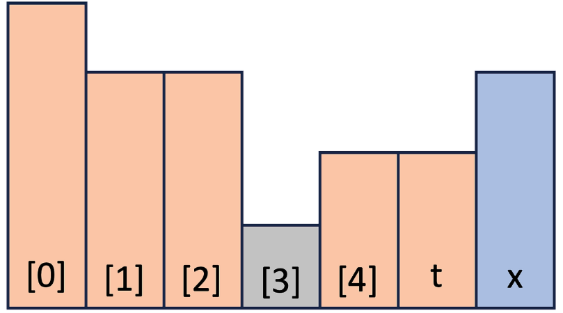
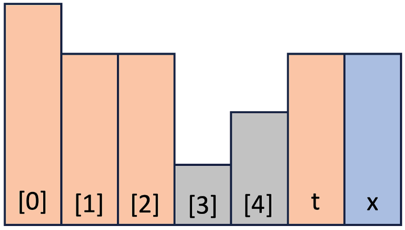
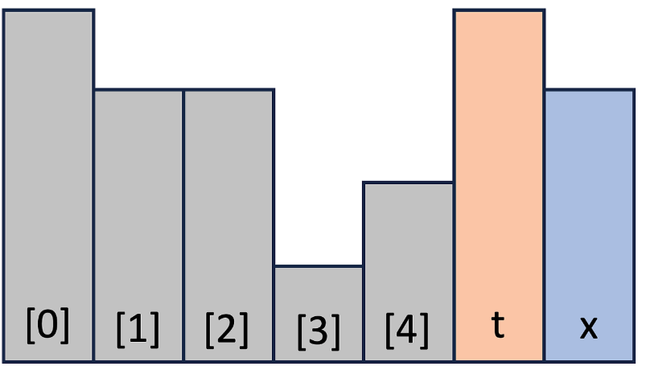
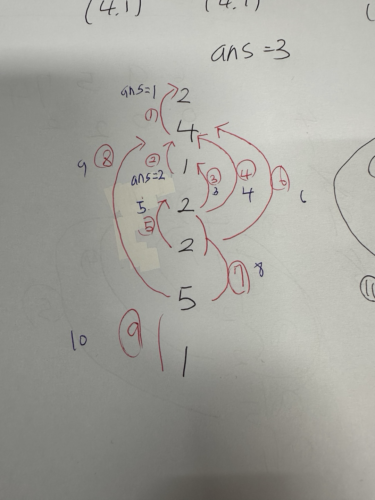
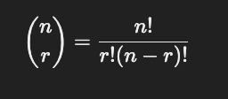
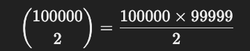

### 문제이름, 링크
---
- 오아시스 재결합
- https://www.acmicpc.net/problem/3015

### 생각한 흐름

### 틀린 부분
- 이 문제는 접근을 아예 못함..
- 문제에서 말하는 거는 A와 B가 있을 때 서로 쳐다볼 수 있다 3가지 경우로 나뉜다. t와 x가 있을 때
1. t < x


2. t == x 


3. t > x



- 밑 처럼 존재 할 때
```cpp
2
4
1
2
2
5
1
```
- 2의 입장에서 보면 4를 볼 수 있지만 4 때문에 그 뒤에 있는 수들은 보지 못한다
- 4의 입장에서는 첫 번째 2를 볼 수 있고 뒤에 1,2,2,5까지 볼 수 있는 상황
- 1의 입장에서는 4와 뒤에 있는 2만 볼 수 있는 상황
- 4번째 2의 입장에서는 1,4,2,5를 볼 수 있는 상황
- 5번째 2의 입장에서는 앞에 2,1,4 뒤에는 5를 볼 수 있는 상황
- 5의 입장에서는 2,2,1,4를 볼 수 있으며 뒤에 1을 볼 수 있는 상황
- 1은 5만 볼 수 있다.
- 그러면 stack을 사용하여 자신 입장에서 볼 때 자기 보다 같거나 낮은 높이는 처리를 하고 pop을 한다. 자기 보다 높으면 push를 한다.
- 즉, 자기 자신이랑 키가 같거나 작은 것들은 처리를 한다 처리를 하고 stack에 남아있는 높이는 자기 자신 보다 더 큰다는 것이니 그 높이랑도 +1을 해준다. 
- 여기서 또 포인트는 높이가 같은 경우에는 한 묶음으로 처리를 해주는 것 {2,1}이렇게 된다면 높이가 2인데 같은 키를 가진 사람의 수가 1을 의미
</br>

순서대로 한 번 해보자
1. 첫 번째 2
- stack에서 자기 자신이랑 높이가 같거나 작은 것은 없으니 넘어간다.
- stack을 보았을 때 자기 자신 보다 키가 큰 사람이 없으니 횟수를 세지 않는다.
- stack에 {2,1}을 push를 한다.
2. 4
- stack에서 자기 자신이랑 높이가 같거나 작은 것인 2가 있다. 2랑 4랑 볼 수 있으니 ans에 1을 더해준다. 
- 여기서 자기 자신이랑 높이가 같지 않으니 넘어가고 2는 이제 필요가 없으니 pop을 한다. 
- 자기 자신 보다 큰 높이는 stack에 남아있지 않으니 넘어간다.
- {4,1} push
3. 1
- stack은 현재 4만 있다 자기 자신이랑 높이가 같거나 작은 것은 없다 그래서 넘어간다.
- 자기 자신 보다 높이가 큰 4가 stack에 남아있다 4랑 볼 수 있으니 ans에 +1가 된다 이렇게 되면 ans는 2가 된다.
- {1,1} push
4. 세 번째 2
- stack에는 현재 4,1이 남아있는데 자기 자신보다 작거나 같은 거는 1만 해당한다. 그래서 1랑 볼 수 있으니 ans + 1 ans는 3이 된다. 
- 자기 자신이랑 높이가 같지는 않으니 넘어가고 1을 pop을 한다.
- 현재 자기 자신 보다 키가 높은 4가 남아 있으니 ans에 +1을 더해주어서 ans는 4가 된다.
5. 네 번째 2
- stack에는 4,2가 있다. 자기 자신 보다 키가 같거나 작은 거는 2가 있다. 세 번째 2랑 볼 수 있으니 ans + 1을 하여 ans는 5가 된다.
- 자기 자신이랑 높이가 같으니 키가 같은 높이가 있어서 cnt에 세 번째의 2에 있는 높이가 같은 사람의 수를 1을 가져와 더해 주어서 cnt를 2로 만든다. 세 번쨰 2를 pop을 한다. 그러면 {2,2}가 완성된다.
- 자기 자신 보다 높이가 큰 4가 스택에 남아 있으니 ans + 1을 해준다. 그러면 ans는 6이 된다. 
6. 5 
- 이제 stack에 남아있는 거는 4,{2,2}가 있다. 자기 자신 보다 같거나 작은 거는 4,2가 있다. 
- 먼저 2를 볼 수 있는데 아까 세번째2를 같이 봐주어야하니 {2,2}의 y값인 2를 들고와 ans에 2를 더해준다 그러면 ans는 8이 된다. 그러고 {2,2} pop
- 그러고 4를 볼 수 있으니 ans는 + 1이 되어 9가 된다. 그러고 4를 pop
7. 1
- 이제 stack에서 5가 남아있는데 자기 자신 보다 같거나 작지 않다. 넘어간다
- 자기 자신 보다 큰 높이가 스택에 남아있으니 ans + 1을 해주면 10이 된다.

순서대로 그림을 그려보면 밑 그림처럼 되는데 빨간색이 순서이고 파란색이 ans 값


여기서 중요한 포인트는 
- 자기 높이 보다 같거나 작은 거는 pop을 처리해주고, 높이가 같으면 합쳐버리는 것
- stack에 남아있는 값이 있다는 거는 자기 자신 보다 높은 게 있으니 서로 볼 수 있다는 것임

</br>

- 내가 헷갈려던 부분이 2가지가 더 있다.
- 문제를 제대로 이해했으면 괜찮지만 세 번째 1과 다섯 번째 5는 서로 볼 수 있을까?에서 좀 헷갈렸다. 네 번째 2덕분에 1과 5는 만남이 되지 않는다.
```cpp
2
4
1
2
2
5
1
```

- long long 
- 사람 수가 최대 500,000명 이라고 했는데 만약 100,000명이 모두 키로 1로 동일하다면 어떻게 될까 
- 같은 키끼리 모두 서로 볼 수 있으니 가능한 쌍의 수는 100000 * 99999 / 2 = 4,99,950,000이 되어 약 50억개의 쌍이 생기기에 int 값을 넘어버려서 long long으로 해야된다.
- 저 값은 조합 구하는 공식은 밑 처럼 된다.
좌항이  n개 중에서 r개를 고르는 조합의 수
우항에서 분자는 n! = n 팩토리얼 (n부터 1까지 곱한 값)



우리는 100000명 중 2명 고르는 경우
팩토리얼 전체를 계산할 필요 없이 이렇게 간단히 줄여서 계산할 가능
이 조합 값이 **약 5,000,000,000 (50억)**으로, 바로 이 때문에 long long이 필요
- 줄여지는 거는 약분때문에 그럼


출처
https://blog.thecloer.com/121


### 코드첨부와 코드 설명
```cpp
#include <bits/stdc++.h>

using namespace std;

int main(void) {
  ios::sync_with_stdio(0);
  cin.tie(0);

  stack<pair<int,int>> sta;
  int n;
  cin >> n;
  long long ans = 0;
  for (int i = 0; i < n; i++)
  {
    int temp;
    cin >> temp;
    int cns = 1;
    
    // 스택에 있는 사람들 중에서, 나보다 키가 작거나 같은 사람들은
    // 내가 전부 볼 수 있으므로 처리
    while (!sta.empty() && sta.top().first <= temp)
    {
        ans += sta.top().second;//// 스택 top의 사람 수만큼 쌍을 만들 수 있음
        if ( sta.top().first == temp) cns += sta.top().second; // 키가 같은 놈들은 같이 처리
        sta.pop();  
    }
    
    // 현재 스택이 비어있지 않다는 것은
    // 아직 나보다 키가 큰 사람이 스택에 있다는 것
    // → 나와 그 사람은 서로를 볼 수 있음
    if (!sta.empty()) ans++;
    sta.push({temp, cns});

  }
  cout << ans << "\n";
  

}
```