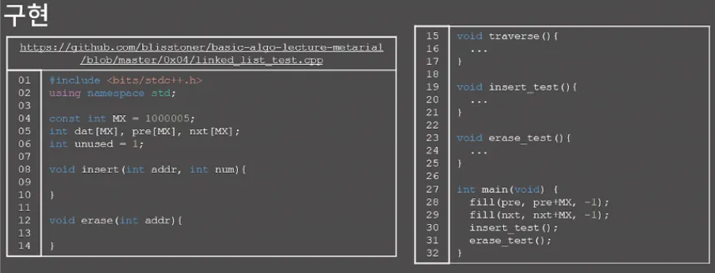

</br>


- 연결리스트 → 원소들을 저장할 때 그 다음 원소가 있는 위치를 포함시키는 방식으로 저장하는 자료구조
- 원소들은 이곳 저곳 흩어져있다.
- 실생활의 예
    - 바킹독님 학교 선생님이고 전체 학생 중에서 영은, 현지, 재현, 상혁 학생 4명을 술래로 정했고, 이 4명을 기억하고 싶다 이런 상황일 떄 배열이라면 그냥 4칸짜리 배열을 만들고 4명을 저장하면 될 것
- 그런데 연결 리스트 관점에서는 영은이자 현지를 기억하고, 현지는 재현이를 기억하고, 재현이는 상혁이를 기억하는 것
- 이렇게 되면 영은이만 외우고 있어면 된다. 4명 전체가 필요하면 바킹독님은 영은이를 통해 나머지 3명이 누구였는지 알아낼 수 있다.
- 이전에 연결 리스트를 전혀 접해본적이 없다면 비유를 보고도 무슨 말인지 영감이 오지 않을 수도 있음

</br>


연결 리스트의 성질

- 배열에서느 어땠는지 떠올리면서 봐도 좋다
1. k번째 원소를 찾기 위해 O(k)의 시간이 필요 
    1. 연결 리스트의 구조 상 어쩔 수가 없다. 
    2. 그림에서 3,13,72,5를 저장하는 연결 리스트
    3. 3번째 원소인 72를 찾고 싶으면 3을 거쳐서 13을 가고 13을 거쳐서 72를 가야하기 때문에 그럼
    4. 이렇게 가지 않고서는 72가 대체 어디 있는 지 알 수 있는 방법이 없다. 배열과 다르게 공간에 원소들이 연속해서 위치하고 있지 않기 때문
2. 연결 리스트에서는 임의의 위치에 원소를 추가하거나 임의 위치의 원소 제거가 O(1)이다. 
    1. 배열과 비교했을 때 큰 차이가 있는 성질이고, 연결 리스트의 굉장히 큰 장점
3. 메모리 상에 데이터들이 연속해 있지 않으니까 Cache hit rate가 낮지만 할당이 쉽다. 코테 칠 때는 이걸 몰라도 됨

</br>


연결 리스트 종류

1. 단일 연결 리스트 
    1. 각 원소가 자신의 다음 원소의 주소를 들고 있는 연결 리스트
2. 이중 연결 리스트
    1. 각 원소가 자신의 이전 원소와 다음 원소의 주소를 둘 다 들고 있다.
    2. 단일 연결 리스트에서는 주어진 원소의 이전 원소가 무엇인지를 알 수가 없는데 이중 연결 리스트는 알 수가 있다.
    3. 다만 원소가 가지고 있어야 하는 정보가 1개 더추가되니 메모리를 더 쓴다는 단점
    4. STL에 연결리스트가 있는데 이 컨테이너 이름은 list이고 구조는 이중 연결 리스트이다.
3. 원형 연결 리스트
    1. 끝이 처음과 연결 되어 있다.
    2. 그림에서는 단일 연결 리스트로 표현했지만 각 원소가 이전과 다음 원소의 주소를 모두 들고 있어도 상관이 없다.


</br>


- 배열과 연결리스트는 메모리 상에 원소를 놓는 방법은 다르다고 해도 어찌됐든 원소들 사이에 선후 관계가 일대일로 정의된다. 즉, 원소들 사이에서 첫 번째 원소, 두 번째 원소 .. 이런 개념이 존재하는 것
- 그래서 배열과 연결리스트는 선형 자료구조라는 불린다.
    - 뒤에 배우게 될 트리, 그래프, 해쉬 등은 비선형 자료구조의 대표적인 예시
- 배열과 연결 리스트는 둘 다 선형 자료구조여서 면접에서 둘의 비교하는 문제를 구술시험으로 내기도 한다 꼭 면접 대비가 아니라고 하더라도 둘의 차이를 잘 알아야 적재적소에 배열이나 연결 리스트를 잘 써먹을 수 있을 테니 둘의 장단점을 비교하는 시간을 가져보도록 하자.
1. k번째의 원소 접근은 배열의 경우 O(1), 연결리스트의 경우 O(k)
2. 임의 위치에 원소를 추가하거나 제거하는 건 배열의 경우 O(N), 연결 리스트의 경우 O(1)
    1. 그런데 엄밀히 말해서 연결 리스트에서도 3번째 원소 뒤에 20이라는 원소를 추가하고 싶다면 일단 3번째 원소까지는 찾아간 뒤에야 O(1)에 추가가 가능한거라 상황이 조금 다르긴 한데, 구현파트에서 이야기 하자
3. 메모리 상의 배치는 배열의 경우 연속이고 연결 리스트의 경우 불연속이다. 마지막으로 추가적으로 필요한 공간 즉 overhead를 생각해보면 배열은 데이터만 딱딱 저장하면 될 뿐 딱히 추가적으로 필요한 공간은 없다. 굳이 따지면 길이 정보를 저장할 int 1개가 필요할 수 있지만 이건 너무 미미함
    1. 그런데 연결리스트에서는 각 원소가 다음 원소, 혹은 이전과 다음 원소의 주소값을 가지고 있어야한다. 
    2. 그래서 32비트 컴퓨터면 주소값이 32비트(=4바이트) 단위이니 4N바이트가 추가로 필요하고, 64비트(=8바이트) 컴퓨터라면 주소값이 64비트 단위니 8N 바이트가 추가로 필요하게 된다. 즉 N에 비례하는 만큼 메모리를 추가로 쓰게 됨


</br>


- 연결 리스트에서 제공 되는 연산들을 하나씩 살펴보자.
1. 임의의 위치에 있는 원소를 확인/변경하는 연산인데, 계속 언급했듯이 배열과는 다르게 임의의 위치에 있는 원소로 가기 위해서는 그 위치에 도달할 때까지 첫 번쨰부터 순차적으로 방문을 해야함
    1. 연결 리스트의 구조 상 어쩔 수가 없는 거임
    2. 분명 모든 원소들은 메모리 어딘가에 있을 테지만, 우리는 그 중에서 첫 번째 원소의 주소만 알고 있다. 그러면 우리가 네 번쨰의 원소의 값을 확인하고 싶다고 할 떄, 우리는 첫 번쨰 원소에 기록된 주소를 보고 두 번쨰 원소로 넘어가고, 두 번쨰 원소에서 기록된 주소를 보고 세 번쨰 원소로 넘어가고, 세 번쨰 원소에 기록된 주소를 보고 네 번쨰 원소로 넘어가서 드디어 도착
    3. 그렇기 떄문에 k번째 원솔르 보기 위해선느 O(k)의 시간이 필요하고, 전체에 N개의 원소가 있다고 하면 평균적으로 N/2의 시간이 걸릴 테니 O(N)이라고 생각하자

</br>


2. 임의의 위치에 원소를 추가하는 연산
    1. 이건 O(1)에 가능
    2. 21 뒤에 84를 추가하고 싶다고 할 떄, 배열처럼 그 뒤의 우너소들을 전부 옮기는 작업을 할 필요가 없고 그냥 21과 84에서 다음 원소의 주소만 변경을 해주면 되기 때문
    3. 단 착각하면 안 되는 게 있는데, 추가하고 싶은 위치의 주소를 알고 있을 경우에만 O(1)
    4. 만약 21의 주소를 준 것이 아니라 그냥 84라는 원소를 세 번째 원소 뒤에 추가하라는 명령의 경우에는, 세번쨰 원소까지 찾아가는 시간이 추가로 걸려서 O(1)이라고 말할 수가 없다.

</br>


3. 임의 위치의 원소를 제거하는 연산이고 이것 또한 O(1)에 가능하다. 21을 지워보자
    1. 21을 지우려고 하면 딱 1개만 하면 되는데,  그냥 65에다가 “너의 다음 원소가 21이 아닌 17이다” 라고만 알려주면 끝이다. 물론 그런 다음에 21이 들어있는 원소는 메모리 누수를 막기 위해서 메모리에서 없애줄 필요가 있다.

</br>


- 정리해보면 임의의 위치에 있는 원소를 확인하거나 변경하는 건 O(N)
- 해당 위치의 주소를 같이 넘겨줄 때 임의의 위치에 원소를 추가하거나 임의 위치의 원소를 제거하는 건 O(1)

우리가 지금 연결 리스트를 다루고 있는데 배열이 너무 익숙하다보니 도대체 임의의 위치에 있는 원소를 확인/변경하는 게 O(N)인 이런 자료구조를 어디에 써먹을까 하겠지만 써먹는 곳이 메모장과 같은 텍스트 에디터이다

- 물론 실제 텍스트 에디터는 매 순간순간마다 화면에 결과를 출력해야 하니 아마도 그냥 배열로 구현할 것 같다.
- 그러나 예를 들어 커서를 옮기고 글자를 지우는 것과 같은 연산들이 다양하게 주어진 후 최종 결과를 출력하라는 문제라고 한다면 우리는 커서가 가리키는 위치에 글자를 추가하거나 글자를 지우는 명령을 계속 수행해야 된다.
- 이런 경우에 배열은 임의의 위치에 글자를 추가하는 연산이 비효율적인데 연결 리스트에서는 O(1)에 처리할 수 있어서 연결리스트로 구현할 경우 효율적

그러니까 임의의 위치에서 원소를 추가하거나 임의 위치의 원소를 제거하는 연산을 많이 해야 할 ㄱ경우 연결 리스트의 사용을 고려

</br>


- 자료구조를 배웠으니 구현을 해보자
- 원래 연결 리스트의 정성적인 구현은 지금 보는 것처럼 NODE 구조체나 클래스를 만들어서 원소가 생성될 때 동적할당을 하는 방식
- 이 방식은 학부에서 자료구조 수업을 들으신 분이라면 분명 보셨을 구현이고, 또 면접에서 손코딩을 시킨다거나 하는 식으로 질문을 할 수가 있기 때문에 개인적으로 공부를 해야된다.

그런데 이 구현은 긴박한 코테에서는 쓰기가 별로 좋지 않다 코테에서는 그냥STL list를 활용하면 된다. 

- STL list가 이중 연결리스트 구조를 가지고 있기 때문에 연결 리스트가 필요하면 그냥 가져다 쓰면 된다
- 그런데 코테에서 STL을 허용하지 않는다면 직접 연결 리스트를 구현해야한다
- STL을 허용하지 않는 코테가 정말 드물긴한데, 연결 리스트를 정석적으로 구현하는 대신 야매로 구현하면 구현 난이도가 크게 높지 않아서 연결 리스트를 연습하는 셈 치고 야매 연결리스트를 보자

그런데 정성적인 구현을 이전에 접해본적이 없으면 야매 연결리스트의 구현을 봐도 코드가 어떻게 동작하는지 감이 잘 안올 수도 있다. 만약 코테를 위해서 강의를 듣고 있는 구현을 봐도잘 이해가 안간다 싶으면 그냥 넘어가고 STL list의 사용 방법만 제대로 익혀가도 괜찮다.

</br>


- 이 야매 연결 리스트는 원소를 배열로 관리하고 pre와 nxt에 이전/다음 원소의 포인터 대신 배열상의 인덱스를 저장하는 방식으로 구현한 연결리스트
- 메모리 누수의 문제 떄문에 실수에서는 절대 쓸 수 없는 방식이지만 코테에서는 구현 난이도가 일반적인 연결 리스트가보다 낮고 시간복잡도도 동일하기 때문에 애용하면 된다.

구현에필요한 변수들을 보면 dat[i]는 i번지 원소의 값, pre[i]는 i번지 원소에 대해 이전 원소의 인덱스, nxt[i]는 다음 원소의 인덱스이다. pre나 nxt의 값이 -1이면 해당 원소의 이전/다음 원소가 존재하지 않는다는 의미

unused는 현재 사용되지 않는 인덱스, 즉 새로운 원소가 들어갈 수 있는 인덱스이고, 원소가 추가된 이후에는 1씩 증가된다. 그리고 특별히 0번지는 연결 리스트의 시작 원소로 고정되어 있다 달리말하면 0번지는 값이 들어가지 않고 단지 시작점을 나타내기 위한 dummy node이다.

지금 코드 상에는 별도로 같이 정보를 두지 않았지만 길이가 필요하다면 따로 len 변수를 두고 원소가 추가될 때 len 변수를 두고 원소가 추가될때 1증가시키고 제거될 때 1감소 시키면 된다.

</br>


- 각 변수들의 역할이 이해가 잘 안 갈수 있어서 예시를 한 번 보자
- 주어진 연결 리스트는 13,65,21,17이라는 값을 가지고 있다. 그리고 이들은 각각 배열에서 2번지, 1번지, 4번지, 5번지에 저장되어 있다고 생각하자 이 위치들은 임의로 정한 위치이고 실제로는 1번지부터 unused가 가리키고 있는 위치 한칸 전까지 사이에서 아무데나 위치하게 된다.
- 그리고 특별히 0번지는 연결 리스트의 시작 원소로 고정되어 있다. 즉, 실제로 값이 들어있는 것은 아니지만 관념적으로 연결 리스트의 제일 앞에 원소 하나가 있다고 생각을 할 것
    - 왜이렇게 하냐면 이런 dummy node를 두지 않으면 나중에 삽입과 삭제 등의 기능을 구현할 때 원소가 아예 없는 경우 예외처리를 해야 하는데 관념적으로 dummy node를 두면 예외처리가 덜 번거로워져서 그렇다
- 일단 0번지의 dat,pre,nxt를 보자 한 세 번쨰 강조하고 있는 말이지만 dummy node라 dat는 의미가 없으니 -1로 두고 pre는 해당 원소의 이전 원소가 존재하지 않으니 -1이고 nxt는 13이 들어있는 주소인 2번지의 2가 된다.
- 그 다음으로 13이 들어있는 2번지의 dat,pre,nxt를 보면 dat는 13, pre는 이전 원소의 주소인 0,(클릭) nxt는 다음 원소의 주소는 1이 된다.

</br>


- 이제 각 기능들을 구현해볼 시간을 가질텐데 traverse 함수는 먼저 같이 구현 해보자
- traverse 함수에서는 연결 리스트의 모든 원소들을 출력할 것이다.
- 배열에서 모든 원소들을 출력할 때 그냥 arr[0], arr[1] .. 을 출력하면 됐는데 이 야매 연결 리스트에서 만약 dat[0], dat[1].. 을 출력하면 좀 이상할 것입니다.

대신 우리는 0번지에서 출발해 nxt 적힌 값을 보고 계쏙 넘어가면서 dat을 출력하는  방식으로 구현해야된다

코드를 보면 cur라는 변수에 각 원소들의 주소가 담겨서 이동하는 방식

일단 cur의 초기값으로 nxt[0] = 2가 들어가고 while이 시작된다. 처음으로 dat[2], 즉 13이 출력되고 cur는 2에서 nxt[2] = 1로 넘어간다. 그 다음에는 dat[1] 즉 65가 출력되고, cur는 1에서 nxt[1] = 4로 넘어간다. 이런식으로 반복되다가 17까지 출력하고, cur에 nxt[5] = -1이 담기면 끝에 도달했다는 것을 깨닫고 while문을 탈출해서 traverse 과정이 종료된다.

</br>


- traverse 함수는 같이 구현을 했고 이제 insert와 erase 함수이다.
- 깡으로 구현하기는 좀 힘들 것 같고, 두 함수 각각을 코드는 안 보여드리고 설명만 해줄테니 그 설명을 같이 본 후에 구현을 시도해보자
- 두 함수에 공통으로 있는 인자만 addr는 앞에서 말한 각 원소의 주소, 즉 배열 상에서 몇 번쨰인지를 의미
    - 예를 들어 13이 2번지이고 13뒤에 20을 새로 추가하고 싶은 거면 insert(2, 20)
    - 13을 지우고 싶으면 erase(2)을 호출해야한다 addr =2가 의미하는 것이 연결 리스트 상에서 2번쨰 원소라는 것이 아니라, 해당 원소의 주소가 2번지라는점을 꼭 헷갈리면 안 된다.

</br>


- insert 함수를 보자
- 65뒤에 30을 추가하고 싶고, 이 경우에는 65가 1번이지니 insert(1,30)이 호출된다. 설명의 편의를 위해 65를 삽입할 위치라고 부른다.
1. 일단 30이 들어갈 새로운 원소를 생성해야 한다 unused가 가리키는 곳이 바로 새로운 원소가 들어갈 자리이다. 그 곳의 dat에 30을 쓰면 관념적으로 원소를 생성한 것과 똑같이 된다.

</br>


2. 새 원소의 pre 값에 삽입할 위치의 주소 즉 1번지를 대입

</br>


3. 새 원소의 nxt 값에 삽입할 위치의 nxt 값 즉 4번지를 대입해야된다.

</br>


4. 삽입할 위치의 nxt와 삽입할 위치의 다음 원소의 pre를 새 원소로 바꿔야 한다.

</br>


1. unused칸을 다 썼으니 unused를 1증가 시켜서 다음 insert에는 비어있는 7번지를 쓸 수 있게끔 해야한다.

insert 함수를 다 채운 후 insert_test() 함수를 실행했을 때의 결과가 주석으로 달아놓은 모양과 동일한지를 확인해보자.


</br>


- 크게 어려울 건 없을 것이다.
- 주의해야할 건 05번째 줄에서 if(nxt[addr) ≠ -1)이라는 처리가 들어간건데, 맨 마지막 원소의 뒤에 새 원소를 추가하는 상황이라면 “삽입할 위치의 다음 원소”가 존재하지 않습니다. 그런데도 pre[nxt[addr]] = unused;로 써버리면 pre[-1]에 접근할 수 있다. 그래서 nxt[addr]가 -1이 아닐때만 pre[nxt[addr]]에 unused를 대입으로 만듦

코드가 헷갈리면 이전 슬라이드들에서 하던 것처럼 직접 표를 그려놓고 한 줄씩 손으로 값의 변화를 따라가도 도움이 될 것이다.

insert 부분

```cpp
#include <bits/stdc++.h>
using namespace std;

const int MX = 1000005;
int dat[MX], pre[MX], nxt[MX];
int unused = 1;

// void insert(int addr, int num){
//     dat[unused] = num; // 제일 마지막에 공간에 있는 부분에 값 넣기
//     if (nxt[addr] == -1){
//         pre[unused] = addr;
//     }
//     else {
//         pre[unused] = pre[nxt[addr]];
//         pre[nxt[addr]] = unused;    
//     }

//     if (nxt[addr] == -1)
//         nxt[unused] = -1;
//     else
//         nxt[unused] = nxt[addr];
//     nxt[addr] = unused; // addr의 nxt
//     unused++;
// }

void insert(int addr, int num){
    dat[unused] = num; // 제일 마지막에 공간에 있는 부분에 값 넣기
    pre[unused] = addr;
    nxt[unused] = nxt[addr];
    if (nxt[addr] != -1) pre[nxt[addr]] = unused;
    nxt[addr] = unused;
    unused++;
}

void erase(int addr){

}

void traverse(){
  int cur = nxt[0];
  while(cur != -1){
    cout << dat[cur] << ' ';
    cur = nxt[cur];
  }
  cout << "\n\n";
}

void insert_test(){
  cout << "****** insert_test *****\n";
  insert(0, 10); // 10(address=1)
  traverse();
  insert(0, 30); // 30(address=2) 10
  traverse();
  insert(2, 40); // 30 40(address=3) 10
  traverse();
  insert(1, 20); // 30 40 10 20(address=4)
  traverse();
  insert(4, 70); // 30 40 10 20 70(address=5)
  traverse();
}

void erase_test(){
  cout << "****** erase_test *****\n";
  erase(1); // 30 40 20 70
  traverse();
  erase(2); // 40 20 70
  traverse();
  erase(4); // 40 70
  traverse();
  erase(5); // 40
  traverse();
}

int main(void) {
  fill(pre, pre+MX, -1);
  fill(nxt, nxt+MX, -1);
  insert_test();
  for (int i = 0; i < unused; i++)
  {
    cout << dat[i] << " ";
  }
  cout << "\n";
  for (int i = 0; i < unused; i++)
  {
    cout << pre[i] << " ";
  }
  cout << "\n";
  for (int i = 0; i < unused; i++)
  {
    cout << nxt[i] << " ";
  }
  cout << "\n";
//   erase_test();
}
```

내가 만든 코드와 바킹독님 풀이

파란 - 바킹독님

빨강 - 나


</br>


- 다음으로 erase 함수를 설명드리겠다
- 그 전에 insert 함수를 익힌 것을 바탕으로 erase 함수는 직접 짜보겠다 이런 자세 좋다
- 설명의 편의를 위해 65를 지우고 싶다고 할 때, 65를 삭제할 위치, 앞의 원소(=13)를 이전 위치, 뒤의 원소(=21)를 다음 위치라고 부르겠다 보면 erase는 insert보다 과정이 훨씬 짧다
1. 이전 위치의 nxt를 삭제할 위치의 nxt로 변경

</br>


2. 다음 위치의 pre를 삭제할 위치의 pre로 변경 

이 두과정만 하면 삭제가 끝난다 

지금 보면 정작 삭제할 위치인 1번지에서는 dat,pre,nxt는 전혀 건드리지 않는 것을 볼 수가 있는데 앞으로 이 값들은 아무 의미가 없다. 제거된 원소고 앞으로 그 어떤 nxt나 pre도 1번지를 가리키지 않을 것이기 떄문

이런 상황이니까 굳이 dat,nxt,pre 값을 -1과 같은 다른 값으로 덮을 필요가 없고 그냥 내버려두면 된다.

대신 이러한 구현 방법 떄문에 이 야매 연결 리스트에서는 제거된 원소가 프로그램이 종료될 때까지 메모리를 점유하고 있게 되고, 그렇기에 실무에서는 사용할 수 없는 구현 방식

하지만 알고리즘 문제에서는 insert의 횟수가 10만 번 혹은 100만번과 같이 제한이 있기 마련이고, 그럴 때에는 그냥 배열을 그 제한에 넉넉하게 잡아버리고 나서 이 야매 연결리스틀 사용하면 된다.

내가 한 거

```cpp
void erase(int addr){
    //1. 이전위치의 nxt 값을 삭제할 nxt값으로 변경
    
    nxt[pre[addr]] = nxt[addr];
    //2. 앞 위치의 pre 값을 삭제할 pre값으로 변경
    pre[nxt[addr]] = pre[addr];
}
```

</br>


- insert 함수때와 비슷하게 if(nxt[addr] != -1)이라는 처리가 되어있는 것을 볼 수 있다.
- 왜 pre[addr]이 -1인이지 체크를 하지 않아도 되는데 nxt[addr]인지는 체크해야 하는지 한 번 고민하는 시간을 가져봐도 괜찮을 것 같다.
- 그 이유는 dummy node의 존재로 인해 그 어떤 원소를 지우더라도 pre[addr]은 -1이 아님은 보장되지만 nxt[addr]은 제일 마지막 원소를 지우는 상황에서 값이 -1일 수 있기 때문
- 지금 구현제에서 제일 마지막 원소를 O(N)에 확인할 수 있는데 조금만 바꾸면 제일 마지막 원소도 O(1)에 확인할 수 있게 만들 수 있다. 이 부분은 우리 에게 맡긴다.

바킹독님 코드

```cpp
void erase(int addr){
    //1. 이전위치의 nxt 값을 삭제할 nxt값으로 변경
    nxt[pre[addr]] = nxt[addr];
    //2. 앞 위치의 pre 값을 삭제할 pre값으로 변경
    if (nxt[addr] != -1 ) pre[nxt[addr]] = pre[addr];
    
}
```

</br>


- STL에는 list가 있다. STL를 사용할 수 있는 상황이라면 STL을 쓰는게 훨씬 더 편하니 STL list의 사용법을 익혀두자
- 일단 STL list에서 push_back, pop_back,push_front, pop_front는 모두 O(1)이고, 우리가 이전 구현에서 ‘번지’라는 개념을 사용했듯 여기서 iterator가 주소 역할을 한다 03번째 줄에서 list:iterator라는 type을 치기 귀찮으면 C++11 이상일 때 auto t = L.begin()으로 써도 된다.
- 그리고 erase는 제거한 다음 원소의 위치를 반환한다. 마지막으로 순회할 할 떄에는 C++11 이상이라면 12번째 줄과 같이 편하게 할 수 있지만, C++11 미만이라면 14,15번쨰 줄과 같이 아주 불편하게 할 수 밖에 없다.

야매 연결 리스트에서는 0번지, 즉 제일 앞의 원소를 더미 노드로 사용하지만 STL list에서는 제일 뒤의 원소가 더미 노드이다 그래서 L.begin()은 제일 앞에 있는 원소를 가리키지만 L.end()는 제일 뒤에 있는 원소의 한칸뒤를 가리킨다는 점에서 주의해야한다.


</br>


- 에디터 문제
- 연결리스트가 쓰이는 문제는 크게 응용해서 낼 만한 게 없고 지금 문제와 같이 원소들을 돌아다니면서 이동하다가 삭제나 십입이 필요한 문제들
- 그런데 만약 N이 5000정도로 작다면 그냥 O(N^2)으로 짜도 통과되니 아무래도 우리에게 더 익숙한 vector로 구현을 하면 된다. 하지만 지금 N이 굉장히 커서 연결 리스트를 이용해 구현을 해야하는데 조금 감이 안올 수도 있을 것 같아 그림으로 느낌을 좀 잡아보자
- 첫 번째 예제를 보면 주어진 문자열이 abcd이니까 일단 연결리스트를 만들자. 그리고 커서는 문장의 맨 뒤에 위치하고 있다고 했는데, 엄밀히 말하면 커서는 글자와 글자 사이에 있어야 하지만 구현의 편의를 위해 커서가 글자를 가리킨다고 생각을 함 그래서 커서가 d를 가리키고 있다고 하자
    - 첫 번째 명령은 x를 추가하라는 명령이니 d 뒤에 x를 추가해주면 된다. 그리고 잘 생각해보면 커서도 오른쪽으로 옮겨야 한다. 왜냐하면 입력을 하면 당연히 커서가 한 칸 오른쪽으로 이동하기 때문
- L,D 명령은 말그대로 커서를 왼쪽이나 오른쪽으로 옮기면 되는 거고 B명령도 연결 리스트에서 커서가 가리키는 원소를 지우는 명령인 걸 알 수가 있다. 이제 연결리스트로 구현을 하는 일만 남았다.

이 그림은 야매 연결 리스트에서의 상황을 나타낸다. 야매 연결 리스트에서는 더미 노드가 제일 앞에 위치하기 때문에 “abcd”에서 실제 커서가 제일 앞에 위치할 경우 연결 리스트에서는 더미 노드를 가리키고 있고 제일 뒤에 위치할 경우 연결 리스트에서는 d를 가리키고 있다. 하지만 STL list에서는 더미 노드가 제일 뒤에 위치해있기 때문에 실제 커서가 제일 앞에 위치할 경우 연결 리스트에서는 a를 가리키고 있고 제일 뒤에 위치할 경우 d의 한칸 뒤인 L.end()를 가리키고 있다. 실제 커서가 있는 위치에 따라 연결 리스트에서 커서가 어디를 가리켜야 하는지 잘 생각해서 구현 해봐라

STL list와 야매 연결 리스트 둘 다를 이용해서 풀어보는 것을 추천

```cpp
#include <iostream>
#include <list>
#include <iterator>

using namespace std;

list<char> ls;

int main(){
    string str;
    cin >> str;
    for (int i = 0; i < str.size(); i++)
    {
        ls.push_back(str[i]);
    }
    list<char>::iterator it = ls.end();

    int n;
    cin >> n;
    for (int i = 0; i < n; i++)
    {
        char temp;
        cin >> temp;
        if (temp == 'L'){
            if (ls.begin() != it){
                // cout << "here\n";
                it--;
            }
            // cout << *it << "\n";
        }
        else if (temp == 'D'){
            if (ls.end() != it){
                it++;
            }
        }
        else if (temp == 'B'){
            if (it != ls.begin()){
                --it;
                it = ls.erase(it);
                // cout << "it : " << *it << "\n";
            }
                
                // cout << *it << "\n";
        }
        else if (temp == 'P'){
            char en;
            cin >> en;
            ls.insert(it, en);
            // cout << "it : " << *it << "\n";
        }

        // cout << "\n";
    }

    for (list<char>::iterator iter = ls.begin(); iter != ls.end(); iter++)
    {
        cout << *iter;
    }
    
}
```

- list의 STL로 풀어본 것
- list에서 iterator를 이용해 insert를 하더라도 insert한 위치에 있는 게 아니라 그대로 위치하게 된다
    - insert는 iterator의 왼쪽부분에 함
- list에서 iterator를 이용해 erase를 사용할 경우 삭제가 된 후 뒤에 있는 원소로 이동
    - end일 때는 마지막 dummy node를 가리키기 때문에 지우면 안됨

```cpp
#include <bits/stdc++.h>
using namespace std;

const int MX = 600100;
char dat[MX];
int pre[MX], nxt[MX];
int unused = 1;
int cursor = 0;

void insert(int addr, int num){
    dat[unused] = num; // 제일 마지막에 공간에 있는 부분에 값 넣기
    pre[unused] = addr;
    nxt[unused] = nxt[addr];
    if (nxt[addr] != -1) pre[nxt[addr]] = unused;
    nxt[addr] = unused;
    unused++;
}

void erase(int addr){
    //1. 이전위치의 nxt 값을 삭제할 nxt값으로 변경
    nxt[pre[addr]] = nxt[addr];
    //2. 앞 위치의 pre 값을 삭제할 pre값으로 변경
    if (nxt[addr] != -1 ) pre[nxt[addr]] = pre[addr];
    
}

void traverse(){
    int cur = nxt[0];
    while(cur != -1){
      cout << dat[cur];
      cur = nxt[cur];
    }
  }

int main(void) {
  fill(pre, pre+MX, -1);
  fill(nxt, nxt+MX, -1);
  string str;
  cin >> str;
  for (int i = 0; i < str.size(); i++)
  {
    insert(i, str[i]);
    cursor++;
  }

    int n;
  cin >> n;
  for (int i = 0; i < n; i++)
  {
    char temp;
    cin >> temp;
    if (temp == 'L'){
        // cursor = pre[];
        if (pre[cursor] != -1){
            cursor = pre[cursor];
        }
    }
    else if (temp == 'D'){
        if (nxt[cursor] != -1){
            cursor = nxt[cursor];
        }
    }
    else if (temp == 'B'){
        if (pre[cursor] != -1){
            erase(cursor);
            cursor = pre[cursor];
        }
    }
    else if (temp == 'P'){
        char en;
        cin >> en;
        insert(cursor, en);
        cursor = nxt[cursor];
    }
  }
  
  traverse();

  
}
```

- 너무 힘들어서 보고 만듦

</br>


- STL list를 이용한 코드
- 문제에서 요구한대로 커서를 이동시키다가 삽입과 삭제를 함
- cursor L.begin()인데 명령 L이 들어온다거나, L.end()인데 D가 들어온다고 했을 때 예외처리를 23,26번쨰처럼 두어야한다.
    - 바킹독님은 L.end()부분을 가지 못하게 막으셨음
- 좋을 점들은 명령과 글자가 다 char 1글자여서 char 자료형에 cin을 받도록 했고, 이렇게 하면 알아서 공백과 줄바꿈은 무시
- 다른 문제에서라도 getline과 같은 함수를 이용할 때 쓸데 없이 줄바꿈이 끼어 들어가서 골치아플 수가 있는데 그럴 땐 그냥 임시 변수에 getline으로 한 번 줄바꿈을 걸러내던가 하는 방식으로 구현을 하면 된다.
- 직접 구현하다보면 런타임 에러를 수도 없이 많이 받을 것인데 워낙 코드가 가양각색이라 직접 오랜 시간을 들여 분석을 해봐야 이유를 알 수 있을 테지만 대부분의 경우에는 이미 cursor가 가리키는 곳이 이미지워졌는데 그곳에 insert를 시킨다거나, cusor가 L.begin()인데 cursor—;를 시킨다거나 하는 이유
- 직접 짰는데 계속 틀릴 때 정말 화가 나고 포기하고 싶겠지만 코딩테스트를 잘 넘기려면 언젠가는 거쳐가야하는 과정이니 제 코드에만 의존하지말고 중간중간 출력을 찍어보며 어디가 잘못되었는지 찾아내고, 코드를 고쳐서 꼭 스스로의 힘으로 올바른 코드를 만들어봤으면 좋겠습니다

</br>


- 저희가 열심히 짰던 야매 연결 리스트를 이용한 방법입니다. 진짜 억지로 어찌저찌 한 페이지에 다 몰아서 뒀는데, 아무튼 STL list를 쓸 땐 커서가 list::iterator에 대응됐고 여기서는 주소에 대응됩니다. 이후에는 상황에 맞게 구현을 하면 됩니다

</br>


- 이 문제는 별 다른 거는 아니고 면접이나 손코딩에서 물어볼만한 문제 3가지 정답을 고민해보자

정답

- 모르겠다..

</br>


- 그냥 시작점을 어디 따로 저장해줬다가 동일한 노드가 나올 때까지 계속 다음 노드로 가능 방식
- 공간복잡도는 O(1)이고 시간복잡도는 O(N)

</br>


- 이 문제는 바킹독님의 고등학교 자료구조 및 알고리즘 과목에서 기말고사 문제
- 공간복잡도를 O(1)로 해결하는 방식을 고민해보자.

정답

- 각 리스트에서 출발해서 각 리스트의 주소값이 같은 리스트를 만나면 되는 거?

</br>


- 지나가면서 스치는 모든 노드를 저장하지 말고 먼저 둘의 길이 차이를 구한 다음에 더 긴쪽을 차이만큼 이동시켜놓으면 이제는 둘의 동시에 한 칸씩 당겼을 때 만나는 지점을 구할 수 있게 된다.

</br>


- 공간복잡도가 O(N)인 방법이 직관적으로 생각이 나실테지만 공간복잡도가 O(1)인 방법이 존재합니다. 이 방법을 찾아보려고 노력해보면 좋겠다

정답

- 공간복잡도가 O(1)이라는 거는 따로 변수를 두지 않고 한다는 뜻인 것 같은데
- 길이를 구한다음 마지막 노드에서 nxt가 있으면 원형

</br>


- 이 문제는 Floyd’s cycle-finding algorithm이라는 이름이 붙어있는 알고리즘으로 해결이 가능한데, 한 칸씩 가는 커서와 두 칸씩 가는 커서를 시작점에서 출발시키면 사이클이 있을 경우 두 커서는 반드시 만나게 된다. 반대로 만약 사이클이 없으면 두 커서가 만나지 못하고 연결 리스트의 끝에 도달하게 된다.
- 이 방식을 이용하면 거치는 모든 노드를 저장할 필요가 없이 공간복잡도가 O(1)에 사이클의 존재 여부를 알 수가 있다.
- 사실 문제 2,3,번 정도면 꽤나 어려운 편이기 떄문에 모른다고 해서 큰 일이 있는 건 아니지만 혹시 면접에서 얻어걸리면 나의 능지를 뽐낼 수 있으니가 가볍게 음미하자