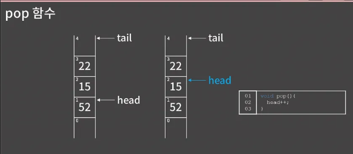

저번 단원에서 배운 스택이랑 이번에 배울 큐랑 좀 비슷한 게 많다. 그래서 전 단원을 잘 이해하고 왔다면 이번 단원도 수월 할 것

</br>


큐는 한쪽 끝에서 원소를 넣고 반대쪽 끝에서 원소를 뺄 수 있는 자료구조

스택에서는 먼저 들어간 원소가 나중에 나왔는데 큐에서는 먼저 들어간 원소가 먼저 나오게 도힌다. 공항에서 입국수속 하는 줄과 같은 상황이라고 볼 수 있다.

스택을 FILO(First In Last Out)이라고 한 것과 비슷하게 큐를 FIFO(First In First Out)이라고 한다.

</br>


- 큐에서 연산의 시간복잡도를 보면 스택처럼 원소의 추가와 제거가 모두 O(1)이다.
- 스택에서는 보통 원소가 추가되고 제거 되는 곳을 top이라고 부르고, 원소가 위 아래로 배치된 것으로 생각을 많이 하는데 큐에서는 추가된 곳을 rear, 즉 뒤쪽이라고 하고 제거되는 쪽을 front, 즉 앞쪽이라고 한다.
- 아무튼 가장 앞쪽에 위치해있거나 가장 뒤쪽에 위치한 원소의 확인도 O(1)
- 4번 성질에 대한 얘기는 이미 스택 단원에서 충분히 언급을 했기 때문에 여기서는 설명을 깊게 하지는 않을 것이다. 요약해서 다시 말해보면 스택과 비슷한 맥락으로 큐라는 자료구조에서는 인덱스를 가지고 원소에 접근하는 기능이 없지만, 배열을 가지고 직접 만들 땐 해당 기능이 가능하도록 구현을 할 수 있다 정도로 요약 가능 단 STL queue에는 인덱스로 내부 원소를 접근하는 기능이 없다.

</br>


- 큐도 스택처럼 배열 혹은 연결 리스트 둘 중 어느 것을 이용해도 구현을 하는데 문제가 없지만 배열을 이용하는 게 구현이 더 쉽기 때문에 배열로 어떻게 구현하면 될지만 짚고 넘어가자 큐를 구현할 때는 원소를 담을 큰 배열 한개와 앞쪽, 뒤쪽을 가리킬 변수 두 개가 필요하다
- 이 head와  tail을 어떻게 두는지는 예시를 보고 이해하자
- {21, 30}이 들어있는 큐를 나타내보면 오른쪽과 같다 head는 가장 앞에 있는 원소의 인덱스이고 tail은 가장 뒤에 있는 원소의 인덱스 + 1이다. 꼭 이렇게 안 두고 tail을 가장 뒤에 있는 원소의 인덱스로 두어도 괜찮지만 지금 보시는 것처럼 두겠다.
- 지금 번지는 비어있고 1,2번지에 차있는지 잘 이해가 안 갈 수도 있다. 그래서 큐를 배열로 표현하는 방법이 이해하도록 한 번 보여주겠다.

</br>


일단 시작할 땐 head와 tail이 모두 0번지를 가리키고 있다. 이 상황에서 55를 추가하면 큐는 두 번째 그림과 같이 head는 변함이 없고 taild은 한 칸 올라가게 된다.


</br>


- 그 다음에는 17을 추가하겠다. 17을 추가할 때도 마찬가지로 head는 그대로 tail은 1증가한다.

</br>


다음으로 제일 앞의 원소를 없애보겠다. 이번에는 head가 1칸 올라간다. 0번지에 있는 55는 굳이 다른 값으로 덮을 필요는 없다.

- 이런 식으로 head와 tail은 0번지에서 시작해 계속 증가하게 된다. 쭉 보면서 알겠지만 dat 배열에서 dat[head]부터 dat[tail-1]번지가 바로 큐의 원소들이 들어있는 자리이다. 그리고 큐의 크기는 tail-head로 쉽게 계산할 수 있다.

</br>


앞 과정을 보면 push 할 땐 tail이 증가하고, pop을 할 땐 head가 증가한다. 그렇기 때문에 dat 배열에서 큐의 원소들이 들어있는 장소는 점점 오른쪽으로 밀린다.

head가 5를 가리키고 있고 tail이 8을 가리키고 있어 dat의 5번지, 6번지, 7번지를 사용하고 있는 상황을 보면 앞쪽에 사용하지 않고 있는 공간이 많음에도 불구하고 더 이상 삽입을 할 수가 없다.

- 삽입을 하려면 dat[8]에 값을 써야 하는데 배열이 8칸이니 그럴 수가 없기 때문이다.

이와 같이 스택과는 다르게 큐는 배열로 구현하면 삭제가 발생할 때 마다 앞쪽에 쓸모없는 공간이 계속 생기게 된다. 이 문제를 해결하는 방법은 의외로 간단한데 큐의 원소가 들어갈 배열을 원형으로 만드는 것이다. 관념적으로는 배열이 원형인거고 실제 구현을 할 땐 head나 tail이 7인 상태에서 1이 더해질 때 0번지로 다시 오도록 만들면 된다.

</br>


즉, dat의 5,6,7번지를 사용하는 상황에서 원소 1개가 추가 되면 0번지를 점유하는 것이다. 이렇게 원형의 배열을 가정하고 구현한 큐를 원형 큐(Circular Queue)라고 부른다.

</br>


- 그냥 선형 배열에서 만든 큐는 삭제가 될 때마다 쓸모없는 공간이 계쏙 생겨서 앞쪽에 공간이 많음에도 불구하고 새 원소를 추가할 수없는 상황이 생길 수 있는데 원형 큐는 head와 tail이 다시 앞쪽으로 돌아오기 때문에 원소의 갯수가 배열의 크기보다 커지지 않는 한 문제가 없다.  그래서 실무에서 굳이 STL 말고 큐를 직접 구현해서 쓰겠다고 하면 원형 큐로 만드는 게 좋다.

하지만 우리가 연결 리스트에서 생각한 것과 비슷하게, 코딩테스트에서는 어차피 push의 최대 횟수가 정해져있다. 그러면 배열의 크기를 push의 최대 횟수보다 크게 둬서 굳이 원형 큐를 만들지 않아도 되게끔 할 수 있다. 

사실 원형 큐의 구현이라고 해봐야 head,tail이 MX가 될 경우 0으로 만드는 것만 달라지기 때문에 어려운 것은 아닌데, 그래도 강의에서는 일단 원형 큐가 아니라 선형 배열에서의 큐를 다루자. push, pop은 각각 삽입과 삭제를 하는 함수이고 front, back은 각각 제일 앞쪽의 원소 확인과 제일 뒤쪽의 원소를 반환하는 함수

```cpp

#include <bits/stdc++.h>
using namespace std;

const int MX = 1000005;
int dat[MX];
int head = 0, tail = 0;

void push(int x){
    dat[tail] = x;
    tail++;
}

void pop(){
    head++;
}

int front(){
    return dat[head];
}

int back(){
    return dat[tail - 1];
}

void test(){
  push(10); push(20); push(30);
  cout << front() << '\n'; // 10
  cout << back() << '\n'; // 30
  pop(); pop();
  push(15); push(25);
  cout << front() << '\n'; // 30
  cout << back() << '\n'; // 25
}

int main(void) {
  test();  
}

```

</br>


- 이제 각 함수들을 구현해보자
- push 함수부터 해보자 지금 52와 15가 있는 큐에 22를 넣고 싶다고 하면 tail이 가리키는 자리에 22를 추가하고 pos를 1증가시키면 된다. 스택에서도 그랬지만 이건 코드 한줄로 표현할 수 있다.


</br>


- pop은 더 날먹임


</br>


- front 함수는 큐에서 제일 앞에 위치한 원소를 반환하는 함수이고 back은 큐에서 제일 뒤에 위치한 원소를 반환하는 함수이니까 지금 저 큐를 보면 front 함수를 52를 반환하고 tail함수는 22를 반환해야된다.

옆에 head랑 tail이 인덱스를 잘 가리키고 있으니까 큰 얼여움 없이 해결 할 것임 각 dat[head]랑 dat[tail-1]을 반환하면 된다. 코드도 같이 확인해보라

전체 코드는 [깃헙](https://github.com/encrypted-def/basic-algo-lecture/blob/master/0x06/queue_test_ans.cpp)에 올려뒀으니 직접 짠거랑 비교를 해보셔도 좋다.


</br>


- 물론 STL에 큐도 있습니다. ([레퍼런스 링크](http://www.cplusplus.com/reference/queue/queue/), [예제 링크](https://github.com/encrypted-def/basic-algo-lecture/blob/master/0x06/queue_example.cpp)) 보통 큐는 BFS랑 Folld FIll를 할 때 쓰게 되는데 둘다 코딩테스트 단골문제여서 문제를 풀 때 STL queue를 쓸일이 아주 많다.
- 나중 가면 적어도 STL queue 만큼은 외우기 싫어도 외워질 것입니다.
- 비어있는데 front나 back이나 pop을 호출하면 런타임에러가 발생할 수 있다는 점은 주의를 하셔야 합니다.

```cpp
#include <bits/stdc++.h>
using namespace std;

int main(void) {
  queue<int> Q;
  Q.push(10); // 10
  Q.push(20); // 10 20
  Q.push(30); // 10 20 30
  cout << Q.size() << '\n'; // 3
  if(Q.empty()) cout << "Q is empty\n";
  else cout << "Q is not empty\n"; // Q is not empty
  Q.pop(); // 20 30
  cout << Q.front() << '\n'; // 20
  cout << Q.back() << '\n'; // 30
  Q.push(40); // 20 30 40
  Q.pop(); // 30 40
  cout << Q.front() << '\n'; // 30
}
```


</br>


```cpp
#include <iostream>
#include <queue>

using namespace std;

int main(){
    int n;
    cin >> n;

    queue<int> Q;
    for (int i = 0; i < n; i++)
    {
        string str;
        cin >> str;
        if (str == "push"){
            int temp;
            cin >> temp;
            Q.push(temp);
        }
        else if (str == "front"){
            if (!Q.empty())
                cout << Q.front() << "\n";
            else 
                cout << "-1\n";
        }
        else if (str == "back"){
            if (!Q.empty())
                cout << Q.back() << "\n";
            else 
                cout << "-1\n";
        }
        else if (str == "pop"){
            if (!Q.empty()){
                cout << Q.front() << "\n";
                Q.pop();
            }
            else 
                cout << "-1\n";
        }
        else if (str == "size"){
            cout << Q.size() << "\n";
        }
        else if (str == "empty"){
            if (!Q.empty()){
                cout << "0" << "\n";
            }
            else 
                cout << "1\n";
        }
    }
    
    
}
```
- 큐의 구현을 연습해볼 수 있는 거 먼저 STL

pop, front, back 명령에 대해서는 STL의 해당 멤버 함수를 실행하기 전에 먼저 큐가 비었는지를 확인해줄 필요가 있다.


</br>


그 다음으로는 직접 구현한 큐를 이용한 코드

[(클릭)](https://github.com/encrypted-def/basic-algo-lecture/blob/master/0x06/10845_2.cpp) 이것도 예외처리만 좀 신경써주고 크기를 tail-head로 계산할 수 있다는 점만 좀 신경쓰면 크게 어려울 건 없을 것이다.
