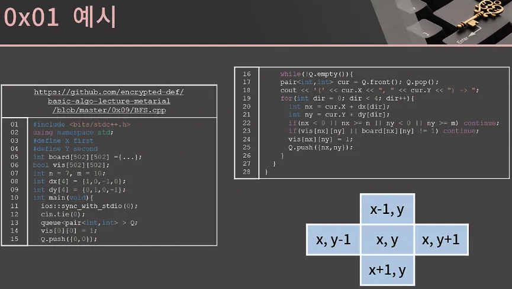
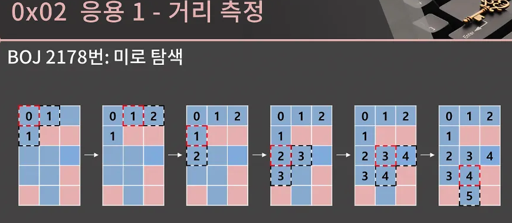
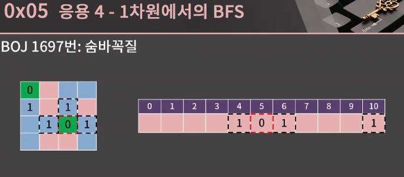

- 드디어 올 것이 왔다.
- 마음의 준비를 단단히 해야한다.
- 실전 알고리즘 강의에서 첫 번째 고비에 도달했음 이 강의와 함께 이번 고비를 잘 헤쳐나가자

</br>


0x05까지 있으니 목차를 보시면 뭐가 되게 많죠? 사실 리뉴얼 하기 전의 강의에서는 기본적인 BFS만 다뤘는데 늘 내용을 보충하고 싶었습니다. 그래서 리뉴얼한 강의에서는 BFS의 다양한 응용 내지는 유형들을 전부 짚고 넘어갈 것입니다.

</br>


- BFS를 알아보기 전에 우리에게 익숙한 문제를 가지고 얘기를 시작해보자
- 대충 물고기 사진을 하나 가져왔는데 그림판의 페인트 기능을 이용하면 물고기의 색을 바꿀 수가 있다. 페인트 기능은 외부 윤곽선을 따라서 구분되는 영역의 색을 한꺼번에 바꾸는 거고 이런 걸 Flood FIll이라고 부르기도 한다.

그론데 이 Flood Fill 기능은 어떻게 구현할 수 있을까? 일단 클릭한 칸의 상하좌우를 보여 나와 색이 같은지 확인하고, 같은 칸에 대해서 또 상하좌우를 확인하고 뭔가 좀 막연하다.

지금까지 배운 지식으로는 이 기능을 구현하는 게 쉽지 않지만, 이번에 배울 BFS라는 알고리즘을 가지고 해결할 수 있게 된다.

</br>


- 계속 BFS BFS하는데 도대체 그게 뭔가 하면, 여기 적힌 대로 다차원 배열에서 각 칸을 방문할 때 너비를 우선으로 방문하는 알고리즘이다.
- 그런데 BFS라는 단어가 굉장히 낯설 텐데 저 표현을 보고 나면 혼란스러울 것 같다. 대체 너비를 우선으로 방문한다는 게 뭔 소리지 싶을 텐데, 달리 어떻게 설명할 벙법이 없다.

왜냐하면 원래 BFS는 그래프라는 자료구조에서 모든 노드를 방문하기 위한 알고리즘이다.

- 여기서 말하는 그래프는 우리가 흔히 아는 왼쪽과 같은 형태의 그래프가 아니라 오른쪽 모양의 그래프이고, 정확한 정의는 정점과 간선으로 이루어진 자료구조이다.

그렇기 때문에 BFS를 정확하게 이해하려면 그래프 자료구조에 대한 이해가 선행되어야 하는데 그건 배보다 배꼽이 더 큰 느낌이다. 그래서 BFS를 엄밀하게 정의할 수는 없지만, 실제로 어떻게 동작하는지를 보면서 다차원 배열에서의 BFS를 이해해보자.

</br>


- 그냥 실제 BFS를 돌리는 걸 한 번 보고 가겠다. 우리의 목표는 (0,0)과 상하좌우로 이어진 모든 파란색 칸을 확인하는 것이다. 이 문제를 BFS로 어떻게 해결하는지 보겠다.

</br>


- 우선 BFS 알고리즘에서는 좌표를 담을 큐가 필요하다
- BFS 알고리즘이 시작되면 우선 (0,0)에 방문했다는 표시를 남기고 해당 칸을 큐에 넣는다.

→ 이 초기 세팅이 끝난 후에는 큐가 빌 때까지 계속 큐의 front를 뺴고 해당 좌표의 상하좌우를 살펴보면서 큐의 넣어주는 작업을 반복하게 된다.

</br>


- 지금 상황에서 큐의 front는 (0,0)이고 pop을 한다. 그리고 (0,0)의 상하좌우 칸을 보는데, 이 중에서 우리는 파란색 칸이면서 아직 방문하지 않은 칸을 찾을 것이다.

</br>


- 지금 상황을 보면 (0,0)과 상하좌우로 인접한 (0,1)과 (1,0)은 모두 파란 칸이면서 아직 방문하지 않았다. 이 2개의 칸에 방문했다는 표시를 남기고 큐에 넣는다.

</br>


- (0,0)에서 할 건 다 했고, 다음으로 넘어간다
- 현재 큐의 front는 (0,1)이고 pop을 한다. 참고로 (0,1)에서 0은 행을 의미하고 1은 열을 의미한다.
- 그리고 이번에도 (0,1)의 상하좌우 칸을 확인한다. 이 칸들 중에서 (0,0)은 파란 칸이지만 이미 방문을 했고 (1,1)은 빨간 칸이다. 유일하게 (0,2)만 파란색 칸이면서 아직 방문을 하지 않은 칸이니까 (0,2)에 방문했다는 표시를 남기고 큐에 넣는다.

</br>


- 계속 이런식으로 큐의 fornt를 pop하고 인접한 칸 중에서 방문하지 않은 파란색 칸에 표시를 남기고 큐에 넣어주면 되는데 이후로는 한 번에 쭉 보여드릴 테니 아래의 예시를 확인해보자.

</br>


- 이렇게 큐가 빈 순간 과정은 종료되고 (0,0)과 상하좌우로 이어진 모든 파란 칸을 잘 방문했음을 알 수 있다.

</br>


- 이렇게 BFS 과정을 같이 살펴봤느데 이해가 잘 가실지는 모르게싿.
- 이제 과정을 Step by step으로 설명드리겠다.

1. 일단 시작하는 칸을 큐에 넣고 방문했다는 표시를 남긴다.
2. 그리고 큐가 빌 때까지 큐에서 원소를 꺼내고 상하좌우로 인접한 칸에 대해 처음으로 방문했다면 해당 칸을 큐에 삽입하는 것을 반복하면 된다.

BFS의 시간 복잡도를 생각해보면 방문 표시를 남기기 때문에 모든 칸은 큐에 1번씩만 들어가게 된다. 그렇기 때문에 시간 복잡도는 칸이 N개 일 때 O(N)이 된다. 만약 행이 R개 이고 열이 C개 이면 O(RC)가 될 것이다.

</br>


- BF의 구현을 다루기 전 코드에서 쓰이게 될 STL을 하나 소개해주겠다.
- utility 헤더에 있는 pair인데 pair를 이용하면 두 자료형을 묶어서 가지고 다닐 수가 있다.
- make_pair로 값을 넣어줄 수도 있고 C++11이상에서는 그냥 중괄호를 써서 쉽게 해결할 수 있다.

값의 접근은 각각 first,second을 부름으로서 가능하고 또 pair에는 미리 대소 관계가 설정되어있어서 편하다. 알아서 앞쪽의 값을 먼저 비교하고 이후 뒤쪽의 값을 비교한다.

BFS를 구현할 때 큐에 좌표를 넣어야하는데 이때 pair를 사용할 것이다.

```cpp
#include <bits/stdc++.h>
using namespace std;

int main(void){
  pair<int,int> t1 = make_pair(10, 13);
  pair<int,int> t2 = {4, 6}; // C++11
  cout << t2.first << ' ' << t2.second << '\n'; // 4 6
  if(t2 < t1) cout << "t2 < t1"; // t2 < t1
}
```

</br>


- BFS를 코드로 어떻게 짜면 될지 고민해보자
- 앞에서 본 것과 같이 큐에서 원소를 뺴고 상하좌우의 칸을 확인하는 식으로 구현하면 되는데 아마 직접 짜보려고 한다면 아마 굉장히 비효율적으로 짜게 될 것이다.
- 직접 시도해보는 것도 정말 좋은 자세이지만 BFS는 어느 정도 정석적인 구현이 있어서 바로 보여드릴 코드를 거의 외우다시피 해도 괜찮다.
- 특히 삼성 A형을 치기 위해서는 BFS가 정말 숙달 되어있어야 하는데 어느 정도냐면 자고 있다가 누가 툭 쳐서 BFS를 짜라고 시켜도 한 5분 내로 기본 틀을 좌르르 쳐낼 수 있어야한다.

일단 코드를 보겠다. 

```cpp
#include <bits/stdc++.h>
using namespace std;
#define X first
#define Y second // pair에서 first, second를 줄여서 쓰기 위해서 사용
int board[502][502] =
{{1,1,1,0,1,0,0,0,0,0},
 {1,0,0,0,1,0,0,0,0,0},
 {1,1,1,0,1,0,0,0,0,0},
 {1,1,0,0,1,0,0,0,0,0},
 {0,1,0,0,0,0,0,0,0,0},
 {0,0,0,0,0,0,0,0,0,0},
 {0,0,0,0,0,0,0,0,0,0} }; // 1이 파란 칸, 0이 빨간 칸에 대응
bool vis[502][502]; // 해당 칸을 방문했는지 여부를 저장
int n = 7, m = 10; // n = 행의 수, m = 열의 수
int dx[4] = {1,0,-1,0};
int dy[4] = {0,1,0,-1}; // 상하좌우 네 방향을 의미
int main(void){
  ios::sync_with_stdio(0);
  cin.tie(0);
  queue<pair<int,int> > Q;
  vis[0][0] = 1; // (0, 0)을 방문했다고 명시
  Q.push({0,0}); // 큐에 시작점인 (0, 0)을 삽입.
  while(!Q.empty()){
    pair<int,int> cur = Q.front(); Q.pop();
    cout << '(' << cur.X << ", " << cur.Y << ") -> ";
    for(int dir = 0; dir < 4; dir++){ // 상하좌우 칸을 살펴볼 것이다.
      int nx = cur.X + dx[dir];
      int ny = cur.Y + dy[dir]; // nx, ny에 dir에서 정한 방향의 인접한 칸의 좌표가 들어감
      if(nx < 0 || nx >= n || ny < 0 || ny >= m) continue; // 범위 밖일 경우 넘어감
      if(vis[nx][ny] || board[nx][ny] != 1) continue; // 이미 방문한 칸이거나 파란 칸이 아닐 경우
      vis[nx][ny] = 1; // (nx, ny)를 방문했다고 명시
      Q.push({nx,ny});
    }
  }
}
```

- 공간이 좁아서 주석을 많이 뺐는데, 저기 [깃헙 링크](https://github.com/encrypted-def/basic-algo-lecture/blob/master/0x09/BFS.cpp)에 들어가서 정확하게 코드를 확인
- 아무튼 코드가 굉장히 낯설텐데 같이 이해해보자
- 3,4 번째 줄에서 #define을 해놓은 건 pair를 조금 더 편하게 쓰기 위함인데, first/second 대신 t.X/t.Y로 쓰고 싶어서 저렇게 했다.
- 그 다음에 있는 변수들의 역할
    - board는 말 그대로 판을 의미한다. 1이면 파란 칸이고 0이면 빨간 칸이라고 생각
    - vis는 방문 여부를 저장할 변수 → 칸 위에 올리던 동그라미를 코드 상에서는 vis의 값을 1로 변경함으로써 처리하는 것이다.
- n과 m은 각각 행과 열의 개수를 의미
- dx,dy는 상하좌우를 영리하게 처리하기 위한 변수인데 이건 실제로 쓰일 때 설명을 주겠더.
- 그 후로 (0,0)에 방문 표시를 하고 큐에 추가하는 과정이 14,15번째줄
- 그 다음에는 큐가 빌때까지 상하좌우의 칸을 추가하는 걸 쭉 반복하는데, 일단 큐의 front를 cur에 저장하고 pop을 한다.
- 그 다음 줄은 그냥 방문 순서를 나타내 주기 위해서 넣은 출력문
- 19번째 줄에서 26번째 줄까지의 루틴이 좀 중요한 루틴
    - 아까 정체를 알 수 없던 dx,dy가 여기서 쓰인다. 판에서 저희가 상하좌우를 생각해보면 오른쪽 아래 그림과 같다.
    - 노파심에 말을 하자면 이 코드에서 x가 행, y가 열을 의미 → 사람에 따라서 x가 열이고 y행인 게 더 익숙할 수 있다. 이게 별게 아닐 수 있지만 생각할 때 굉장히 헷갈리게 하는 요소가 될 수 있다.
    - 당장 지금 저 그림도 만약 x가 열이고 y가 행이라면 왼쪽 칸이 x-1,y가 되어야함.
    - 뭐 어떻게 하든 답은 잘 나오겠지만 대부분의 BFS코드가 x가 행을, y가 열을 의미하는 경우가 많아서 이 방식으로 따라오는 게 좋다.
- 아무튼 우리는 {cur.X, cur.Y}에 대해 상하좌우 칸인 (cur.X-1, cur.Y), (cur.X, cur.Y-1), (cur.X, cur.Y+1), (cur.X+1, cur.Y)를 확인할 필요가 있다. 그리고 이걸 쉽게 하는 방법이 바로 19번째 줄부터 이어지는 for문인데 nx와 ny의 값을 보자
    - cur.X,cur.Y에 대해 dx[dir], dy[dir]을 각각 더함 그리고 0809번째 줄로 시선을 돌려보면 dx[dir], dy[dir] 값이 (1,0), (0,1) (-1,0) (0,-1)이니까 nx,ny에 상하좌우의 좌표값이 깔끔하게 담긴다는 것을 알 수가 있다.
    - dx, dy  값에 따른 순서는 아랫쪽, 오른쪽, 위쪽, 왼쪽 순서이긴 한데 이건 크게 중요하지 않다.
- 이후 22번째 줄에서 일단 범위에 들어오는지 확인하고, 23번째 줄에서 이미 방문했거나 파란칸이 아닌 경우 를 걸러내고 난 후에는 방문헀다는 표시를 vis[nx][ny] = 1로 바꿈으로서 남기고 큐에 추가해주면 된다.
- 만약 22번쨰 줄과 23번째 줄의 순서가 바뀌면 어떻게 될까?
    - 그롷게 되면 vis[-1][0]과 같은 값을 참조할 수 있어서 런타임에러가 날 수 있다.
    - 그렇기 때문에 일단 범위 내에 들어오는지를 꼭 먼저 확인한 후에 vis,board 배열값을 봐야함


</br>


- 제 코드를 보기 전에 BFS를 먼저 구현해보려고 시도해보셨다면 아마 높은 확률로 뭔가 비효율적이거나 잘못 동작하는 코드를 짰을 것입니다. 조금만 익숙해지면 그냥 정석적인 구현을 거의 복붙하다시피 할 수 있겠지만 그래도 구현을 시도해보실 분들을 위해 자주 실수하는 점들을 몇 개 짚고 가겠습니다.
1. 시작점을 큐에 넣긴 하는데 정작 방문했다는 표시를 남기지 않은채로 진행하는 경우가 있다. 이렇게 되면 시작점을 두 번 방문할 수 있다.
2. 큐에 넣을 때 해당 칸에 방문했다는 표시를 남기지 않고 큐에서 빼낼 때 남기는 경우인데, 이렇게 되면 같은 칸이 큐에 여러 번 들어가게 되어서 시간 초과나 메모리 초과가 발생할 수 있다. 특히 이건 보통 예제로 주는 작은 케이스에서는 잘 돌아가다 실제 제출을 했을 때 터지는 경우가 많기 때문에 주의
3. 앞의 코드에서 있던 nx,ny가 배열 바깥으로 벗어났는지에 대한 루틴을 아예 빼먹었거나, 아니면 이상하게 구현을 한 상황

직접 짠 BFS가 좀 이상하면 이런 점들 체크

</br>


- 지금부터 BFS를 이용해서 해결할 수 있는 문제를 살펴보도록하자 [BOJ 1926번 그림](https://www.acmicpc.net/problem/1926) 문제를 확인해보자

우리는 지금 하나의 시작점에서 BFS를 도는 방법만 익혔는데 이 문제에서는 주어진 도화지에서 모든 그림을 찾아야하고 크기도 알아내야 한다.

꽤 어려운 게 아닌 가 싶을 수도 있는데 지금 이 문제 정도면 BFS의 기본 예제 정도라고 생각하면 된다.

- 쉽지는 않겠지만 한 번 고민해보는 시간을 가지도록 하자 먼저 도전해봐도 좋다.

사실 오늘 처음 BFS를 배웠으면 어려운 게 당연하거라 도움이 될만한 팁을 살짝 드려보겠다. 결국 이 문제를 해결하기 위해 우리가 해야할 일은 상하좌우로 연결된 그림의 크기를 알아내기, 도화지에 있는 모든 그림을 찾아내기 2개이다.

1. 첫 번재 경우는 크게 어렵지는 않은게 그냥 큐에서 pop을 몇 번하는지만 세면 끝
2. 문제는 두 번재인데 우리는 지금 어떤 한 시작점과 이어진 그림만 찾아내는 법만 알고 있기 때문에 뭔가 고민을 좀 해볼 필요가 있다.
- 지금 나타낸 그림은 주어진 예제인데 여기 있는 4개의 그림을 어떤 식으로 찾아야할까? 이 부분은 이중 for문을 돌면서 BFS의 시작점이 될 수 있는 곳 찾으면 됨 무슨 소린가 싶을 텐데 이런 느낌

</br>


- 일단 (0,0)는 파란 칸이고 아직 방문을 안 했으니 여기서 BFS를 시작하면 크기가 4인 그림이 찾아질 것이다. BFS를 돌고 나면 방문 표시도 적절하게 남게 된다.

</br>


- 그 후로 (0,1)이 시작점이 될 수 있는지 보면 (0,1)은 파란칸이지만 이미 방문을 했으니 여기서 또 BFS를 돌리면 안 된다.

</br>


- 다음에는 (0,2)인데 여기는 애초에 빨간 칸이니 거른다.

</br>


- 그 다음은 (0,3)은 파란칸이고 아직 방문을 하지 않았으니 새로운 그림이다.
- 그렇기 때문에 여기서 BFS를 시작한다.
- 이와 같이 이중 for문으로 각 칸이 BFS의 시작점이 될 수 있는지를 체크해주면 도화지에 있는 모든 그림을 찾아낼 수 있다.
- 그리고 여기서도 결국 각 파란 칸은 큐에 딱 한 번씩만 들어가서 시간 복잡도는 칸의 갯수만큼만 필요하다 이 문제에서는 O(nm)이다.

내가 푼 거

```cpp
#include <bits/stdc++.h>

using namespace std;

int board[502][502] = {0};
int view[502][502] = {0};

int dx[4] = {1,-1,0,0};
int dy[4] = {0,0,1,-1};

int main(){
    ios::sync_with_stdio(0);
    cin.tie(0);

    int n,m;
    cin >> n >> m;
    for (int i = 0; i < n; i++)
    {
        for (int j = 0; j < m; j++)
        {
            cin >> board[i][j];
        }
    }
    int count = 0;
    int max_size = 0;
    for (int i = 0; i < n; i++)
    {
        for (int j = 0; j < m; j++)
        {
            if (board[i][j] == 1 && view[i][j] == 0){
                // cout << "here\n";
                count++;
                int temp_max_size = 0;
                queue<pair<int,int>> Q;
                Q.push({i, j});
                view[i][j] = 1;
                while (!Q.empty())
                {
                    pair<int,int> cur = Q.front(); Q.pop();
                    temp_max_size++; 
                    for (int idx = 0; idx < 4; idx++)
                    {
                        int nx = dx[idx] + cur.first;
                        int ny = dy[idx] + cur.second;
                        if (nx < 0 || nx >= n || ny < 0 || ny >= m) continue;
                        if (view[nx][ny] == 1 || board[nx][ny] == 0) continue;
                        view[nx][ny] = 1;
                        Q.push({nx, ny});
                        
                    }
                }
                // cout << "max_size : "  << max_size << " temp_max_size : " << temp_max_size << "\n";
                max_size = max(max_size, temp_max_size);
            }   
        }
    }
    // for (int i = 0; i < n; i++)
    // {
    //     for (int j = 0; j < m; j++)
    //     {
    //         cout <<  view[i][j] << " ";
    //     }
    //     cout << "\n";
    // }
    cout << count << "\n";
    cout << max_size << "\n";
}
```

</br>


- 방법을 알았으니 구현을 하면 된다. 바킹독님 코드를 한 번 보면 아프이 BFS코드에서 조금만 변형한 걸 알 수가 있다.
- 천천히 코드를 분석해보면 말한대로 이중 for문을 돌면서 (i,j)가 BFS의 싲가점이 될 수 있는지 확인한다.
- 빨간 칸이거나 이미 방문했으면 제외하고, 이후 그 점을 시작점으로 BFS를 돌린다.

그리고 while문안에서 pop이 이루어질 때마다 area값을 1 증가 시키면 area의  값이 곧 그림의 넓이가 된다.

BFS의 과정을 잘 이해하고 있다면 이 정도의 응용은 따라가는데 큰 무리가 없을 것 같은데 아직 조금 아리까리 하다면 과정을 계속 들여다보면서 확실하게 이해할 필요가 있다.

</br>


- BFS로 Flood Fill을 수행하는 것을 같이 살펴봤는데, Flood Fill 말고도 정말 다양한 응용이 있고 안타깝게도 BFS는 코딩 테스트 단골 문제이기 때문에 이런 응용들을 모두 잘 알고 있어야한다.
- 그 응용 중에서 첫 번쨰 다차원 배열에서의 거리 측정을 보겠다.
- [BOJ 2178번 미로 탐색](https://www.acmicpc.net/problem/2178) 문제

문제를 보면 이 문제는 미로의 좌측 상단으로부터 우측 하단으로 가는 최단 경로의 길이를 찾는 문제이다. 그리고 BFS를 이용해 시작점에서 연결된 다른 모든 점으로부터 최단 경로를 찾을 수 있다. 

이 성질을 이해하기 위해서 BFS의 고하정을 다시 살펴보자 지금 상황은 (0,0)에서 BFS를 도는 상황인데, 뭔가 (0,0)에서 사방으로 퍼져나가는 것과 같은 느낌이 들지 않나? 감이 잘 안 온다면 다음 슬라이드를 보자

</br>


- 이번에는 방문했다는 표시 대신에 각 칸들에 (0,0)까지의 거리를 적어놨는데 눈에 들어오는 게 있나?
- 보면 빨간색 칸은 현재 보이는 칸이고 검정색은 추가되는 칸인데, 현재 보고 있는 칸으로부터 추가되는 인접한 칸은 거리가 현재 보는 칸 보다 1만큼 더 떨어져있다.

제일 첫 번째는 빨간색 칸에서 거리가 0인데 검정색 칸에서 거리가 1이고, 마지막 껀 빨간색 칸에서 거리가 4인데 검정색 칸에서는 거리가 5이다.

이 성질을 활용하면 우리는 단순히 상하좌우로 연결된 칸들을 방문하는 에서 끝나는 게 아니라 시작점과의 거리를 전부 계산 할 수 있다.


</br>


- 구현의 흐름은 크게 다르지 않다
- 거리를 저장할 dist 배열을 두고 상하좌우의 칸을 볼 때 값을 잘 넣어주면 된다. 그리고 이 배열을 미리 -1로 초기화 해두면 굳이 vis 배열을 따로 두지 않아도 방문 여부를 확인할 수 있다.

구현한 [코드](https://github.com/encrypted-def/basic-algo-lecture/blob/master/0x09/2178.cpp)를 같이보자

- 일단 입력은 Stirng 배열에 받았고 dist 배열은 전부 -1로 초기화 시켜뒀다.
- 초기화를 할 때 fill을 썼는데 잘 이해가 안 가면 0x03강을 참고해도 좋다 그냥 fill 대신 이중 for문을 돌면서 -1을 대입해도 아무 상관 없다
- 그리고 큐 안에서 도는 과정은 vis 대신 dist 썼다는 것만 차이가 있고 크게 다라진 건 없어서 이해에 큰 무리가 없을 것이다.

```cpp
#include <bits/stdc++.h>

using namespace std;

string board[102];
int dist[102][102];
int n,m;
int dx[4] = {1,0,-1,0};
int dy[4] = {0,1,0,-1};
int main(){
    cin.tie(0);
    ios::sync_with_stdio(0);

    cin >> n >> m;

    for (int i = 0; i < n; i++)
    {
        cin >> board[i];
    }
    
    for (int i = 0; i < n; i++)
    {
        fill(dist[i], dist[i] + m, -1);
    }
    queue<pair<int,int>> Q;
    Q.push({0 ,0});
    dist[0][0] = 0;
    while (!Q.empty())
    {
        auto cur = Q.front(); Q.pop();
        for (int idx = 0; idx < 4; idx++)
        {
            int nx = cur.first + dx[idx];
            int ny = cur.second + dx[idx];
            if(nx < 0 || nx >= n || ny < 0 || ny >= m) continue;
            if(dist[nx][ny] >= 0 || board[nx][ny] != '1') continue;
            dist[nx][ny] = dist[cur.first][cur.second] + 1;
            Q.push({nx,ny});
        }
    }
    cout << dist[n-1][m-1] + 1;

}
```

</br>


- BFS로 거리를 잴 수 있는 것도 알았으니 다음 응용으로 넘어가겠다.
- [BOJ 7576번 토마토](https://www.acmicpc.net/problem/7576) 문제를 확인하고 오자
- 일단 이 문제가 BFS라는 걸 보고 캐치할 수 있으셨는지 궁금하다. 토마토가 익어가는 상황 자체가 BFS를 하는 것과 똑같기도 하고, 토마토가 익기까지 필요한 최소 일수를 구하려면 모든 익지 않은 토마토들에 대해 가장 가깝게 위치한 익은 토마토까지의 거리를 구해야한다는 관점에서 살펴봐도 마찬가지로 BFS를 활용할 수 있겠다는 생각이 들 것이다.

그래서 만약 익은 토마토가 1개 였다면 앞의 미로 탐색 문제랑 비슷하게 익은 토마토가 있는 곳을 시작점으로 해서 BFS를 돌려 쉽게 해결이 가능할 텐데

- 이 문제에서는 익은 토마토의 갯수가 여러 개일 수 있다. 각 익은 토마토들에 대해 해당 위치를 시작점으로 하는 BFS를 한 번씩 다 돌리는 방법을 떠올릴 수 있지만, 그러면 BFS의 시간복잡도가 O(NM)이고 익은 토마토 또한 최대 NM개 있을 수 있으니 총 O(N^2M^2)이 되어 시간 내로 해결이 안 될 것이다.
- 지금까지 상황을 다시 정리해보면 우리는 지금 시작점이 여러 개인 BFS를 돌 수 있어야하나
- 그리고 해결법은 의외로 간단한데 그냥 모든 시작점을 큐에 넣고 앞에서 한 것과 똑같이 BFS를 돌면 끝이다.
- 지금 슬라이드에서의 그림을 보면 파란색은 익지 않은 토마토, 초록색은 익은 토마토 빨간색은 빈칸을 의미
- 현재 익은 토마토가 2개가 있는데 그 2개를 큐에 넣어두고 BFS를 돌리면 자연스럽게 거리가 잘 구해지게 된다.


</br>


- 익지 않은 토마토 == dist 값 -1, 익은 토마토의 dist 값은 0
- BFS를 도는 부분은 크게 특이한점이 없고 마지막에 답을 출력할 땐 거리가 가장 먼 것을 찾지만 익지 않은 토마토가 있는지를 꼭 확인해줘야한다. 이렇게 토마토 문제를 처리할 수 있습니다.
- [BOJ 7569번 : 토마토](https://www.acmicpc.net/problem/7569)
    - 3차원이라고 해서 크게 다를 거는 없고 단지 배열이 3차원이고 6개의 인접한 칸을 처리하기 위해 dx,dy,dz가 필요하게 된다 이 문제는 여러분에게 맡기겠다.
    - STL tuple을 사용해서 하면 좋다.

</br>


- 이 문제를 풀 때 쓰이지 않았지만 알아둘 필요가 있는 BFS의 성질이 하나 더 있다.
- 앞의 코드가 어떤 식으로 동작하는지 같이 생각해보자.

문제에서의 표현은 익은 토마토와 익지 않은 토마토이긴 한데 그냥 여러 개의 시작점에서 모든 지점으로의 거리를 구하는 문제라는 것을 우리는 알고 있다.

</br>


- 코드를 다시 떠올려보면 일단 익은 토마토, 즉 거리가 0인 칸들을 큐에 다 넣는다.

</br>


- 이때 첫 번째 칸을 통해 추가되는 칸은 앞에서 같이 본 성질로 인해 거리가 1이다.

</br>


- 그 다음 칸을 통해 추가되는 칸들도 마찬가지로 거리가 1이다.

</br>


이제 거리가 0인 칸들은 큐에서 다 빠졋꼬, 순차적으로 1인 칸들을 pop할 텐데 잘 생각해보면 

- 1인 칸들을 pop하는 동안 거리가 2인 칸들이 쭉 추가될 것이다.

</br>


- 거리가 1인 칸들이 다 빠지고 2인 칸들을 볼 때면 3인 칸들이 쭉 추가될 거싱다. 이제 전체적인 큐의 모양을 확인해보면 BFS를 돌 때 큐에 쌓이는 순서는 반드시 거리 순이게 된다.

</br>


- 이제 응용 4개 중 절반을 끝냈다.
- [BOJ 4179번 불!](https://www.acmicpc.net/problem/4179)
- 불의 전파를 BFS로 처리할 수 있음을 알 수 있다. 그런데 지금 지훈이의 탈출도 같이 처리를 해주어야하고 이게 꽤 어렵다
- 일단 결론적으로 말하면 이런 문제는 불에 대한 BFS와 지훈이에 대한 BFS모두 돌림으로서 해결 가능

먼저 지훈이는 신경쓰지 말고 불에 대한 BFS를 돌려서 미리 각 칸에 불이 전파되는 시간을 다 구해둔다. 두 번째의 맵이 바로 각 칸에 불피 전파시간을 의미한다.

그다음에는 지훈이에 대한 BFS돌리면 지훈이를 이동시킨다. 이 때 만약 특정 칸을 x시간에 최초로 방문할 수 있는데 그 칸에는 x시간이나 그 이전에 불이 붙는다면 그 칸을 못가게 된다.

예를 들어 “**”으로 마킹한 칸을 보면 지훈이는 저 칸에 2시간이 될 때 방문하게 되는데 그런데 불은 이미 1시간만에 전파되었기 때문에 지훈이는 저곳을 갈 수가 없다. “**,****” 으로 마킹한 칸도 마찬가지 이유로 지훈이가 갈 수 없는 칸이다. 

원래 BFS의 구현에서는 큐 안에 (nx, ny)를 살펴볼 때 방문했는지 여부를 vis[nx][ny]가 true인지 혹은 dist[nx][ny]가 0 이상인지 확인하고 이미 방문한 칸이라면 continue를 한다. 

이 문제에서는 추가로 해당 칸에 불이 붙은 시간을 확인해서 필요에 따라continue를 하면 된다. 이렇게 BFS와 지훈이에 대한 BFS를 따로 해서 문제를 그렇게 어렵지는 않게 해결할 수 있다.

</br>


- 어렵긴 해도 못할 난이도는 아닐 것 같은데 어떤지 모르겠다. 일단 [코드](https://github.com/encrypted-def/basic-algo-lecture/blob/master/0x09/4179.cpp)를 보자

이 문제의 코드는 도저히 한 슬라이드에 다 담을 수가 없었다. 한 20줄 정도가 더 남아있는데 일단 지금여기까지 보자 불에 대한 BFS는 Q1, dist1을 활용하고 지훈이에 대한 BFS는 Q2, dist2를 활용할 것이다. 불에 대한 BFS는 늘 해오던 것 과 똑같다.

</br>


- 불에 대한 BFS가 끝나고 나면 dist1에는 해당 지점에 불이 언제 붙는지가 저장된다.
- 그 다음으로는 지훈이에 대한 BFS를 돌면서 외곽으로 빠져나올 수 있게 해야하는데 지금까지의 BFS에서는 목적지가 정해져있거나 더 이상 갈 곳이 없을 때까지 계속 돌리는 상횡이ㅓㅆ다면 반면 이번에는 외곽으로 탈출을 해야하니 52번째 줄의처리가 들어가게 된다.
- 주석으로 적어놓은 것 처럼(nx, ny)가 범위를 벗어났다는 건 곧 탈출헤 성공했다는 의미
    - 17번 슬라이드에서 본 것과 같이 큐에 원소들은 거리 순으로 들어가니 최초로 탈출한 시간을 바로 출력하고 종료
- 지훈이는 자신이 도착한 시간과 동시에 불이 도착하거나, 혹은 자신 보다 더 빨리 불이 도착하는 자리로는 갈 수 없기 때문에 58번째 줄의 조건이 추가로 들어가게 된다
    - +1 한 건 불의 위치가 다음 칸이기 때문
- 만약 프로그램이 종료되지 않고 While문이 끝나게 된다면 지훈이가 탈출에 실패했다는 의미이니 IMPOSSIBLE을 출력

이렇게 시작점이 두 종류인 문제를 해결할 수 있게 되었다. 그런데 시작점이 두 종류인 문제에 관해서 저희가 생각해야 할 점이 사실 추가로 있다.

- 지금 이 방식이 가지고 있는 문제는 지금은 지훈이의 이동은 불의 전파에 여향을 받지만 불의 전파는 지훈이의 이동에 영향을 받지 않아서 불만 먼저 전파를 쭉 시키는 게 가능했다
- 그런데 예를 들어 시작점이 A,B 두 종류가 있고 A의 전파에 B가 여향을 주고 B의 전파에도 A가 영향을 준다고 해보자
- 지금 이 문제에서 불과 지훈이가 아니라 불과 소방수 내지는 불과 물이 전파되는 문제여서 둘이 만나면 뭔가 상호작용이 발생한다고 생각을 하는 거다
- 그런 상황을 생각해보면 어느 하나를 먼저 끝까지 전파시키는 게 불가능하다. 바킹독님이 출제 했던 [18809번 문제](https://www.acmicpc.net/problem/18809)가 딱 그런 문제이다.
- 아쉽게도 이 문제는 백트래킹 기법을 추가로 알고 있어야 해결이 가능하기 때문에 당장 풀어볼 수는 없지만 두 종류의 BFS에서 BFS를 돌 때 어느 하나가 독립적이지 않고 서로에게 여향을 준다면 지금 보여드린 방법으로는 해결할 수 없다는 것을 꼭 이해해야한다. 그런 상황에서는 시간 순으로 A와 B를 동시에 진행시켜야한다.

이 부분은 충분히 생각해볼 가치가 있고 두 종류의 시작점 문제를 몇 개 풀다보면 지금 바킹독님이 한 얘기가 더 명확하게 이해가 갈 것 이다. 그때 다른 사람의 코드를 찾아보거나 직접 고민하면서 시간 순으로 A와 B를 동시에 진행시킨다는 의미를 이해해보면 좋겠다.

</br>


- 마지막 BFS
- [BOJ 1697번 숨바꼭질](https://www.acmicpc.net/problem/1697)
- 이 문제는 지금까지 다뤘던 문제들이랑 느낌이 많이 다른 것을 확인할 수 있다.
- 지금까지 죄다 2차원 배열 형태에서 상하좌우로 움직이는 모양새였는데 얘는 전혀 다르다. 그래서 이게 BFS랑 관계가 있긴 한건가 싶을 텐데 이 문제도 BFS이다.

</br>


- 이차원에서의 BFS를 생각하면 지금 이 그림처럼 현재 선택된 칸에서 상하좌우로 뻗어나가는 방식으로 진행이 됐다.
- 왜 상하좌우로 뻗어갔나 생각해보면 그게 불이 됐든 토마토가 됐든 전파가 상하좌우로 이루어졌기 때문
- 그럼 약간의 창의성을 발휘해서 아래와 같이 이 문제에서도 수빈이가 X에 있다고 할 때 X-1, X+1, 2X로 이동하는 것을 처리할 수 있겠다는 생각을 해볼 수 있다.

</br>


수빈이가 예제처럼 5에 있었다고 치면 5에서 BFS를 시작하고 5에서 갈 수 있는 4,6,10은 거리가 1이 되는 것임.

</br>


- 그 다음으로는 4가 선택되고 3,5,8을 보는데 5에는 이미 값이 써져 있으니 3,8만 거리가 2가 될 것이다.
- 이렇게 BFS를 돌다가 동생이 있는 위치의 값이 써지게 되면 문제에서 원하는 답을 알 수 있게 된다.
- 구현이 그렇게 어렵지는 않을 것 같은데 어떤가?

그런데 사실 한 가지 더 고민해야할 문제가 있다.

- BFS 범위를 어디까지로 해야할까? 0부터 100,000으로 하면 되는 거 아닌가 하고 쉽게 생각을 하셨을 수도 있는데
- 문제를 보면 수빈외와 동생의 위치가 0에서 100,000 사이라고 했지 수빈이가 이동 중에 반드시 0에서 100,00 사이에만 있어야한다는 조건은 없다. 예를 들어 100,00 밖으로 나갔다가 다시 안으로 올 수도 있다. 그래서 이 부분을 고려해야함.

일단 상식적으로 생각했을 때 음수로 갈 일은 없을 것이다. 그건 진짜 절대 빠른 경로가 될 수 없기 때문 그리고 100,000 바깥으로 나갈 수 있겠지만 일단 한 번 나갔다면 그 이후로는 -1만 계속 하게 된다. 그렇기 때문에 동생을 가장 빠르게 찾아나가는 상황에서는 아무리 멀리가도 200,000을 넘어가지 않는다.

이러한 생각을 거쳐서 0에서 200,000 사이에서만 BFS를 돌려도 답을 구하는데는 문제가 없음을 알 수 있게 되고 여기서 더 깊게 생각을 해보면 사실 100,000을 나가는 것 자체가 손해라는 것을 알 수가 있다 +1로 100,000 탈출하는 건 정말 바보짓이고 x2로 100,000을 탈출하는 상황이 있을 수 있겠다 싶지만 x2를 한후 -1을 여러번 할 바에야 -1을 먼저하고 x2를 하는 게 더 낫기 때문 

지금 설명이 잘 이해가 가지 않을 수 있습니다. 이해가 가지 않더라도 상관은 없지만 이 문제에서 당연히 수빈이가 0에서 100,000 사이에서만 움직인다고 멋대로 가정을 하고 풀면 안된다는 점은 꼭 짚고 넘어가면 좋겠습니다. 이 문제에서는 운 좋게 논리적으로 생각을 했을 때 수빈이가 0에서 100,000 사이에서만 움직이게 되었지만 다른 문제에서는 멋대로 가정한 것 때문에 말아먹을수도 있습니다.

</br>


현에서 크게 어려울건 없을 것 같습니다. 17번째 줄에서 range-based for를 이용했고, 구현 흐름은 늘 보던 것들의 반복


</br>


굉장히 빡센 BFS가 마무리 됨

Flood Fill로 시작해서 거리 측정, 시작점이 여러 개 있을 때, 시작점이 두 종류 일때, 1차원에서의 BFS를 모두 다 뤘는데 한 강의에서 다루기 정말 많은 분량이긴 했다. 하지만 이왕하는거 여러 응용들을 잘 섭렵하시라고 이렇게 준비를 했고 BFS부턴느 본격적으로 코딩테스트에 정말 잘 나오는 유형이기 때문에 그룹 내의 문제집을 꼼꼼하게 풀어보고 BFS의 기본 틀 자체도 반복적으로 짜면서 코드의 흐름을 손에 익힐 필요가 있다 .

</br>
</br>
</br>
</br>
</br>
</br>
</br>
