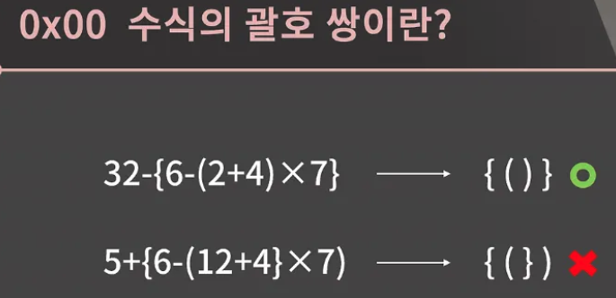

- 0x05에서 스택을 다룰 때 후반부에 얘기를 하기도 했었지만 스택의 대표적인 활용 사례로 수식의 괄호 쌍이랑 전위/중위/후위 표기법, DFS, Flood Fill 등이 있다. 이 중에[서 전위/중위/후위 표기법은 코딩테스트 대비용으로 너무 지엽적으로 생각해서 알골리즘 강의에서 뺐다.
- 나머지들은 같이 공부를 할 건데 일단 이번 시간에는 수식의 괄호 쌍을 공부해보겠다.


</br>


수식의 괄호 쌍이 대체 무엇을 말하는 건지 같이 이해해보고, 문제를 어떻게 해결하면 좋을지 생각해보는 시간을 가지도록 하자.

</br>


- 수식의 괄호 쌍은 진짜 말 그대로 수식의 괄호 쌍을 의미
- 우리 모두 비록 20대 중반을 넘어서 30대를 향해 달려가고 있지만, 옛날 옛적 구몬 같은 학습지를 풀었던 추억을 떠올리면서 머리도 한 번 굴림 겸 위의 식을 한 번 암산해보자.
- 뭐 아무짝에 의미는 없지만 아무튼 제일 안쪽 괄호부터 차근차근 정리하면 68임을 계산할 수 있다.

</br>


- 아무튼 저 위 식은 정상적인데 그 밑에 있는 식은 뭔가 좀 이상하다.
- (12+4} 부분이 좀 마이 안 된다. 그래서 이 식은 정상적인 식이 아니다.
- 일단 문제를 좀 단순하게 생각하고 싶어서 수식은 다 빼고 괄호만 냅둬놓고 생각을 한 번 해보자.
- 괄호를 뺴놓고 봐도 위에껀 올바른 수식의 괄호 쌍이고 밑에껀 그렇지 않다는 게 딱 눈에 들어온다.

이와 같이 수식의 괄호 쌍이란, 주어진 괄호 문자열이 올바른지 판단하는 문제이다.

</br>


- 우리가 눈으로 보면 괄호 문자열이 올바른지 아닌지 판단할 수 있다.
- 그런데 혹시 머릿속에서 어떤 로직을 거쳐서 판단을 하시나요? 우리는 이걸 코드로 구현해내는 게 목표이니 로직을 잘 생각해볼 필요가 있다.
- 쉬운 것부터 하나씩 해보는 게 좋을 것 같아서 일단 괄호의 종류가 1개인 경우만 다뤄보자.
- 저 3개의 문자열 각각에 대해서 올바른지 아닌지 먼저 눈으로 보고 또 판단법을 고민해보자.

</br>


- 일단 결론적으로 말해서 첫 번째 식만 올바른 식이다.
- 그런데 저 식이 올바르다는 건 어떤 방식으로 계산해낸건가?
- 그게 지금 우리가 고민해야할 문제이다.
- 이 내용을 모른느 사람은 어떤 식으로 생각하는지 알고 싶어서 컴퓨터를 전공하지 않는 주변 친구들에게 바킹독님이 물어보심 물어보면서 여러 방법들을 들을 수 있었다.

</br>


- 가장 보편적인 방법은 바로 안쪽부터 짝맞추기를 해서 지워나가는 방법이었다. 그래서 다 짝이 맞으면 올바른 괄호 쌍인거고 그렇지 않으면 올바르지 않은 괄호 쌍이다.

관찰력이 뛰어나다면 )개수가 (의 갯수를 넘지 않으면 된다는 사실을 알아차릴 수도 있을 것이다.

</br>


- 그런데 괄호가 여러 종류일 때에는 여는 괄호의 갯수가 닫는 괄호의 갯수만으로는 해결되지 않는다.
- 예를 들어서 지금 슬라이드의 저 두 괄호 문자열을 생각해보면 위는 올바르고 아래는 올바르지 않다.
- 그런데 둘 다 )의 갯수가 (을 넘은적도 없고, }의 갯수가 {을 넘은 적도 없다.

대신 붙어있는 () 혹은 {}를 지우는 방법은 여전히 잘 동작한다.

- 이 방법은 배열로 구현할 경우 최대 N번 중간에 있는 원소의 삭제가 발생하기 때문에 O(N^2)이고, 연결리스트로 구현할 경우 O(N)이다.
- 배열은 시간 복잡도가 안좋으니 거르고, 연결 리스트로 구현은 해볼만하니까 한 번 짜봐도 좋다. 그런데 스택을 이용하면 훨씬 더 간단하게 할 수 있다. 이 방법을 고안하려면 하나의 관찰이 추가로 더 필요하다.

- 그 관찰은 바로 “문자열을 앞에서부터 읽어나갈 때, 닫는 괄호는 남아있는 괄호 중에서 가장 최근에 들어온 여는 괄호와 짝을 지어 없애버리는 명령이라고 생각해도 된다.”라는 것
- 이걸 듣고 흠칫햿다면 좀 많이 대단한거지만 그러기가 쉽지 않을 테니 예씰르 보자. 이핼르 돕기 위해 짝이 맞는 애들은 색깔로 표시 해놓았다.

</br>


- 일단 여는 괄호를 만나면 그냥 여는 괄호를 쓴다. 두 번째와 세 번째도 모두 여는 괄호이니 다 쓰면 된다.

</br>


- 이제 다음으로 가면 처음으로 닫는 괄호를 만났다. 그러면 우리의 관찰에 따라 가장 최근에 들어온 여는 괄호를 없애면 된다. 지운 괄호와 닫는 괄호가 모두 노란색이니 짝이 잘 맞아떨어졌다.

</br>


- 다음꺼는 여는 괄호이니 쓰면 된다.

</br>


- 그 다음으로 있는 3개는 닫는 괄호이니 차례로 지우면 된다. 문자열을 다 읽었고 남아있는 괄호가 없는 것으로 보아 모든 게 다 짝이 잘 맞았다는 걸 알 수가 있다.
- 이처럼 올바른 괄호 쌍일 경우 여는 괄호를 읽을 때 마다 저장하다가 닫는 괄호를 읽을 때 가장 최근에 들어온, 즉 가장끝에 있는 여는 괄호와 짝을 이루게 해주고 pop을 하면 올바른 괄호 쌍인지 확인할 수 있다.
- 올바르지 않은 괄호 쌍에서는 이 알고리즘이 어떤 식으로 동작하는지 살펴보자


</br>


- 첫 번쨰로 짝이 맞지 않는 경우를 살펴보자
- 일단 처음 2개 괄호는 여는 괄호이니 그냥 쓰면 된다. 그 다음 괄호는 닫는 괄호이니 가장 최근에 들어온 여는 괄호와 짝을 지어야한다.
- 그런데 여기서 문제가 생겼다. 여는 괄호는 중괄호인데 닫는 괄호는 소괄호이다.
- 이렇게 되면 둘은 짝 지을 수가 없다. 그래서 우리는 지금 이 문자열이 올바르지 않은 괄호 쌍임을 알 수가 있다.


</br>


- 올바르지 않은 괄호 쌍의 두 번째 예시를 보자. 일단 처음 2개는 괄호는 여는 괄호이니 그냥 쓰면 된다. 그 다음 괄호는 닫는 괄호이니 가장 최근에 들어온 여는 괄호와 짝을 이를거고 둘 다 중괄호이니 별 문제는 없다.
- 이렇게 문자열 끝까지 읽었는데 아직 처리를 하지 못하고 여는 괄호가 있다. 즉, 짝을 지어주지 못한 여는 괄호가 남아있어서 지금 이 문자열이 올바르지 않은 괄호 쌍임을 알 수가 있다.

</br>


- 올바르지 않은 괄호 쌍의 세 번째 예시를 보자. 일단 첫 번째 괄호가 여는 괄호여서 써주고, 그 당므 괄호는 닫는 괄호이니 첫 번쨰 괄호랑 짝을 지어줬다.


</br>


- 여기까지는 좋은데 그 다음 괄호를 가보자.
- 다는 괄호이니 여는 괄호와 매칭 시켜줘야 하는데 남아있는 여는 괄호가 없다. 즉 짝을 지어주지 못한 닫는 괄호가 남아있어서 지금 이 문자열이 올바르지 않은 괄호 쌍임을 알 수가 있게 된다.

</br>


- 이제 올바른 괄호 쌍의 판단을 위해 해야하는 일을 알게 됨
- 앞에서 본대로 여는 괄호가 나오면 저장해뒀다가 닫는 괄호가 나오면 짝이 맞는지 확인 후에 가장 최근에 들어온 여는 괄호를 제거하고 이런식으로 진행하면 된다.
- 과정에서 잘 생각해보면 가장 최근의 것이 가장 먼저 나오게 됨. 즉 FILO인거고 스택 자료구조를 이용해서 구현할 수가 있다. 그래서 과정을 구체적으로 정리하면 이런식이다.
1. 여는 괄호가 나오면 스택을 추가하고, 닫는 괄호가 나오면 스택이 비어있거나 top이 짝이 맞지 않은 괄호인지를 먼저 확인
    - 여기서 걸리면 올바르지 않은 괄호 쌍인거고, 짝이 맞는 괄호라면 pop을 해준다. 
2. 모든 과정을 끝낸후에 스택이 비어있는지도 확인


</br>


```cpp
#include <stack>
#include <iostream>

using namespace std;

int main(){
    while (1)
    {
        string str;
        getline(cin, str);
        if (str == ".")
            break;
        stack<char> sta;
        bool check = true;
        for (int i = 0; i < str.size(); i++)
        {
            if (str[i] == '(' || str[i] == '['){
                sta.push(str[i]);
            }
            else if (str[i] == ')' ){
                if (sta.empty() || sta.top() != '('){
                    cout << "no\n";
                    check =false;
                    break;
                }
                else 
                    sta.pop();
            }
            else if (str[i] == ']'){
                if (sta.empty() || sta.top() != '['){
                    cout << "no\n";
                    check = false;
                    break;
                }
                else 
                    sta.pop();
            }
        }
        if (check == false)
            continue;

        if (!sta.empty() ){
            cout << "no\n";
        }
        else 
            cout << "yes\n";
    }
}
```

- 방법을 잘 익혔으니 이제 구현을 해볼 시간 [BOJ 4949번: 균형잡힌 세상](https://www.acmicpc.net/problem/4949) 문제를 확인해보면 괄호가아닌 다른 문자들은 다 무시하고 괄호들만 모아놓고 봤을 때 올바른 괄호 쌍인지 판단하는 문제라는 것을 알 수가 있다.
- 공백을 포함한 줄의 입력이 조금 껄끄러울 수 있는데 0x02에서 배웠듯 getline을 이용하면 된다.

그러면 지금부터 구현을 해보는 시간을 가져보도록 하자 구현과정에서는 STL stack을 쓰면 되고, 한 번만에 맞기는 어려울 수 있지만 직접 짜보면 얻는 게 많을 것이다.

- 이제 버킹독님 [코드](https://github.com/encrypted-def/basic-algo-lecture/blob/master/0x08/4949.cpp)를 보면서 같이 얘기해보자
- 08, 09, 10 번째 줄을 보면 string a를 getline으로 입력받고 문제에서 말한대로 점 하나면 종료할 게했다. 그 후 스택을 선언하고, 올바른 괄호 쌍인지를 저장할 변수 isValid를 뒀다. 이때 이 변수의 초기값은 true여야 한다.
- 그 다음에는 문자 하나씩 살펴보는데 일단 문자가 열린 괄호일 땐 그냥 스택에 push를 하면 된다.

그리고 닫는 괄호일 땐 일단 스택이 비었거나 짝이 맞지 않다면 isValid를 false로 만들고 바로 끝내고, 짝이 맞다면 pop을 하면 된다. 이 때 stack이 empty인데 s.top()을 호출하면 런타임 에러가 발생한다는 점에 주의해야한다.

지금 16번 줄과 23번 줄을 보면 조건문에서 일단 s.empty()를 먼저 확인하는 것을 볼 수가 있는데 만약 s.empty()가 true일 경우 뒤의 식을 확인하지 않고 바로 if문안의 명령을 수행해서 스택이 비었는데 s.top을 호출하는 일은 발생하지 않는다. 이런 걸 Short-circuit evaluation이라고 한다.

while문이 끝난 후에 스택이 비어있는지를 추가로 확인해주고, isVliad의 값에 따라 yes 혹은 no를 출력해주면 구현이 끝난다.

혹시 오답 혹은 런타임에러를  받았다면 스택이 비어있는데 top() 호출했거나 끝난 후에 스택이 비었는지를 확인하지 않았거나 스택을 전역으로 선언했을 경우 각 줄에 대한 처리가 끝난 후에 스택을 초기화 시키지 않았다거나 하는 등의 이류를 떠올려볼 수 있다.


</br>


- 수식의 괄호 쌍 문제는 굉장히 유명한 스택의 응용이어서 사실 코테에 앞의 문제처럼 대놓고 드대로만 풀면 되는 문제가 나올 것 같지는 않다.
- 물론 그렇게 나온다면야 땡큐긴 하지만, 보통은 이 내용을 잘 알고 있는 상태에서 머리를 좀 써야하는 문제가 나올 것이다. 여기 ㅈ거어놓은 10799번, 2504번이 다 그런 유형이다.

깡으로 혼자 덤벼들면 많이 고생하실 것 같아서 접근 방법만 살짝 알려드릴까한다.

혼자 힘으로 도전해보고 싶으시면 이 슬라이드의 내용을 더 보지 마시고 다음 슬라이드로 넘어가면 된다. 

[BOJ 10799번: 쇠막대기](https://www.acmicpc.net/problem/10799)  

- 이 문제의 경우 괄호 쌍을 볼 때 지금 보고 있는 이 닫힌 괄호가 레이저를 의미하는지 쇠막대기를 의미하는지는 그 앞의 괄호를 보면 알 수 있을 것이다.
- 그리고 레이저를 쏠 때 몇 개의 막대기가 잘려나가는지는 그 순간에 스택의 길이와 연관해서 생각해보면 느낌이 올 수도 있다.

[BOJ 2504번: 괄호의 값](https://www.acmicpc.net/problem/2504) 

- 문제는 일단 손으로 한 번 해결을 하려고 해보고 그리고 그 과정을 어떻게 스택 상에서 처리하면 될지도 생각을 해보자 하다 보면 스택이 단순히 문자만 가지고 있는 게 아니라, 값도 같이 가지고 있으면 될 것 같다는 느낌이 올 것 같다.

</br>


- 이번 단원에 다루려고 했던 내용은 다 끝났다.
- 응용문제까지 다 풀어보고 가시면 좋겠지만 잘 이해가 가지 않는데 시간이 촉박하다면 수식의 괄호 쌍 내용만 이해한채로 넘어가고, 이전 슬라이드에 나온 두 문제는 배제해도 좋다. 수식의 괄호쌍이 오케텡서 무조건 나온다라고 할 정도로 중요한 내용은 아니기 때문

그런데 이 당므 단원 부터 5개 단원 동안 BFS, DFS, 재귀, 백트래깅, 시뮬레이션을 다루게 되는데  이 내용들은 정말 중요해서 진짜 주구장창 문제를 풀어야한다. 그러니까 미리 마음의 준비를 단단히 하고 다음 단원으로 넘어오셔야 한다.
