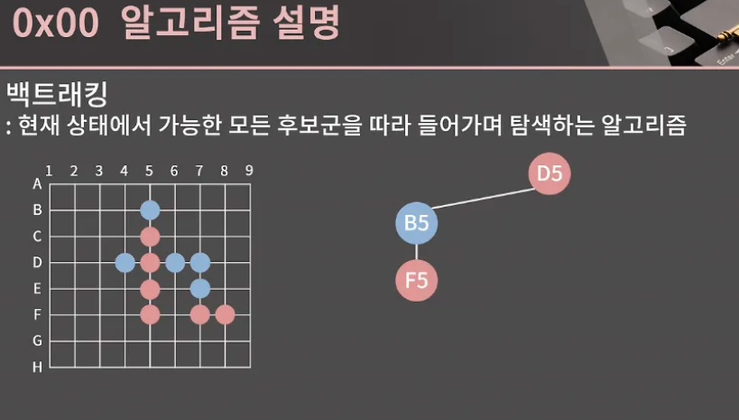
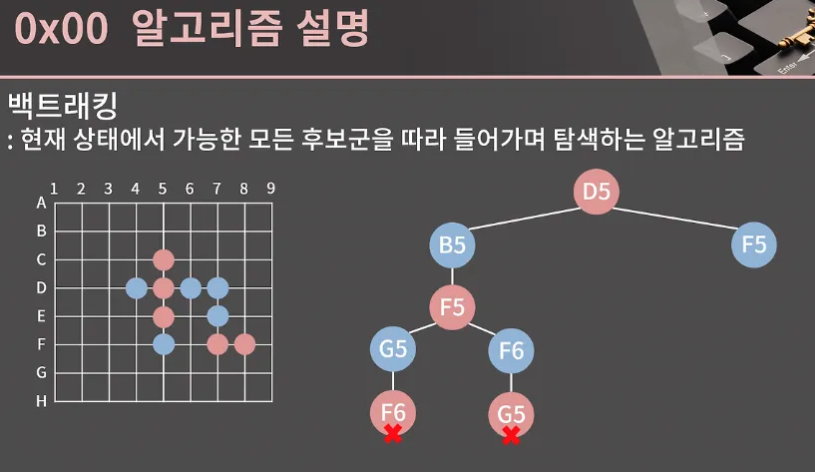
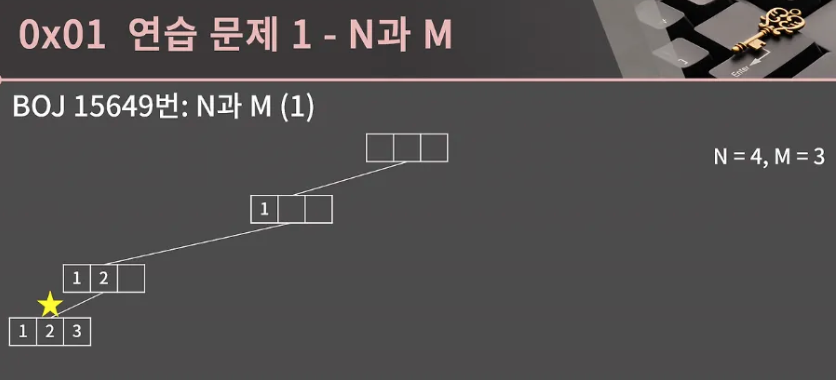
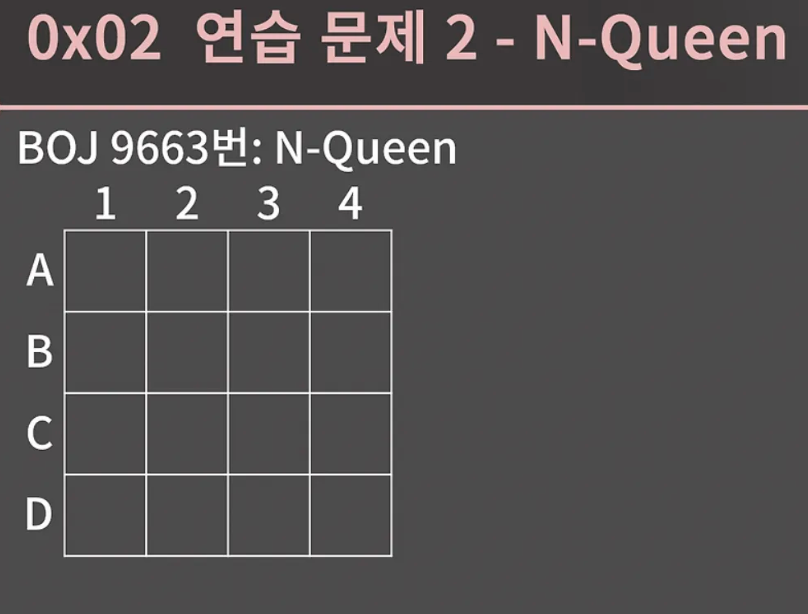
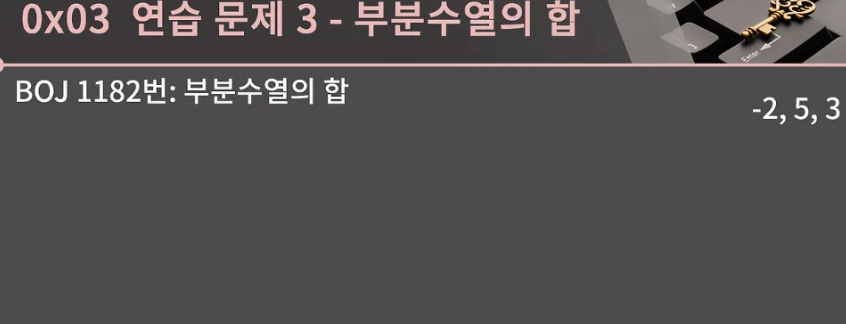

- 이번에는 백트래킹을 배워보자
- 백트래킹도 재귀와 더불어 많은 사람들이 고통을 호소하는 알고리즘 중 하나이다
- 의외로 그 재귀적인 구조에 매료되어서 참재미를 알아버리는 경우도 있다. 앞 단원에서 재귀를 충실하게 익혔다면 그렇게까지 어렵지 않을 수 있다.


</br>


- 백트래킹에 대해 설명을 해주고 관련 문제들을 풀어보는 방식

</br>


- 백트래킹의 정의를 읊어보자면 현재 상태에서 가능한 모든 후보군을 따라 들어가며 탐색하는 알고리즘
- 정의를 봐도 그다지 느낌이 없을 텐데 백트래킹이란 걸 전혀 몰랐더라도 백트래킹이란 걸 전혀 몰랐더라도 분명 이 알고리즘을 써서 실생활의 문제를 해결해본 경험이 분명 있을 것이다.
- 혹시 여기 게임들 중에서 아는 거 하나라도 있다하면 마음 속으로 손을 한 번 들어볼까?

왼쪽 위에서부터 프리세스 메이커, 미연시, 역전 재판, 검은방, 회색도시, 문명이다.

- 게임에서 선택지가 막 나누어질 때 저희는 뭔가 하나를 정해서 가야함
- 검은방 스샷을 가지고 얘기를 이어가보면 저 3가지 선택지 중에서 첫 번째를 선택했더니 게임오버가 떴다고 해보겠다.
- 그러면 되돌아와서 두 번째 선택해볼꺼고, 두 번째도 이상하면 세 번째 것을 선택해보고 결론적으로 모든 경우를 다 훑어보게 될 것이다.
- 즉 현재 상태에서 가능한 모든 선택지를 다 플레이해보는 방법이 바로 백트래킹이다.

</br>


- 아쉽게도 이번에 풀 문제들이 이런 게임들처럼 재밌지는 않을 것이다.
- 참 슬픈 일인데 그래도 백트래킹의 쓰임새를 하나 더 설명해보자면 백트래킹이 요새 핫한 분야와도 조금 닿아있다.
- 바로 알파고
- 당장 저도 그렇고 바둑에 안 익숙한 사람이 많을 테니 오목으로 예를 들어서 백트래킹의 쓰임새를 설명드리겠다.

저희는 파랑 돌이고 상대는 직전에 D5를 뒀다.

이 상황에서 우리는 어디에 둘지 정해야하는데 C5 D5 E5로 대놓고 세로로 3개가 완성된 게 있으니 저걸 막아야함. 그러면 B5나 F5중 하나를 선택해야함은 자명한데 둘 중에 어딜 두면 좋을지 지금 진짜 오목을 둔다고 생각하고 고민해보자.

</br>


- 먼저 B5에 뒀다고 가정을 해보면 상대는 물론 어디에나 두어도 상관 없지만 상대가 F5에 착수를 한다면 굉장히 곤란해질 것이다.


</br>


- 상대의 4-3이 완성 되었기에 내가 G5를 둔다 한들 상대가 F6를 두어지게 될 거고

</br>


내가 F6을 두면 상대는 그냥 G5를 둬서 바로 오목을 완성할 것이다.

이렇게 내가 B5에 뒀을 때 생기는 상황을 쭉 따라 들어가 확인한 결과 B5에 두면 진다는 것을 알게 됐다.

그 다음으로는 F5에 착수한 뒤의 상황을 확인해보자


</br>


- 이 상황에서는 상대는 B5나 E6이나 C4나 G8에 두면서 공격을 이어나가려고 할 것이다.
- 그럼 우리는 그 각각의 수들에 대해 다시 나의 대응 수를 정해보는 식으로 계산을 이어갈 수 있다.

</br>


지금 이 방식이 일종의 백트래킹인거고 용어를 몰랐다 뿐이지 우리는 지금까지 게임을 할 때, 아니면 오목을 둘 때 백트래킹을 자연스럽게 이용했다.

참고로 이렇게 생긴 트리를 상태공간트리라고 부르는데 바킹독님은 프로그래밍을 시작한 이후로 지금까지 전혀 상태공간트리라는 용어를 모르다가 이번에 강의자료를 만들면서 처음으로 알게 되었기 때문에 이 용어를 한 번 듣고 잊어버리셔도 ㄱㅊ을 듯하다

</br>


이 정도 워밍업은 적절하게 잘 된 것 같은데 대충 개념은 이해했다고 치더라도 막상 백트래킹 문제를 풀려고 하면 꽤 많은 애로사항이 있다.

- 백트래킹은 상당한 구현력을 필요로 하고 실수하기도 쉽다. 또 앞 단원의 문제를 풀다가 느꼈을 테지만 재귀의 특성상 틀리더라도 실수한 부분을 찾기가 정말 힘들다

그래서 

- 굉장히 많은 시간을 할애해 개념을 익히고 연습을 해야하고, 그렇지 않으면 풀이는 대충 알겠는데 그 풀이를 코드로 옮겨내지 못해서 문제를 틀릴 확률이 크다
- 그래도 한편으로는 그렇게 응용할 수 있는 건덕지가 많지는 않기 때문에 예제들을 꼼꼼하게 풀고 BFS를 배울때와 비슷하게 기본적인 코드의 형태를 익혀두면 그럭저럭 할만할 것이다.

백트래킹을 익힐 때 BOJ의 N과 M시리즈가 아주 적절한데 총 12문제 중에서 1개만 같이 풀어보자

바로 [BOJ 15649번 N과 M (1)](https://www.acmicpc.net/problem/15649)이다. 문제를 확인해보고 어떻게 풀면 좋을지 한 번 고민해보자.

아무런 배경 지식 없는 상황에서 어떻게든 이 문제를 풀어야 한다고 하면 딱 떠오르는 방법이 있을 것 같다.

족므 추하기는 하지만 그냥 8중 for문을 쓰면 구현을 해낼 수 있긴 하다. 하지만 8중 for문 보다 조금 더 그럴싸한 방법으로 풀 수 있으면 좋을 것 같고 그 방법이라 함은 바로 백트래킹을 이용하는 방법이다. 

비어잇는 리스트에서 시작해 수를 하나씩 추가하면서 길이가 M인 수열이 완성되면 출력하는 방식으로 구현할 수 있고 이해를 돕기 위해 상태공간트리로 나타내겠다.


</br>


처음에는 빈 리스트로 시작


</br>


- 여기서 첫 번째 원소를 1으로 둡니다.
- 별의 의미가 조금 불명확할 수 있는데 백트래킹은 상태를 넘나든다.
- 상태를 넘나든다는 게 빈 리스트인 상태였다가 첫 번째 원소로 1이 쓰인 상태로 넘어가는 것과 같은 상황을 말한다.
- 이 때 별은 현재 어떤 상태에 위치해있는지를 나타냄 잘 와닿지 않더라도 일단 한 번 보겠다.
- 지금 첫 번째 원소로 1이 쓰였으니 두 번째 원소로는 2, 3, 4가 가능하다.


</br>


먼저 2를 써보겠다. 지금 1,2가 채워진 상태까지 왔다.


</br>


마지막 원소로 3을 넣겠다. 이렇게 모든 칸이 찼으면 수열을 완성한다거나 출력하고 여기서는 이제 이전 상태로 되돌아가야함.

</br>


되돌아가기 위해 마지막 원소를 빼고 다시 마지막 원소를 채워야하는데 지금 여긴 3 혹은 4가 가능한 상황 그리고 3은 이미 확인했으니 4를 넣은 상태로 이동하면 된다.


</br>


이렇게 해서 1 2 4도 얻어냈다. 수열을 출력했으니 되돌아간다.

</br>


지금 여기서 무엇을 하는지가 문제인데

- 마지막 칸으로 올 수 있는 3과 4를 다 넣어보았다
- 그러니 지금 할 수 있는 건 다 한 상태이고 여기서도 되돌아가면 된다.

</br>


- 이 다음 무엇을 하면 좋을진느 대충 감이 올 것 같다. 두 번째 칸에 3을 넣은 상태로 가면 된다.

</br>


현재 아직 사용하지 않은 수는 2와 4이니 먼저 마지막 칸에 2을 넣어보고 되돌아와 4를 넣으면 되겠다.

</br>


공간이 좁은 관계로 여기까지만 설명하겠다.

보면 동작 흐름은 크게 어렵지 않게 이해가 갈 것이다. 상태라는 개념이 들어가서 그렇지 그냥 문제라고 생각하지 말고 종이에 1부터 4까지 자연수 중에서 중복 없이 3개를 고른 수열을 쭉 나열한다고 해보면 분명 지금 우리가 같이 한 것과 비슷한 흐름을 머릿 속에서 생각할 것이다.

이 상태공간트리를 보면서 백트래킹이 이런 식으로 돌아가는구나 하고 시각적으로는 이해를 할 수 있었을 것이다. 

그런데 이걸 구현해야한다고 하면 사실 감이 잘 안 올 것이다. 재귀를 이용하면 된다는 힌트를 드릴 수 있긴 한데 제 생각에 지금까지 배운 내용만 가지고 혼자 힘으로 백트래킹을 구현하는 건 불가능에 가깝다고 생각한다.

그래서 바로 코드를 드릴 테니 코드를 보면서 같이 얘기를 해보도록 하자

</br>


- 보면 재귀적으로 구현이 된 것을 볼 수 있는데 지금 이 구조가 백트래킹의 전형적인 구조여서 잘 익혀둘 필요가 있다.
- 공간이 좁아서 주석은 뺏는데 깃헙 링크에 들어가면 주석들을 전부 확인할 수 있으니 확인을 권장

https://github.com/encrypted-def/basic-algo-lecture/blob/master/0x0C/15649.cpp

```cpp
// http://boj.kr/f36567ec0c9f44b4b460b5b29683c27b
#include <bits/stdc++.h>
using namespace std;

int n,m;
int arr[10];
bool isused[10];

void func(int k){ // 현재 k개까지 수를 택했음.
  if(k == m){ // m개를 모두 택했으면
    for(int i = 0; i < m; i++)
      cout << arr[i] << ' '; // arr에 기록해둔 수를 출력
    cout << '\n';
    return;
  }

  for(int i = 1; i <= n; i++){ // 1부터 n까지의 수에 대해
    if(!isused[i]){ // 아직 i가 사용되지 않았으면
      arr[k] = i; // k번째 수를 i로 정함
      isused[i] = 1; // i를 사용되었다고 표시
      func(k+1); // 다음 수를 정하러 한 단계 더 들어감
      isused[i] = 0; // k번째 수를 i로 정한 모든 경우에 대해 다 확인했으니 i를 이제 사용되지않았다고 명시함.
    }
  }
}

int main(void){
  ios::sync_with_stdio(0);
  cin.tie(0);
  cin >> n >> m;
  func(0);
}
```
- 먼저 이 전역 변수들의 쓰임새들을 집고 가자면 n과 m은 입력으로 주어진 그 값
- arr는 수열을 담을 배열, isused는 특정 수가 쓰였는지를 true 혹은 false로 나타내는 배열이다
- n = 4, m = 3에서 현재 상태가 3, 2가 채워진 상태라고 한다면
    - arr[0] = 3
    - arr[1] = 2
    - 1과 4는 아직 쓰이지 않았는데 2와 3은 쓰였으므로 isused[1]=false, isused[2] = true, isused[3] = true, isused[4] = false이다.

재귀

- 이 함수는 func(k)는 현재 k개까지 수를 택한 상황에서 arr[k]를 정하는 함수이다.
- 맨 처음에는 수를 한 개도 택하지 않았으니 func(0)을 호출할 거고 func(0)은 arr[0]을 정한 후 func(1)을 호출한다.
- arr 배열이 0-indexed인걸 놓치면 코드를 따라가다가 중간에 헷갈릴 수 있어서 잘 기억하고 계속 따라오면 된다.
- func이 재귀 함수이니 당연히 base condition이 필요하고, k = m이 되었을 때 m개를 모두 택했으니 수열을 출력한 후 함수를 종료하면 된다는 것을 알 수가 있다.
- 만약 k가 m이 아니라면 if문을 건너뛰어 15번 째 줄로 넘어오고 여기서는 1부터 n까지 수를 차례로 확인하며 아직 쓰이지 않은 수를 찾아낸다.
- !isused[i]에서 !은 논리 NOT이니까 isused[i]가 false일 때 if 문이 참이 되고 arr[k] = i, isused[i] = true로 만든 후 func(k + 1)을 호출한다.
- 그 후 20번째 줄에 도착했다는 건 arr[k]=i로 둔 상태에서 func(k+1)에 들어갔다가 모든 과정을 끝냈다는 얘기이니 isused[i] = false로 되돌려 수 i가 사용되지 않고 있음을 명시한다.
- 단 현재 값이 i인 arr[k]는 굳이 0과 같은 값으로 변경할 필요가 없는데 어차피 자연스럽게 다른 값으로 덮힐 예정이라 그렇다

15 ~ 22번째 줄이 백트래킹의 핵심이면서 한편으로는 재귀에 어느 정도 익숙하다고 해도 정말 헷갈릴 파트이다. 다음 슬라이드에서 n = 4, m = 3일 때를 예시로 들어 다시 설명을 드리긴 하지만 이해가 안 간다면 함수의 중간 중간 arr, isused, k를 출력한다던가 하는 방식으로 동작 원리를 세밀하게 들여다 보시고 그래도 헷갈리는 게 있다면 100% 이해하려고 하기 보다는 이 기본 틀을 바탕으로 n과 m 시리즈들을 풀어보면 자연스럽게 체화될 수도 있다.

</br>


N = 4, N = 3일 때 func(0)을 호출한다면 실제로 어떤 일이 발생하는지 호출 과정을 따라가보면서 이해해보자.

일단 arr과 isused는 전역 변수이니까 모두 0과 false로 초기화가 되어있다.

</br>


이 상황에서 func(0)이 호출되고 func(0) 내에서 i = 1일 때 생각해보면 isused[1]이 false이기 때문에 if문 안으로 들어와 arr[0] = 1로 바뀌고  isused[1] = true로 바뀐 후 func(1)이 호출된다.

</br>


func(1)에서 i = 1일 때를 생각해보면 isused[1] = true이기 때문에 넘어간다.

i = 2일 때에는 if문 안으로 들어갈거고 arr[1] = 2로, isused[2] = true로 바뀐 후 func(2)가 호출된다.

</br>


이 다음으로는 isused[1], isused[2]가 true이므로  i = 1 , 2일 때는 넘어가고 i = 3일 때는 가능하다.

arr[2] = 3으로, isused[3] = true로 바뀐 후 func(3)이 호출된다.

func(3)에서는 basecondition에 도달했으니 지금 arr에 써져있는대로 1,2,3을 출력한다.

</br>


이후 return을 만나서 돌아간다. 지금 func(3)을 들어갔다 왔으니 13번째 줄을 실행할 차례이고 그에 따라 isused[3] = false가 된다.

</br>


그 다음으로 i = 4인 상황이라 arr[2] = 4, isused[4] = true가 된 후 func(3)이 호출된다.

여기까지 같이 살펴봤는데 i는 각 상태들이 따로 가지고 있고 arr와 isused는 공통으로 쓰니 조금 헷갈릴 수 있지만 차분하게 상황을 따져보면 5페이지에서 본 상황 그대로이다.

헷갈리면 지금 이 슬라이드에서 한 것을 직접 종이로 그려보는 것도 도움이 될 것이다.

강의 안에서는 N과 M(1)만 다루지만 나머지 N과 M 시리즈들도 다 풀어보는 것을 추천

이 시리즈를 다 해보고 나면 백트래킹을 모를래야 모를 수가 없게 될 것이다.

여기까지 N과 M을 다 이해하고 문제 다 풀고 밑에 문제 풀러가자

- 다 풀어봄 신기하긴 함

</br>


N-Queen 문제([BOJ 9663번)](https://www.acmicpc.net/problem/9663)

이 문제는 N X N 체스판에 퀸 N개를 서로 공격하지 못하는 위치에 놓는 경우의 수를 구하는 문제

퀸은 체스판 위에서 상하좌우와 대각선으로 공격할 수 있는 기물이고

- N = 4일 때를 예로 들면 슬라이드 상의 저 2가지 배치가 가능한 배치이다.
- 오른쪽의 배치는 빨간색으로 칠한 퀸 2개가 서로를 대각선으로 공격할 수 있는 위치에 있기 때문에 불가능한 배치이다.
- 문제의 N 제헌이 14 이하로 굉장히 작기 때문에 이 문제는 백트래킹으로 해결할 수 있다.


</br>


- 백트래킹을 어떤 식으로 구현하냐고 했을 때 절차가 그렇게 어렵지는 않다.
- 이 문제를 직접 손으로 계산해보려고 한다면 제가 봤을 때 아마 열에 아홉은 각 행에 대해 퀸을 한 개씩 놓으면서 밑으로 내려오는 방식으로 구현을 할 것이다.
- 다들 각 행에 퀸이 딱 1개씩 있어야 한다는 사실을 자연스럽게 받아들이고 있기 때문
- 그래서 N = 4일 때를 같이 해본다고 생각하면서 상대공간트리를 만들어보자

A행에서 퀸을 어디에 둘지 정해야하는데 먼저 A1에 두겠다.

</br>


- 이제 B행에 퀸을 둘 차례인데 A1에 퀸을 뒀으니 자연스럽게 B1과 B2에는 퀸을 둘 수 없고 가능한 곳은 B3 혹은 B4이다


</br>


B3에 퀸을 두고 나면 C행에는 퀸을 둘 수 있는 곳이 아예 없다. 그래서 더 내려갈 수 없고 B3에 놓은 퀸을 무르면서 올라가야한다.

</br>


그 다음으로는 B4에 퀸을 놓아보겠다.

</br>


B4에 놓으면 C행에서 C2만 유일하게 퀸을 둘 수 있는 곳이니 C2에서 퀸을 두겠다.

</br>


두고 났더니 D행에 퀸을 둘 수 있는 곳이 없고 되돌아가야함.

</br>


정신을 차려보니 꼭대기까지 도달함

A1에 퀸을 놓음으로서 생기는 모든 경우를 다 따졌고 이제 A2에 퀸을 놓아볼 차례이다.

- 이후의 진행은 앞에서 본 것과 똑같으니 굳이 또 볼 이유가 없다.
- 최종적인 상태 공간트리를 한 번 확인해보고 더 이상 진행하지 않겠다.

</br>


D행에 퀸을 놓았다면 퀸을 4개 놓는데 성공했다는 의미이니 사앹공간트리를 통해 N = 4일 때의 답은 2임을 알 수가 있다 그리고 이제 우리는 이걸 코드로 구현해볼 것이다.

</br>


- 일단 기본 함수 틀은 이렇게 생겼다
- func(0)을 호출해 0번째 행에 퀸을 배치하고 func(0)은 func(1)을 호출하고 이렇게 진행하다 보면 func(n)이 호출되면 퀸 n개를 놓는데 성공했다는 의미이니 cnt를 1증가시킨다.
- 여기까지는 좋은데 이 문제에서 가장 어려운 부분은 특정 좌표에 퀸을 둘 수 있을지를 어떻게 판단할 것인가 하는 문제이다.

</br>


- 앞에서는 A, B, C, D 행 그리고 1,2,3,4 열로 표기 했는데
- 우리가 실제 코딩을 할 때 2차원 배열의 좌표로 쓰는 것이 편하니까 앞으로 (0,3), (1,2)와 같이 나타내겠다.
- 지금 이렇게 퀸이 (0,0)과 (1,3)에 있을 때 (2,0), (2,2), (2,3)은 퀸을 둘 수 없지만 (2,1)에는 퀸을 둘 수 있다는 사실을 우리는 눈으로 보고 쉽게 알아낼 수 있다.
- 하지만 컴퓨터가 이걸 계산할 수 있게 만들어야 하는데 어떻게 해야할까?
- 처음 이 문제를 처음 접했으면 모르는 게 당연한거라 너무 마음을 조급하게 먹지는 말고 한 단계씩 진행하자
- 우리는 각 행에 퀸을 한 개씩만 놓으니까 한 행에 퀸이 2개인지는 생각할 필요가 없는데 열과 대각선에 대해서는 생각을 해야한다.

</br>


먼저(0, 1)과 (2,1)이 같은 열에 있다는 걸 어떻게 확인할 수 있을지 고민해보자

- 이건 아주 간단한데 그냥 y좌표가 일치하는지를 확인하면 끝

이걸 왜 확인하는 거지.,.?

찾았다 그러니까 

- 퀸을 놓을 때 놓인 퀸들이 같은 열 같은 대각선이 있는지 확인하고 있으면 못 놓는다라는 거임
- 뭐 열 체크, 대각선 체크 이것들이 지금 퀸을 놓을 자리에 열과 대각선에 다른 친구들이 없는지 확인하겠다 이거임.

</br>


그 다음으로 볼 건 좌측 하단과 우측 상단을 잇는 대각선인데

- (3, 0)과 (1,2)가 같은 대각선에 있음을 어떻게 알 수 있을까?
- 이건 사실 살짝의 수학적 관찰을 필요로 하는데 x + y가 같으면 좌측 하단과 우측 상단을 잇는 대각선에 위치해 있습니다.
- 좌측 하단과 우측 상단을 잇는 대각선이라는 게 x가 1 증가하면 y가 1 감소하는 대각선이니 크게 어렵지는 않게 이해할 수 있을 것 같다.

3 + 0 = 3

1 + 2 = 3 

이렇게 해서 같은 대각선이라는 거임


</br>


마지막으로 좌측 상단과 우측 하단을 잇는 대각선에 대해서는 x - y가 같은지를 보면 됩니다.

- 예를 들어 (1,1)과 (3,3)은 x - y가 0으로 동일 하니까 같은 좌측 상돤과 우측 하단을 잇는 대각선에 위치함을 알 수가 있다.

</br>


- 여기까지 했으면 이런 방법을 머릿속에서 떠올릴 수 있을 것 같다.
- 지금까지 놓은 퀸의 목록을 외부 변수로 가지고 있다가 func 함수 안에서 퀸을 놓을 때 각 퀸과 대각선 혹은 열에서 만나는 것이 있는지를 확인하는 방법
- 이해가 되나?
    - 이 방식대로 구현을 하면 통과될 수도 있고 나쁘지 않은 방법이지만 사실 더 좋은 방법이 있어서 설명을 조금 더 드리겠다
- 이전 챕터에서 다룬 N과 M(1) 문제에서 현재 상태가 {1,4,3}일 때 그 다음 수로 2를 쓸 수 있는지 어떻게 판단했는지 기억을 되새겨 보자
- 현재까지 쓰인 원소들 중에 2가 있는지를 1,4,3를 다 순회하면서 확인했나? 아님 그게 아니고 그냥 isused[2]가 true인지만 확인했다.
- isused 없이는 지금 2를 쓸 수 있는지 최대 M - 1개 수를 확인해야 하기에 그 과정에서 O(M)이 필요한데 isused를 쓰면 O(1)에 바로 2를 쓸 수 있는지 알 수 있다는 장점이 있다.
- 지금 이 문제에서도 놓은 모든 퀸에 대해 대각선 혹은 열에서 만나는 것이 있는지를 확인하려고 한다면 그 과정에서 O(N)이 추가로 필요하게 되는데 각 대각선과 열의 점유 상태를 나타낼 isused 변수를 두면 시간을 절약할 수 있게 된다.

</br>


isused1은 열에 대응되는 값으로 (x, y)에 퀸이 있으면 isused1[y]를 true로 만들면 된다.

</br>


두 번쨰는 좌측 하단과 우측 상단을 연결하는 대각선이고 (x, y)에 퀸이 있으면 isused2[x+y]를 true로 만들면 된다.

</br>


마지막 좌측 상단과 우측 하단을 연결하는 대각선이고 (x, y)에 퀸이 있으면 isused3[x - y + n - 1]을 true로 만들면 된다. n - 1이 붙어서 좀 예쁘지 않게 생겼지만 인덱스를 음수로 보내지 않게 하기 위해서는 어쩔 수가 없다

- 이제 N과 M(1) 문제에서 한 것과 비슷하게 진행을 하면 된다.
- func(cur)에서는 (cur, 0), (cur, 1), … , (cur, n - 1)에 퀸을 둘 수 있는지 확인합니다.
- 둘 수 있는지는 isused1, isused2, isused3을 보면 알수 있다.
- 만약 (cur, i)에 퀸을 둘 수 있다면 isused[i], isused2[cur+i], isused[cur-i+n-1]을 true로 변경한 후 func(cur + 1)을 호출한다.
- 지금까지 다룬 내용을 바탕으로 직접 구현하는 게 그렇게 어렵지 않을 것 같은데 시도 해보자


</br>


코드의 흐름에서 크게 어려울건 없어보이고 20, 21, 22번째 줄의 처리와 같이 함수를 들어갔다가 나올 때 isused 값들을 false로 만들어줘야 하는걸 꼭 까먹으면 안됩니다.  그리고 이 문제에서 우리는 시간복잡도를 제대로 파악하기가 많이 힘듭니다. 열만 가지고 생각을 해보면 O(N!)이니 N = 14일 때 조금 애매한데 실제로 구현을 해서 돌려보면 꽤 빠르게 돕니다.

A1에 퀸을 놓으면 바로 B1, B2에 퀸을 놓는 경우는 해볼 필요가 없어지는 것과 같은 상황을 백트래킹에서 가지치기라고 부르는데 가지치기가 빈번하면 백트래킹의 시간복잡도를 가늠하기가 많이 힘듭니다. 그렇기 때문에 문제를 보고 시간복잡도가 가늠이 잘 안가는데 N이 많이 작아 백트래킹으로 푸는 문제일 것 같다는 생각이 들면 직접 구현한 뒤 가장 시간이 오래 걸릴만한 케이스를 직접 돌려봐서 시간 초과가 나는지 안나는지를 보면 됩니다. 이 문제라면 N = 14를 넣어보는 것입니다. 만약 시간이 애매하면 최대한 최적화할 수 있는 것들을 찾아서 고치고 제출을 하면 됩니다. 시간을 로컬에서 측정할 때에는 반드시 Release 모드로 실행을 해야 하고 보통은 서버가 로컬보다 빠르다는 점도 기억하시면 좋습니다. Release 모드가 무엇인지는 구글에 한 번 검색해보세요.

</br>


- 세 번째 문제도 괜찮은 걸로 준비했다
- 문제를 한 번 보고 오면 된다.

https://www.acmicpc.net/problem/1182

- 문제를 풀기 전에 선행적인 지식으로 알고 있으면 좋은 게 있는데
- 원소가 n개인 집합에서 부분집하의 갯수는 2^n이다.
- 요즘 교육과정이 어떤지는 모르곘지만 20대 초중반인 분들은 아마 중1때 이걸 배웠을 것이다.
- 증명도 그렇게 어렵지 않은데 각 원소는 포함되거나 포함되지 않거나 이 2가지의 선택권을 가지고 원소는 총 n개이니 2가 n번 곱해져 2^n이 된다.
- 문제에서의 표현은 수열과 부분수열이지만 부분집합을 고르는 것과 동일한 상황이니 공집합은 뺴고 2^n-1개의 모든 부분수열에 대해 합이 S와 일치하는지를 확인하면 된다.
- 이렇게 문제는 이해를 했는데 구현은 어떤 방식으로 해야하는지 조금 막연할 수 있을 것다.
- 하지만 절대 엄두조차 못 낼 난이도는 아니라고 생각이 든다.
- 함수 내에서 i번쨰 수를 더할지 말지 정하고 i+1번쨰 수를 정하러 한 단계 더 들어간다는 관점에서 한 번 고민을 깊게 해보고 코드를 짜보려고 노력을 한다면 설령
- 완성하지 못하더라도 좋은 연습이 될 것 같다.

</br>


역시 일방향 전달 매체의 한계로 진짜 시도해보셨는지 알 수는 없지만 그렇다고 믿고 설명을 이어가겠습니다. 수열이 -2, 5, 3일 때의 상태공간트리를 그리겠습니다.

</br>


원 안의 값은 내가 택한 수열의 전체 합을 의미한다. 

각 상태는 두갈래로 분기하는데 왼쪽은 현재 보는 수를 수열에 추가하지 않는 경우이고, 오른쪽은 수열에 추가한 경우이다.

먼저 -2를 수열에 추가하지 않았다고 하겠다.

</br>


그러면 합은 여전히 0이 된다.

그 다음은 5를 더할지 말지 정하는 단계이고 또 추가하지 않는다.

</br>


그 다음으로는 3이고 또 추가하지 않는다.

</br>


이렇게 우리는 3개의 수를 더할지 말지 다 정했고 합 0을 얻었다 3개의 수를 다 더하지 않았으니 지금의 상태는 공집합에 대응된다.

</br>


거슬러 올라가면 다시 3의 해방을 고를 수간이고 이번에는 수열에 추가해보겠다.

</br>


이제 합은 3이 됐고 이 합은 {3}이라는 집합으로부터 얻어낸 것이다. 할 거 다 했으니 돌아가고 또 돌아간다.

</br>


이 번에는 5의 행방을 골라야 하고 5를 수열에 추가하겠다

</br>


이 상황에서 먼저 3을 추가하지 않아 {5}의 합을 보고

</br>


다음으로 3을 추가해 {3,5}의 합을 봤다.

</br>


이후 과정은 생략하겠다.

</br>


이렇게 매 순간 수를 더할지 더하지 않을지 선택하는 방법으로 모든 부분 수열의 합을 뽑아낼 수 있다. 이제 이 값을 S와 비교해주면 끝이다.

</br>


실제 구현을 할 때에는 함수의 인자로 현재까지의 합을 가져가게 했습니다. 그리고 문제에서 크기가 양수인 부분수열만 센다고 했으니 공집합은 제외를 해줘야 하는데 s가 0이 아닐 때에는 상관이 없고 s가 0일 때에는 cnt에서 1을 빼줘야 합니다.

```cpp
#include <bits/stdc++.h>
using namespace std;

int n, s;
int arr[30];
int cnt = 0;
void func(int cur, int tot){
  if(cur == n){
    if(tot == s) cnt++;
    return;
  }
  func(cur+1, tot);
  func(cur+1, tot+arr[cur]);
}
int main(void) {
  ios::sync_with_stdio(0);
  cin.tie(0);
  cin >> n >> s;
  for(int i = 0; i < n; i++)
    cin >> arr[i];
  func(0, 0);
  if(s == 0) cnt--;
  cout << cnt;
}

```

</br>


- 얼추 백트래킹에서 핵심적인 문제들은 다 다루었고 이번 챕터에서 소개할 건 C++ 한정 아주 사기성이 짙은 마치 테란의 스파이더 마인과 같은 next_permutation 함수이다.
- 나중에 코테 문제들을 풀다보면 순여과 조합을 가지고 코딩 노가다가 빡세게 들어가는 것들을 보게 된다
- 당장 N과 M 시리즈도 그런 유형이다. 이런 문제들을 백트래킹으로 해결할 수 있지만 아무래도 백트래킹은 실수할 수 있는여지가 있고 코드가 길어진다. 그런데 이 next_permutation 함수만 있다면 아주 깔끔하게 순열과 조합을 해결할 수 있다.
- 레퍼런스 https://cplusplus.com/reference/algorithm/next_permutation/ 알아서 참고 하시고 바로 사용 예시를 보면 1 2 3을 가지고 만들 수 있는 모든 순열을 왼쪽과 같이 쉽게 구할 수가 있다. next_permutation은 현재의 수열을 사전 순으로 생각했을 때 다음 수열로 만들고 true를 반환하는 함수이다.
- 현재가 1 2 3 이면 next_permutation을 실행한 후 1 3 2가 되고 1 3 2에서 next_permutation을 실행하면 2 1 3이 됩니다.
- 만약 현재의 수열이 사전 순으로 생각했을 때 제일 마지막이어서 다음 수열이 존재하지 않는다면 false를 반환합니다
- 그렇기 때문에 지금처럼 do-while문으로 작성하면 코드가 깔끔하게 떨어진다.
- 만약 중복된 수가 있다고 해서 사전 순의 결과를 잘 돌려준다
- 예를 들어 1 1 2에서 시작했다면 1 2 1, 2 1 1로 바뀌게 된다.

함수의 이름에서 볼 수 있듯 이 함수를 가지고 순열을 잘 처리할 수 있는데 만약 조합이 필요하다면 어떻게 해야할지 고민해보자

예를 들어 1 2 3 4에서 수 2개를 순서없이 뽑는 모든 경우를 출력하는 문제와 같은 상황이다. 그럴 때에도 이 함수를 이용하면 되늗네 오른쪽의 코드를 확인해보자 

바로 0과 1을 이용해 next_permutation을 돌리는 방법으로 해결하면 된다

- 4개에서 2개를 뽑는게 아니라 5개에서 3개를 뽑는 문제라면 배열 a를 {0,0,0,1,1}로 두면 되겠다
- 이와같이 next_permutation을 쓰면 순열과 조합이 필요할 때 아주 정확하고 또 타이핑을 아끼면서 구현을 해낼 수 있다.

</br>


이번 강의도 잘 마무리됐습니다. 재귀와 백트래킹은 많이 힘든 파트이지만 문제들을 많이 풀다보면 함수의 구성이 정형화되고 머릿속에 마치 공식처럼 자리잡아서 백트래킹 문제가 두렵지 않게 됩니다. N과 M 시리즈를 포함한 연습문제들을 꼭 백트래킹으로 풀어보시고 N과 M 시리즈의 문제 중에서 1, 2, 5, 6번은 next_permutation을 써서도 다시 풀어보셔야 합니다. 1, 2, 5, 6번과 같은 상황에서는 next_permutation을 통해 구현을 효율적으로 하도록 합시다.

단, N과 M 3, 4, 7, 8 등과 같이 같은 수를 여러 번 쓸 수 있는 상황에서는 next_permutation을 사용하기가 어렵습니다. 다음 시간은 어찌됐든 재귀가 끝났기 때문에 최근 강의들보다는 훨씬 수월합니다. 고생 많으셨습니다

