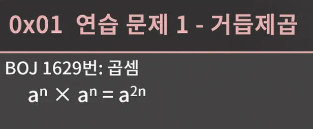
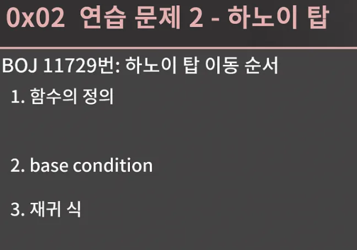
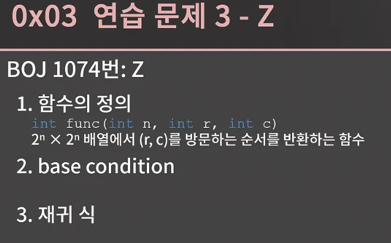

- 지금 자신있게 말할 수 있는게 있는데 이 파트가 정말 어려울 것입니다.
- 물론 이전의 내용들 중에서도 군데군데 어려운게 있었겠지만 이번 단원에서는 아예 우리가 지금까지 코딩하면서 쌓아온 기본 상식을 과감하게 깨야 이해를 잘 할 수 있습니다. 그래서 마음의 준비를 단단히 하셔야 합니다.

</br>


- 재귀가 무엇인지 먼저 설명을 드리고 문제들을 풀어보면서 감을 잡아보도록 하자

</br>


- 재귀란 무엇일까
- 이거 사골드립이긴 한데 지금 딱 보여지는 이 움짤이 재귀이다.

- 이거는 좀 드립이고
- 정의를 다시 해보자면
    - 재귀는 하나의 함수에서 자기 자신을 다시 호출해 작업을 수행하는 알고리즘
- 언어를 배울 때 보통 재귀를 다루니 재귀를 아예 처음보는 분은 없을 것 같은데, 재귀로 N부터 1까지 출력하는 함수와 1부터 N까지의 합을 구하는 함수를 한 번 짜보는 시간을 가져보자

```cpp
#include <iostream>

using namespace std;

int ans = 0;
void fun2(int n){
    if (n == 0)
        return ;
    fun2(--n);
    ans += n;
}

void fun1(int n){
    if (n == 0)
        return;
    cout << n << " ";
    fun1(--n);
}

int main(){
    int n = 10;
    fun1(n);
    cout << "\n";
    fun2(n);
    cout << ans << "\n";
}
```

- 스크롤을 위로 올려 바킹독님이 짠 코드를 확인해보자
- 사람마다 구현 방식은 다를 수 있겠지만 이 두 함수는 워낙에 간단한 함수로 대부분 비슷하게 짜셨을 것 같다. 그런데 우리가 여기서 구현을 했다는 것으로 넘어가면 안 되고 이 코드가 왜 올바른 결과를 주는지 제대로 이해할 필요가 있다.

</br>


- 지금 여기서 제대로 이해를 하고 가야 나중에 재귀를 이용해 문제를 푸는 과정에서 헤매지 않는다.
- 우리가 어떤 문제를 재귀로 푼다는 것은 곧 귀납적인 방식으로 문제를 해결했다는 것인데 이 귀납적인 방식이란 게 지금까지의 우리의 상식과 큰 차이가 있다.

- 예를 들어 어떤 문자열이 올바른 괄호 쌍인지 판단하는 문제를 짠다고 하면 여는 괄호가 나왔을 떄 스택에 넣고 다는 괄호가 나온다면 스택이 비어있는지, 스택의 top이 짝이 맞는지를 확인해서 각각의 상황에 따라 무언가를 해라 이런 식으로 순서에 따라 해야할 일이 정해져있는 코드를 짜왔다.
- 이런 방식과 귀납적인 방식이 어떤 차이가 있는지 도미노를 예를 들어 설명해보겠다.

지금 사진의 도미노에서 제일 앞의 도미노를 쓰러트리게 되면 모든 도미노가 쓰러질 것이다. 그런데 왜 모든 도미노가 쓰러지는지를 설명해보라고 한다면 두 가지 방법이 있다.

- 편의상 앞에서부터 1번,2번 … 도미노라고 한다면
1. 첫 번째 설명 방법
    1. 1번 도미노가 쓰러지면 2번 도미노가 쓰러지고, 2번 도미노가 쓰러지면 3번 도미노가 쓰러지고, 3번 도미노가 쓰러지면 4번 도미노가 쓰러지고.. .이런식으로 계속 진행되기 때문에 모든 도미노가 쓰러진다는 설명
2. 수학적 귀납법을 이용한 방법
    1. ‘1번 도미노가 쓰러진다’, ‘k번 도미노가 쓰러지면 k+1번 도미노도 쓰러진다’가 참이니까 모든 도미노가 쓰러진다는 설명 방법
- 2번째 설명 방법이 맞는 이유
    - 결국 1번 도미노가 쓰러지고 이후에 2번 도미노가 쓰러지고… 이렇게 연쇄적으로 진행되어 모든 도미노가 쓰러지기  떄문에 그런 것
- 하지만 앞으로는 ‘1번 도미노가 쓰러진다’, ‘k번 도미노가 쓰러지면 k+1번 도미노도 쓰러진다’까지만 생각한 후에 바로 모든 도미노가 쓰러진다는 결론에 도달할 수 있어야함 즉 우리가 지금까지 당연하게 생각하던 절차지향적인 사고를 탈피해야됨


</br>


- 아까 앞에서 보여드렸던 n부터 1까지 출력하는 문제로 절차지향적 사고와 귀납적 사고의 차이를 알려주겠다.
- 우선 절차지향적인 사고로 func1(3)의 출력 결과가 왜 3 2 1 인지를 생각해본다면 이 코드가 동작하는 흐름을 그대로 따라가면 됩니다.

일단 func1(3)가 호출되면 3을 출력하고 func1(2)를 호출한다. func1(2)는 2를 출력한 후에 func1(1)을 호출할 거고 func1(1)은 1을 출력한 후에 func1(0)을 호출한다. 그리고 func1(0)은 02번 줄에 걸려서 종료가 된다. 이렇게 과정을 따라가고 나면 func1(3)을 실행했을 때 3 2 1이 출력된다느 것을 알 수가 있다.

</br>


- 이번에는 func1 함수가 n부터 1까지 차례로 출력하는 함수임을 귀납적인 사고로 이해해보자
1. func1(1)이 1을 출력한다. 이건 굉장히 자명하다. 
    1. 그 다음이 관건인데 func1(k)가 k k-1 k-2 … 1을 출력하면, 즉 k부터 1까지 차례대로 출력하면 func1(k+1)은 k+1부터 1까지 출력한다는 걸 보여야함
    2. 이걸 보이는 건 func1(k+1)이 호출될 떄 어떤 상황이 생기는가를 보면 되는데 k+1을 출력된 이후 func1(k)가 호출되고 func1(k)는 k부터 1까지 차례로 출력한다 가정을 했으니 func1(k+1)부터 1까지 차례대로 출력함을 알 수가 있다.
    3. 이 두 문장이 참이므로 귀납적으로 func1 함수가 n부터 1까지 차례로 출력하는 함수임을 알 수 있게 된다. → 이제 귀납적으로 생각하는 것에 친숙해졌나요?
    4. 앞에서 살펴본 1부터 n까지의 합을 구하는 함수에 대해서도 왜 올바른 결과를 내는지 과정을 하나하나 따라가는 대신 귀납적인 사고를 통해서 이해해보길 바란다.

</br>


- 앞의 예시를 통해서 귀납적인 방식으로 생각하는 것에 익숙해지길 바라며 설명을 마저 이어가겠다.
- 올바른 재귀 함수는 반드시 특정 입력에 대해서는 자기 자신을 호출하지 않고 종료되어야한다.
    - 이러한 입력을 base condition 내지는 base case라고 한다.
- 모든 입력은 base condition으로 수렴해야한다.
    - 이 코드를 보면 n = 0 일 때 자기 자신을 호출하지 않고 종료가 되니 이것이 base condition이고 우리는 이 함수에 자연수만 넣을 테니 모든 입력은 결국엔 n = 0으로 수렴하게 된다.
    - 이 두 조건 중 어느 하나라도 지켜지지 않는다면 재귀 함수는 결과를 내지 못하고 무한히 들어가다가 런타임 에러가 발생하게 될 것이다.

</br>


- 재귀에 충분히 익숙하지 않으면 남이 재귀로 짠 코드를 이해하는 데에도 정말 오랜 시간이 걸리고 능숙하게 재귀를 이용할 수도 없다.
- 역시 이건 시간이 해결해줄 문제이지만 조금이라도 쉽게 갈 수 있도록 재귀를 사용할 때 도움이 될 팁을 알려주겠다.

1. 먼저 재귀에서는 함수를 명확하게 정의
- 정의라는 건 함수의 인자로 어떤 것을 받을지, 그리고 어디까지 계산한 후 자기 자신에게 넘겨줄 지 의미
- 예시 문제를 풀어볼 때 함수의 형태를 잡는 부분을 계속 강조할 것이다.

2. 모든 재귀 함수는 재귀 구조 없이 반복문만으로 동일한 동작을 하는 함수를 만들 수 있다.
    1. 재귀는 적재적소에 사용하면 코드가 간결해지지만 함수 호출이 꽤 비용이 큰 연산이기 때문에 메모리와 시간에서는 손해를 본다.
    2. 그렇기 떄문에 굳이 재귀를 쓰지 않아도 구현에 큰 어려움이 없으면 재귀 대신 반복문으로 코드를 짜는 게 좋지만 재귀 없이 구현을 하면 코드가 너무 복잡해지는 일부 문제들은 재귀로 구현을 하는 게 좋다.

다양한 문제들을 풀면서 경험적으로 어떨 때 재귀를 사용하면 유리하고 어떨 때에는 굳이 재귀를 사용할 필요가 없는지 알게 될 것이다.

</br>


1. 재귀 함수에 대해 또 한 가지를 알고 있어야하는 점은 재귀 함수가 자기 자신을 여러번 호출하게 되면 예상과는 다르게 굉장히 비효율적일 수 있다.
- 지금 이 함수는 n번째 피보나치 수열을 반환하는 함수이다. 피보나치 함수는 초항 2개가 1 1이고 그 뒤의 항들은 직전 항 2개의 합으로 정의되는 함수인데 처음 들어보면 한 번 찾아보고 와라
- 보면 base condition은 n이 1이하 일 때이고 당연히 모든 입력에 대해 base condiiton으로 수혐할 것이다.
- 잠시 코드를 생각하지 말고 n번째 피보나치 항을 구하기 위해 필요한 연산의 횟수를 생각해보면 상싱적으로 생각했을 때 앞에서부터 차례로 1 1 2 3 4 8 n번의 덧셈이 필요
- 그런데 이 재귀 함수의 시간 복잡도는 놀랍게도 O(1.618^n)이다. 즉 n = 100 정도만 되어도 일반 컴퓨터로 거의 20000년 넘게 걸릴 것이다.
- 그냥 우리가 손으로 계산하는 것 보다도 훨씬 느리게 되었음 1.618이라는 값이 조금 뜬금없어 보일 수 있는데 크게 중요한 내용은 아니고 n에 대한 지수함수 만큼의 시간이 걸린다는 점을 기억해야함
- 그러면 왜 이런일이 발생한거냐면 바로 함수 호출이 어떤 식으로 이루어지는 보면됨
    - fibo(5)를 예로 들어 보자 fibo(5)는 fibo(4)와 fibo(3)을 호출하고 fibo(4)는 fibo(3)과 fibo(2)를, fibo(3)은 fibo(2)와 fibo(1)을 호출 전체적인 재귀 호출 상황을 나타내보면 슬라이드의 그림과 같다.
    - 이 그림을 보면서 아주 중요한 것 하나를 눈치 채면 좋은데
        - 바로 계산한 걸 또 계산한다는 일이 아주 빈번함을 알 수가 있다.
        - 당장 fibo(3)만 보더라도 왼쪽에서 fibo(3)을 계산하기 위해 fibo(2)와 fibo(1)을 부르고 fibo(2)는 fibo(1)과 fibo(0)을 부르는 일이 발생했는데 오른쪽에서 또 fibo(3)을 계산하려고 함수를 따라들어가는 짓을 한다.
        - 이렇게 이미 계산한 값을 다시 계산하는 일이 빈번하게 발생하면서 시간복잡도가 말도 안 되게 커져버렸다.
        - 이와 같이 한 함수가 자기 자신을 여러 번 호출 할 경우 시간복잡도가 이상하게 될 수 있어서 조심해야됨

즉 이 피보나치 문제의 경우에는 식을 별 생각없이 재귀로 구현했더니 자기 자신을 여러 번 호출하는 과정에서 중복된 계산이 계속 발생해 시간복잡도가 말도 안되게 커져버린 상황이고 이 문제는 재귀 대신 나중에 배울 다이나믹 프로그래밍이라는 방법을 이용해 우리의 상식대로 O(n)에 해결할 수 있다.

</br>


1. 재귀 함수가 자기 자신을 부를 떄 스택 영에 함수에 대한 정보가 누적된다.
- 이 스택 영역이라고 하는 것은 메모리 구조에서의 스택 영역을 말하는 건데 우리가 문제를 풀 때 메모리 제한이라는 게 있다.
- 그 제한이 512MB라고 하면 프로그램이 점유하는 메모리가 최대 512MB여야 하는데 일부 컴파일 환경에서는 스택 영역의 메모리가 별도로 1MB로 제한되어 있기도함
- 엄밀히 말해 Visual Studio 2017/2019에서도 별도로 설정을 안 하면 1MB이고 GCC+MinW도 1MB이고 리눅스이 경우 버전에 따라 차이가 있긴 하지만 8MB혹은 10MB와 같이 제한이 걸려있다. 그리고 채점 사이트 중에서도 설정을 따로 바꾸지 않아 스택 메모리의 제한이 문제의 메모리 제한과 별도로 작게 걸려 있는 경우가 있다.
- BOJ는 스택 메모리의 제한이 없지만 현재(2020년 6월) 기준 [swexpertacademy.com](http://swexpertacademy.com/) 에는 제한이 걸려 있다. 그래서 지금 이 코드처럼 재귀를 한 10만번 정도만 들어가도 스택 메모리에 함수에 대한 정보가 계속 쌓이다가 1MB를 넘겨서 제출해보면 런타임 에러가 발생
    - 만약 [swexpertacademy.com](http://swexpertacademy.com/) 과 같이 스택 메모리가 작게 제한된 곳에서 문제를 푸는데 본인의 풀이가 재귀를 깊게 들어가는 풀이라면 어쩔 수 없이 재귀 대신 반복문으로 문제를 풀어야함. 참고로 스택 메모리에는 지역 변수도 들어간다.
- 그리고 BOJ에 제출하면 맞았습니다가 뜨는 남의 코드를 로컬에서 돌렸을 때 계속 런타임에러가 나는 일을 겪는 사람이 있는데 가장 의심해볼만한건 재귀가 너무 깊거나 지역 변수로 int arr[2000][2000]과 같은 큰 배열을 잡았지 않았을까 하는 것
- int 400만개면 벌써 16MB를 잡아먹기 때문

</br>


거듭 제곤 문제

- a^b를 m으로 나눈 나머지 즉 a^b mod m을 어떻게 구할 수 있을까?
- 딱 쉽게 떠오로는 방법은 a를 b번 곱하는 방법이다. 코드로 그다지 어렵지 않게 작성할 수 있다.
- 만약 func1(6, 100, 5)를 넣으면 6 ^ 100 mod 5의 결과가 나와야하고 6을 5로 나눈 나머지는 1 이니 직관적으로 6^100 mod 5가 1이라는 것을 알 수가 있다. 하지만 결과는 놀랍게도 1이 아니라 0이 나옴
- 이런식으로 저 코드는 지금 제대로 동작하지 않는데 그 이유는 알겠지?
    - 밑에 내가 해봄 보셈
    - 잘 모르겠으면 맴찢인데 한 5분 정도 고민하는 시간을 가진 후에 계속 진행

```cpp
#include <iostream>

using namespace std;

int func1(int a, int b, int m){
    int val = 1;
    while (b--)
    {
        val *= a;
    }
    cout << "val : " << val << "\n";
    return val % m;

}
void func2(int a, int b, int m){
    long long val = 1;
    while (b--)
    {
        val *= a;
        cout << val << " ";
    }
    cout << "val : " << val << "\n";
    
}

int main(){
    int ans = func1(6, 100, 5);
    cout << ans << "\n";

    func2(6, 100, 5);
    cout << 60466176 % 5 << "\n";
}
```

결과

```cpp
val : 0
0
6 36 216 1296 7776 46656 279936 1679616 10077696 60466176 362797056 2176782336 13060694016 78364164096 470184984576 2821109907456 16926659444736 101559956668416 609359740010496 3656158440062976 21936950640377856 131621703842267136 789730223053602816 4738381338321616896 -8463200117489401856 4561031516192243712 8919445023443910656 -1823562080465190912 7505371590918406144 8138741398091333632 -6507783832580653056 -2153214848064815104 5527454985320660992 -3728758235495137280 -3925805339261272064 -5108087961858080768 6244960376270618624 576274110204608512 3457644661227651072 2299123893656354816 -4652000711771422720 8981483876790566912 -1451328960385253376 -8707973762311520256 3092389647259533312 107593809847648256 645562859085889536 3873377154515337216 4793518853382471680 -8132375027124273152 6545982058383015936 2382404202878992384 -4152318856435597312 -6467169064904032256 -1909526242005090304 6989586621679009792 5044031582654955520 -6629298651489370112 -2882303761517117440 1152921504606846976 6917529027641081856 4611686018427387904 -9223372036854775808 0 0 0 0 0 0 0 0 0 0 0 0 0 0 0 0 0 0 0 0 0 0 0 0 0 0 0 0 0 0 0 0 0 0 0 0 0 val : 0
1
```

</br>


- 그 이유는 바로 바로 int overflow 때문
- 6^100은 int 범위를 까마득하게 벗어났다. 이걸 해결해주려면 곱하는 중간 중간계속 m으로 나눠서 나머지만 챙겨가면 된다.
- 왜 m으로 나눈 나머지만 챙겨가면 되는지 이해가 잘 안갈 수 있는데 증명을 하려고 해도 그다지 어렵지 않게 할  수 있지만 어떤 식으로도 생각을 해볼 수 있냐면 234236116 * 268921 * 29123의 일의 자리를 구할 때 아마 대부분의 사람이 직접 저 값을 계산하는 대신 그냥 각 수의 일의 자리인 6, 1, 3곱한 후 답이 8이라는 것을 알아낼 것 같다
- 왜 이렇게 계산을 하는거나면 우리는 이미 직관적으로 a * b * c의 일의 자리 즉 10으로 나눈 나머지는 a와 b와 c 각각의 일의 자리를 구한후 곱하면 된다는 것을 알고 있기 때문
- 지금 코드도 10이 m으로 달라졌다는 것 뿐이지 우리가 상식적으로 알고 있던 그 내용
- type도 long long 으로 바꿔주면 더 좋을 것이다.
- int verflow를 고려한 코드를 확인해보자 코드를 보면 m 미만의 수 2개를 곱하는 상황이 계속 발생하니 m이 2^32보다 크다면 long long의 범위 조차 넘어설 수 있다.
    - 이 말이 밑에 코드에서 나머지는 m보다 무조건 작은 걸 말하는 듯
- 이런 상황에서는 그 냥 Big Integer 기능이 있는 java 혹은 python을 사용하거나  __int 128과 같은 것을 써야하지만 정상적인 코테는 2^32보다 작을 것이다.
- 결론은 ab mod m을 O(b)에 구할 수 있다.

</br>


그런데 b가 최대 20억이라서 O(b)로 해결할 수 없을 땐 어떻게 해야할 까 지금 저 [BOJ 1629번:곱셈](https://www.acmicpc.net/problem/1629)이 대놓고 그런 문제인데 b가 최대 21억 가까이 되기 때문에 a를 b번 곱하는 방식은 분명 시간 초과가 발생할 것이다. 그래서 더 효율적인 방법이 필요한데 그 방식은 먼 곳에 있지 않다. 방법을 찾기 위한 첫 번째 힌트를 공개하겠다.

</br>


- a^n * a^n = a^2n .. 조금 뜬금없나,,?
- 굉장히 당연한 식을 써놓았다. 쉽지는 않겠지만 이걸 보고 느낌이 오는 게 없을까요? 있으면 좋겠지만 아마 없을 테니 2번쨰 힌트 공개

</br>


- 솔직히 이 힌트는 너무 노골적
- 우리가 12^116 mod 67을 구하고 싶다고 하면 되게 막막함.
- 그런데 12^58 mod 67이 4라는 걸 알려드린다면 116승을 구하는 게 아주 쉬워진다는 걸 알겠죠? 첫 번쨰 힌트로 드린 성질을 쓰면 그냥 4 * 4를 하면 끝이기 떄문

이걸 보고 아 귀납법으로 해결을 할 수 있겠다 하는 생각이 들었으면 정말 좋을 텐데 어땠을지 궁금하다.

</br>


- 귀납법을 다시 떠올려보면 모든 도미노가 쓰러진다는 것을 증명하기 위해 이 두 문장이 필요했다.
- 그리고 지금 이 문제에서는 두 문장이 이렇게 살짝 바뀌게 된다.

</br>


- 12^58과 12^116의 관계에서 보듯 k승을 계산했으면 2k승을 계산할 수 있다는 건 이해가 갈거고 2k승을 계산하고 a를 한 번만 곱해주면 2k + 1승이 구해지니까 2k승과 2k+1승 모두 k승을 계산했으면 O(1)에 계산할 수 있다.
- 이 두 문장이 참이기 때문에  우리는 a의 임의의 지수승을 귀납적으로 계산할 수 있다.
- 지금까지 살펴본 내용을 바탕으로 재귀 함수를 만들 수 있겠나?
- 다음 슬라이드에 바로 코드가 있으니까 꼭 먼저 시도해보고 넘어오길 바란다.

</br>


- 코드에서 POW함수가 바로 a^b mod m을 계산해주는 함수이다. base condition은 07번째 줄에 명시되어있다. b = 1일 때 base condition으로 뒀는데 b = 0 일 때 두어도 상관없다. 그리고 a가 m 보다 클 수 있기 때문에 a를 반환하는 대신 a % m을 반환

재귀적으로 나만의 풀이법을 만들어보자

예제 a = 12, b = 116, m = 5

1. 1승을 계산할 수 있다. 및 k승을 계산했으면
    1. base condition으로 a^1승을 구해서 % m을 통해 출발점 시작
    2. 즉 a^1승의 나머지값을 구한 거임
    
    ```cpp
      if(b==1) return a % m;
      ll val = POW(a, b/2, m);
    ```
    
    ```cpp
    POW(12,116)
    └── POW(12,58)
        └── POW(12,29)
            └── POW(12,14)
                └── POW(12,7)
                    └── POW(12,3)
                        └── POW(12,1) → 2 반환
    ```
    
2. 2k승을 계산
- "12^58을 계산했으면, 12^116은 (12^58)^2로 계산할 수 있다.”

```cpp
12^58 -> 12^116 = (12^58)^2
```

즉 이런 형태 인데 

$$
a^{2k}=(a^k)^2
$$

이 코드와 대응

- (a^{b/2})^2 mod m 이것과 같은 값을 도출하게 됨 즉 (a^k)^2를 의미

```cpp
val = val * val % m
```

POW(12,1)  POW(12,3) POW(12,7) 이 3가지를 통해서 a^{2k}=(a^k)^2 이 수식이 증명됨을 한 번 보자

- pow(12,1)

```cpp
if (b == 1) return a % m;
```


- pow(12,3)

```cpp
ll val = POW(12, 1, 5);   // val = 2
val = val * val % 5;      // val = 2 * 2 % 5 = 4
if (3 % 2 == 0) return val;
return val * a % 5;       // return 4 * 12 % 5
```

- pow(12,7)

```cpp
ll val = POW(12, 3, 5);   // val = 3
val = val * val % 5;      // val = 3 * 3 % 5 = 4
if (7 % 2 == 0) return val;
return val * a % 5;       // return 4 * 12 % 5
```


결과

POW(12,1)=2

POW(12,3)=3

POW(12,7)=3

수식 검증


전체 코드 설명

```cpp
ll POW(ll a, ll b, ll m){
  if(b == 1) return a % m;
  ll val = POW(a, b/2, m);   // (1) k승 계산
  val = val * val % m;       // (2) 2k승 계산
  if(b % 2 == 0) return val; // (3) b가 짝수면 2k승 반환
  return val * a % m;        // (4) b가 홀수면 2k승에 a를 곱해 2k+1승 반환
}

```

이 부분은 1승을 구하는 것과 1승의 나머지를 계산하는 코드


```cpp
if(b == 1) return a % m;
ll val = POW(a, b/2, m);   // (1) k승 계산
```

val = val * val % m;       // (2) 2k승 계산
이 부분은 a^3 = (a ^1)^2 * a를 같다고 보고 나머지를 계산해서 나머지 값을 다시 대입해주는 거고

```cpp
val = val * val % m;       // (2) 2k승 계산
```

이 코드는 b가 짝수 일 때 홀 수 일때를 보는 것인데 k승의 나머지를 계산했으니 2k승의 나머지와 2k+1승 나머지도 구할 수 있다라는 설명

```cpp
if(b % 2 == 0) return val; // (3) b가 짝수면 2k승 반환
return val * a % m;        // (4) b가 홀수면 2k승에 a를 곱해 2k+1승 반환
```

- 다시 본문
- 그 다음에는 재귀적으로 a^b/2 mod m을 계산해 val에 대입하고 val을 제곱
- 만약 b가 7이라고 한다면 b/2는 3이니 9번쨰 줄이 끝났을 때 val는 a^6 mod m 값이 들어갈 것임
    - val = val * val % m; 이 코드를 말하는 것인데
    - 
- 즉 b가 짝수이면 그냥 val의 값을 반환하면 끝이지만 b가 홀 수 이면 val에 a를 한 번 더 곱해서 반환해야함

이렇게 재귀 함수를 만들어낼 수 있고 꼭 절차지향적인 사고 대신 귀납적인 사고로 이 코드가 올바른 답을 낸다는 사실을 히애하면 좋겠다.

- 물론 이 문제까지는 예를 들어 pow(5,14,3)이 pow(5,7,3)을 부르고 pow(5,3,3)을 부르고 이런식으로 절차지향적인 사고로 따라가는 게 어렵진 않지만 점점 그렇게 따라들어가려고 하면 머릿속이 너무 복잡해질 문제들을 만나게 될 것이다.
- 그때 재귀함수를 잘 짜려면 귀납적인 사고 즉 base condition을 잘 잡아뒀고 k승의 결과를 토대로 2k, 2k+1승의 결과를 계산할 수 있으니 마치 도미노를 쓰러트리는 것처럼 모든 결과가 잘 계산될 것이다로 함수를 이해할 필요가 있다.
- 이 함수의 시간 복잡도는 b가 계속 절반씩 깎이기 때문에 O(log b)이다.
- 그래서 문제의 시간 제한을 아주 넉넉하게 지킬 수 있다. 만약 직접 짜서 냈는데 틀렸거나 시간 초과가 발생했다면 int overflow가 발생했거나, pow 함수 내에서 pow 함수를 1번 부르는 게 아니라 2번 불러서 시간 복잡도가 O(log b)가 아닌 O(b)가 됐거나 base condition을 빼먹었거나 하는 이유 등을 짐작할 수 있다.

</br>


- 두 번 째 문제는 재귀 함수 관련 문제 중 스테디셀러급인 하노이 탑 문제이다. 라뗀느 이 하노이 탑이 kbs 티피 프로 스펀지에 소개되어서 유행을 탔다. 막 이거 잘하면 공부 잘 하게 된다면서..

아무튼 하노이 탑을 처음 들어보거나 규칙이 좀 가물가물하면 일단 [온라인으로 해볼 수 있는 링크](https://www.mathsisfun.com/games/towerofhanoi.html)에 들어가서 하노이 탑을 한 번 해보고 오시면 좋을 것 같다. 원판이 3,4,5개 일때를 다 깨보는 것을 추천드린다. 

꼭 다 깨고 오셔야 다음 진행이 수월할 것이다.

원판이 4개일 때 플레이하는 걸 한 번 보고 가자

</br>


- [하노이 탑 이동 순서](https://www.acmicpc.net/problem/11729) 이 문제를 확인해보자
- 보고 오면 답이 없다 대체 어쩌라는 거임?
- 감이 1도 안오고 굉장히 난해 하겠지만 어찌됐든 우리는 이 문제를 해결해야하니 고민을 좀 해보자

</br>


- 애초에 지금 재귀 단원이니 당연히 재귀를 써서 푸는 문제이긴 할 텐데 함수의 형태도 감이 잘 안오고 막막할 거임.
- 이 문제는 특히 절차지향적 사고로 접근한다면 답이 없다. 지금 이상황에서 1번 원판을 기둥 2로 옮겨야하는지 아니면 3을 옮겨야하는지 그리고 그 다음은 어떻게 해야할지 전혀 감이 안올 것임. 그래서 우리는 관점을 살짝 바꿔서 먼저 n번 원판에만 집중을 해보자.

원판들을 전부 기둥 1에서 기둥 3으로 옮기려면 n번 원판을 기둥 1에서 기둥 3으로 옮겨야 한다. 

그런데 n번 원판을 움직이려면 n번 원판 위에 있는 1번부터 n-1번까지의 원판들일 전부 비켜줘야하고 더 나아가 이들은 전부 기둥 2로 가야 합니다.

왜냐하면 저것들 중에서 어느 하나라도 기중 3으로 가게될 경우 작은 원판 위에 큰 원판을 둘 수 없다는 규칙 떄문에 n번 원판을 기둥 3으로 옮길 수 없기 때문

</br>


- 그래서 이렇게 n-1개의 원판을 기둥 1에서 기둥 2로 옮겼고 그 후 n번 원판을 기둥 3으로 옮겨야한다.

</br>


- 이 다음에는 무엇을 해야할 지 알겠죠?
- n-1개의 원판을 기둥 2에서 기둥 3으로 옮기면 된다.

</br>


- 이렇게 우리는 n개의 원판을 기둥 1에서 기둥 3으로 옮겼다. 뭔가 약파는 느낌도 나고 이게 맞는 건가 싶겠지만 어떻게 다르게 설명이 안된다.
- 과정을 보면 알겠지만 n-1개의 원판을 원하는 곳으로 옮길 수만 있다면 n개의 원판을 처리할 수 있다. 그리고 이건 뭐다? 딱 재귀다 이말이다.

</br>


- 앞의 설명을 보고 이 문제가 재귀라는 사실을 많이 알아채셨을 것 같지만 이해를 돕기 위해 설명을 좀 더 해보자.
- 앞에서 살펴본 과정을 이렇게 세 단계로 정리할 수 있다. 그리고 이 과정을 통해 얻을 수 있는 결론은 바로 우리가 원판이 n-1개 일 때를 처리를 할 수 있다면 원판이 n개 일 때에도 처리를 할 수 있다는 것이다.

이걸 알아냈담녀 다 끝난건데 원판이 1개일 때에는 자명하게 옮길 수 있고 원판이 k개 일 때 옮길 수 있으면 원판이 k+1개 일 때에도 옮길 수 있다는 걸 같이 봤으니 귀납적으로 이 문제를 풀 수 있음을 알게 된 것이다.

</br>


- 느낌은 좋은데 막상 구현을 하려고 하면 좀 막막할 것임
- 그래서 step by step으로 같이 해보자

</br>


- 함수 정의
    - 함수를 정의 한다는 건 함수가 어떤 역할을 수행하는지, 어떤 인자를 받는지를 정하는 것
    - 딱 쉽게 생각할 수 있는 형태는 이런 형태
    - func 함수를 이렇게 정의했는데 재귀가 늘 그렇듯 우리는 func(n) 내에서 func(n-1)을 불러야 하는데 이 재귀 식이 상상이 가나?
    - 아쉽지만 func 함수에는 큰 결함이 있는데 func(n) 즉 원판 n개를 기둥 1에서 기둥 3으로 옮기려면 원판 n-1개를 기둥 1에서 기둥 3으로 옮기는 게 아니라 기둥 2로 옮겨야한다.
    - 그러면 func(n-1)을 활용할 수가 없다. 그래서 지금 이 함수는 이 문제를 풀기에 적절하지 않다.

</br>


- 도대체 함수는 어떤 형태여야 하냐면 시작 기둥과 도착 기둥도 인자로 받는 함수야야함
    - 이렇게 인자 a와 b를 추가로 두면 해결이 가능하고 구체적인 식은 재귀 식에서 보겠다.

</br>


- base condition
    - n = 1일 때 a에서 b로 옮기도록 하면 된다.
    - 직관적으로 이해하기 쉬운 건 n = 1이고 코드가 더 예쁜 건 base condition을 n = 0 으로 두는 건데 일단 강의에서는 n = 1로 처리하겠다
    - 나중에 n = 0으로 두면 어떤 모양일지 한 번 고민해보면 좋을 것 같다.

</br>


- 재귀식
    - 일단 a도 아닌 b도 아닌 기둥의 번호는 6-a-b이다.
    - 번호의 합이 6이니 쉽게 이해할 수 있을 것이다.
    - 이제 원판 n개를 기둥 a에서 b로 옮기는 과정을 말로 풀어쓰면 이런식이다.
    - 그리고 각 과정을 코드로 나타내는 건 아주 간단 하다. 이제 코드로 만들기 위한 것들을 다 알려드렸으니 구현을 시도해보면 되겠다.

그리고 문제에서는 총 옮긴 횟수도 같이 물어보고 있는데 원판 k개를 옮기기 위해 A번 이동이 필요하다고 했다. 그러면 원판 k + 1개를 옮길 때는 k개의 원판을 빈 곳으로 옮길 때 A번, K+1번 원판을 옮길 때 1번, k개의 원판을 다시 빈곳에서 목적지로 옮길 때 A번 필요하니 2A+1번 이동이 필요함

더 나아가 초항이 1이기 때문에 이 수열의 일반항은 2^K-1이 되긴 하는데 하노이 탑은 워낙 유명한 문제이니 지금처럼 횟수를 물어보지만 코딩 테스트에서 이러한 지식이 필요한 일은 없을 거라 일반항을 유도하는 방법은 몰라도 괜찮다.

</br>


- 코드를 같이 보면 앞의 슬라이드 부분에서 쪼개 설명을 다 했어서 다시 설명할 부분이 없긴 하지만 18번쨰 줄에서 (1<< k)가 조금 어색할 수 있겠다 싶다.
    - 이건 left shift라고 불리는 비트 연산자인데 1을 비트 기준 왼쪽으로 k칸 멀어라는 의미기 때문에 (1<<K)는 2^K가 된다.
- 그리고 분명 앞 슬라이드에서는 설명을 들으면서 고개를 끄덕끄덕하며 대충 맞는 소리인 것 같은데 하고 생각을 하셨다가도 지금 이 코드가 대체 왜 잘 동작하는지 도저히 이해가 안가는 분이 계실 것입니다. 그런 분들은 뭐가 문제냐면 아직 절차지향적인 사고를 완전히 탈피하지 못하신 것입니다.
- 왜 이게 올바른 답을 내냐는 질문에 대해 예를 들어 func(1, 3, 5)를 부르면 func(1, 3, 5)는 func(1, 2, 4)를 부르고 func(1, 2, 4)는 func(1, 3, 3)을 부르고… 이렇게 생각하기 시작하면 무간지옥에 빠졌습니다.
- 머릿 속은 꼬이고 감도 안올것입니다.  이렇게 함수를 계속 따라들어가면 답이 없고 그냥 딱 귀납적으로 생각을 하면 됩니다. 일단 n = 1일 때 잘 동작합니다. 그냥 a b를 출력하니 이건 정말 자명합니다. 그리고 n = k일 때 잘 동작한다고 치면 n = k+1일 때에도 잘 동작합니다. 아마 이건 충분히 납득할 수 있을 것입니다. 그러면 마치 1번 도미노를 쓰러트리면 모든 도미노가 다 쓰러지는 것과 같이 n = 1, 2, 3, 4… 이렇게 모든 n에 대해 이 함수는 잘 동작합니다

귀납적인 사고를 잘 받아들이셔서 재귀를 마저 잘 해낼 수 있으면 좋겠다

코드

```cpp
#include <iostream>

using namespace std;

void func(int a, int b, int n){
    // cout << "check : " <<  a << " " << b << "\n";
    if (n == 1){
        cout << a << " " << b << "\n";
        // cout << "here\n";
        return; 
    }
    func(a, 6-a-b, n - 1);
    cout << a << " " << b << "\n";
    func(6-a-b, b, n - 1);

}

int main(){
    int n;
    cin >> n;
    cout << (1<<n) - 1 << "\n";
    func(1,3,n);
}
```

나만의 풀이법

- 재귀법 생각
n = 1일 때 a b를 출력하니 자명, n = k일때 잘 동작한다고 치면 n = k + 1잘 동작하니 재귀는 성공될 것이다.
라고 생각을 하는데
func(a, 6-a-b, n - 1); 이게 n-1개의 원판을 기둥 a에서 6-a-b로 옮긴다.
cout << a << " " << b << "\n"; n번 원판을 기둥 adㅔ서 기둥 b로 옮긴다.
func(6-a-b, b, n - 1); n-1개의 원판을 기둥 6-a-b에서 기둥 b로 옮긴다.
이 코드 설명이 정확하게 이해가 잘 안 돼 어떻게 연결시켜야되지?

이 구조가 코드의 **세 줄**로 대응

| 코드 | 문제 해결 과정 |
| --- | --- |
| `func(a, 6-a-b, n-1)` | n-1개 원판을 a → 보조(c)로 옮기기 |
| `cout << a << " " << b` | 큰 원판을 a → b로 옮기기 |
| `func(6-a-b, b, n-1)` | n-1개 원판을 보조(c) → b로 옮기기 |

n번 원판 위에 있는 1번부터 n-1번까지의 원판들이 전부 비켜줘야하니 전부 기둥 2로 감
n번 원판을 기둥 3으로 옮김
n-1개의 원판을 기둥 2에서 기둥 3으로 옮김

이걸로 문제 해결로 봤을 때 원판이 n-1개 일때 옮길 수 있으면 원판이 n개일 때에도 옮길 수 있다.

즉,  n = 1일 때 잘 동작함 그냥 a, b 를 출력하는 건 자명, n = k일때 잘 동작한다고 하면 n = k+1일 때에도 잘 동작함

이것만으로

```cpp
void func(int a, int b, int n){
if (n == 1){
cout << a << " " << b << "\n";
return;
}
func(a, 6-a-b, n - 1);
cout << a << " " << b << "\n";
func(6-a-b, b, n - 1);
}
```

이함수를 작성해서 귀납법으로 푸는 것


</br>

다시 본문

- 하노이탑을 끝내고 뭔가 아리송하지만 그래도 재귀가 조금이나마 친숙해졌다고 생각이 드는지 모르겠다.
- [BOJ 1074번 : Z](https://www.acmicpc.net/problem/1074)를 보고 오면 다시 재귀가 정 떨어질 것임.
- 문제를 보면 진짜 좀 어쩌라는 건가 싶다.
- 고통 스럽겠지만 내 안의 잠재력을 믿고 생각해보는 시간을 한 5분정도만 가져보자 잠깐 멈춰놓고 재귀적인 관점에서 생각을 한 번 해보자

```cpp
- Z가 그려지는 거는 항상 N^2만큼 그려짐

재귀로 풀려면 어떻게 해야될까
- 방문했다는 것도 필요한가?
- 
```

</br>


우리는 N이 3일 때 특정칸을  몇번 쨰로 방문하는지 알아볼 건데 미리 N=2일 때의 결과를 다 알려주겠다 r = 2, c = 2 인 곳을 몇 번 째로 방문하는지 알겠나?

</br>


잘모르겠다면 N = 2 일 때의 이 값을  한 번 참고해보면 좋겠다

- 이 문제에서 번호가 어떤 식으로 매겨지냐면 배열을 4등분한 후에 1,2,3,4 순으로 진행이 된다. 그리고 각 사각형 안에서는 N =2 일 떄의 움직임을 그대로 따라가니 r = 2, c = 2 인 곳은 12번째로 방문함

</br>


- 그 다음으로 r = 6 c = 2 인 곳은 몇 번째로 방문하는지 알아보자. 이곳을 방문하기 전에 분명 1번과 2번 사각형 내의 모든 칸을 다 방문했을 것이다.
- 즉 3번 사각형이 시작되기전 이미 32개의 칸을 방문했고, 3번 사각형 내에서는 지금 우리가 보는 저칸 12번째로 방문되니 최종적으로 32 + 12 == 44번째라는 것을 알 수 있다.
- 이걸 보면서 뭔가 좀 느낌이 오나? 보면 N = k일 때의 결과를 가지고 N = k + 1 결과를 구할 때 써먹을 수 있다. 즉 재귀적인 형태를 잡아낼 수 있는 거고 함수의 형태를 한 번 고민해보자.

</br>


- 딱 직관적으로 보이는 그 모양대로 바로 정의하면 된다.

</br>


이 값이 int 범위 안에 들어오는지도 신경을 써줄 필요가 있는데 n이 15이하라고 주어져있으니 int 범위에 잘 맞다.

그 다음은 base conditioin인데 n = 0 일 때 0을 반환하다록 하는 게 편하다.

</br>


n = 1로 해도 되지만 그러면 base condition에서 별도의 처리가 필요하니 편하게 가겠다. 마지막으로 재귀 식인데 봤듯이 (r,c)가 어느 사각형에 있는지에 따라 식이 달라진다.


</br>


각 상황에 따른 반환값은 위와 같다. 여기서는 half는 한 변의 길이의 절반 즉 2^n-1이다. 이제 이것들을 합쳐서 구현을 하면 끝이다.
```cpp
// http://boj.kr/fd805e1226e949f9b6b2eff59e5be642
#include <bits/stdc++.h>
using namespace std;

int func(int n, int r, int c){
  if(n == 0) return 0;
  int half = 1<<(n-1);
  if(r < half && c < half) return func(n-1, r, c);
  if(r < half && c >= half) return half*half + func(n-1, r, c-half);
  if(r >= half && c < half) return 2*half*half + func(n-1, r-half, c);
  return 3*half*half + func(n-1, r-half, c-half);
}

int main(void){
  ios::sync_with_stdio(0);
  cin.tie(0);
  int n, r, c;
  cin >> n >> r >> c;
  cout << func(n, r, c);
}
```

</br>


오늘 소개해드릴 내용이 전부 끝났습니다. 재귀가 익숙하지 않았다면 까다로웠을텐데 다음 단원에서 배울 백트래킹을 잘 해내기 위해서라도 재귀를 능숙하게 다룰 수 있어야 합니다. 문제집에 있는 문제들이 쉽지 않겠지만 함수의 정의, base condition, 재귀 식을 잘 생각해서 풀어보시길 추천드립니다. 설령 풀이를 보고 푸는 한이 있다고 하더라도 더 이상 재귀가 두렵지 않을 때 까지 문제들을 풀고 나서 백트래킹을 듣는게 좋아보입니다.
</br>
</br>
</br>
</br>
</br>
</br>
</br>
</br>
</br>
</br>
</br>
</br>
</br>
</br>
</br>
</br>
</br>
</br>
</br>
</br>
</br>
</br>
</br>
</br>
